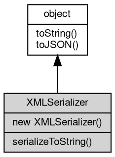

# 对象 XMLSerializer
XMLSerializer 接口提供将 DOM 树序列化为 XML 字符串的能力

XMLSerializer 可以将 DOM 节点序列化为 XML 字符串：

```JavaScript
const serializer = new XMLSerializer();

// 序列化 XML 文档
const parser = new DOMParser();
const doc = parser.parseFromString('<root><item>data</item></root>', 'text/xml');
const xmlStr = serializer.serializeToString(doc);
console.log(xmlStr); // 输出: <root><item>data</item></root>
```

## 继承关系


## 构造函数
        
### XMLSerializer
**构造一个 XMLSerializer 对象**

```JavaScript
new XMLSerializer();
```

## 成员函数
        
### serializeToString
**将 DOM 节点序列化为 XML 字符串**

```JavaScript
String XMLSerializer.serializeToString(XmlNode node);
```

调用参数:
* node: [XmlNode](XmlNode.md), 要序列化的 DOM 节点

返回结果:
* String, 返回序列化后的 XML 字符串

--------------------------
### toString
**返回对象的字符串表示，一般返回 "[Native Object]"，对象可以根据自己的特性重新实现**

```JavaScript
String XMLSerializer.toString();
```

返回结果:
* String, 返回对象的字符串表示

--------------------------
### toJSON
**返回对象的 JSON 格式表示，一般返回对象定义的可读属性集合**

```JavaScript
Value XMLSerializer.toJSON(String key = "");
```

调用参数:
* key: String, 未使用

返回结果:
* Value, 返回包含可 JSON 序列化的值

