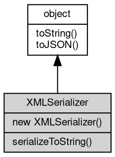

# Object XMLSerializer
XMLSerializer serializes a DOM node into XML text; the class is a [global](../../module/ifs/global.md) and Node.js has no equivalent

`new XMLSerializer().serializeToString(node)` accepts any [XmlNode](XmlNode.md) — a document, element, text
node, comment, CDATA section or processing instruction — and returns the XML serialization of
that node alone. There is no [module](../../module/ifs/module.md) to require, and `instanceof XMLSerializer` recognizes the
instances.

Concepts:

- **XML rules**: elements are written with XML syntax regardless of how the document was
  parsed: an empty element becomes `<name />`, and `<`/`&`/quotes are escaped in text and
  attribute values (a newline, carriage return or tab in an attribute becomes
  &#10;/&#13;/&#9;). Comments and CDATA sections are kept, and namespace prefixes and xmlns
  declarations already present in the tree are serialized like ordinary attributes; fibjs adds
  no namespace of its own, while browsers serialize HTML documents with the XHTML namespace.
- **Node-level dispatch**: serializing an element uses the XML element writer, but a document
  node goes through the generic node writer; for an HTML-parsed document the document [path](../../module/ifs/path.md)
  keeps HTML-style tags (`<br>`), so pass the element or documentElement when XML-style output
  (`<br />`) is required.
- **XML declaration**: serializing a whole document whose source had an XML declaration
  includes the declaration (<?[xml](../../module/ifs/xml.md) version="1.0"?>); serializing documentElement or any other
  node never emits it.

Obtained from:
- `new XMLSerializer()` — the constructor takes no arguments, and the serializer is stateless,
  so one instance can serialize any number of nodes.

Example 1 — serialize a parsed XML document:

```JavaScript
const doc = new DOMParser().parseFromString(
    '<?xml version="1.0"?><root a="1"><child/></root>', 'text/xml');
const xml = new XMLSerializer().serializeToString(doc);

console.log(xml); // <?xml version="1.0"?><root a="1"><child/></root>
```

Example 2 — serialize, re-parse and compare a round trip:

```JavaScript
const parser = new DOMParser();
const serializer = new XMLSerializer();

const source = '<root><item id="1">a &amp; b</item></root>';
const text = serializer.serializeToString(parser.parseFromString(source, 'text/xml'));
const second = parser.parseFromString(text, 'text/xml');

console.log(text); // <root><item id="1">a &amp; b</item></root>
console.log(second.documentElement.firstChild.textContent); // a & b
```

Example 3 — XML output for an HTML-parsed element:

```JavaScript
const doc = new DOMParser().parseFromString(
    '<html><body><br></body></html>', 'text/html');
const serializer = new XMLSerializer();

console.log(serializer.serializeToString(doc.body.childNodes[0])); // <br />
console.log(serializer.serializeToString(doc).indexOf('<br>') >= 0); // true
```

## Inheritance

```dot
digraph {
    node [fontname="Helvetica,sans-Serif", fontsize=10, shape="record", style="filled", fillcolor="white"];

    object [tooltip="object", URL="object.md", label="{object|toString()\ltoJSON()\l}"];
    XMLSerializer [tooltip="XMLSerializer", fillcolor="lightgray", id="me", label="{XMLSerializer|new XMLSerializer()\l|serializeToString()\l}"];

    object -> XMLSerializer [dir=back];
}
```

## Constructors
        
### XMLSerializer
**Constructs an XMLSerializer [object](object.md)**

```JavaScript
new XMLSerializer();
```

The constructor takes no arguments; calling it with any argument throws TypeError [20001].

Example — create a serializer:

```JavaScript
const serializer = new XMLSerializer();
console.log(serializer instanceof XMLSerializer); // true
```

## Methods
        
### serializeToString
**Serializes a DOM node into an XML string**

```JavaScript
String XMLSerializer.serializeToString(XmlNode node);
```

Parameters:
* node: [XmlNode](XmlNode.md), the DOM node to serialize

Returns:
* String, returns the serialized XML string

The argument must be an [XmlNode](XmlNode.md) instance; a primitive, null or a non-node [object](object.md) throws
TypeError [20005], and calling the method with zero or two arguments throws
TypeError [20002]/[20001]. The method is stateless and can be called repeatedly. See the
class description for the serialization rules and for the difference between serializing
a document and its elements.

Example — serialize a parsed document:

```JavaScript
const doc = new DOMParser().parseFromString('<root><a/></root>', 'text/xml');
const xml = new XMLSerializer().serializeToString(doc);
console.log(xml); // <root><a/></root>
```

--------------------------
### toString
**Returns the string form of the [object](object.md)**

```JavaScript
String XMLSerializer.toString();
```

Returns:
* String, returns the string form of the [object](object.md)

The base implementation reports an error: a native [object](object.md) has no implicit
text form, and only the classes whose value can be written as a string
override the member. [Buffer](Buffer.md) returns its content decoded with the given
[encoding](../../module/ifs/encoding.md), [HttpCookie](HttpCookie.md) returns "name=value", and so on; an override commonly
accepts optional arguments ([Buffer.toString](Buffer.md#toString) takes [encoding](../../module/ifs/encoding.md), start and
end) that are not part of this declaration.

Calling the member on a class that does not override it throws
"<Class>: the [object](object.md) can not be converted to string.", which is the
behavior to rely on when probing whether a value has a string form. See
toJSON for the serialization hook.

--------------------------
### toJSON
**Returns the JSON representation of the [object](object.md)**

```JavaScript
Value XMLSerializer.toJSON(String key = "");
```

Parameters:
* key: String, the property name of the value being serialized

Returns:
* Value, returns the JSON-serializable value

JSON.stringify(value) calls value.toJSON(key) when the member exists and
serializes the returned value in its place; the key argument carries the
property name of the value inside its parent [object](object.md) (an empty string at
the top level) and may be used to build a keyed form. The base
implementation returns a plain [object](object.md) holding the readable properties of
the instance, so a native [object](object.md) serializes without per-class code; a
class with a portable shape such as [Buffer](Buffer.md) overrides it, and a JavaScript
class may override it in the same way.

The member is normally reached through JSON.stringify rather than called
directly; calling it returns the same value JSON.stringify would
serialize.

