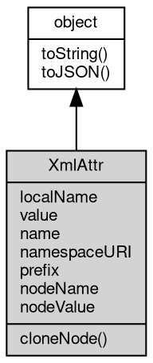

# Object XmlAttr
The XmlAttr [object](object.md) represents one attribute of an [XmlElement](XmlElement.md): a name, a value

and the namespace information needed to serialize it

In most code an attribute is read and written as a string through getAttribute and
setAttribute; XmlAttr exists for the cases that need the attribute as an [object](object.md) - the
namespace-qualified name, a value mutated through a reference, or an attribute node
that is moved between elements. Attribute nodes are not part of the tree: they do not
appear in childNodes, they have no parent and they are not [XmlNode](XmlNode.md) objects.

Concepts:

- **Names and namespaces**: name is the qualified name as written (`n:v`), prefix is
  the namespace prefix (`n`, null when absent) and localName is the part after the
  colon (`v`, equal to name when there is no prefix). namespaceURI is null for an
  attribute without a namespace; an xmlns declaration reports
  `http://www.w3.org/2000/xmlns/` and an attribute using the built-in [xml](../../module/ifs/xml.md) prefix
  reports the XML namespace URI. In HTML mode the parser lower-cases attribute names
  and name lookup through the attribute map is case-insensitive for namespace-less
  attributes; in XML mode names are case-sensitive.
- **Value and serialization**: the value is stored as text. Writing it updates the
  element serialization immediately and invalidates the document-level id/class query
  indexes, so the next query sees the new value. String(attr) returns the serialized
  form ` name="value"` with a leading space and XML escaping - a fibjs extension
  shared by the native [object](object.md) model.
- **Not an [XmlNode](XmlNode.md)**: fibjs declares nodeType, parentNode, ownerDocument, isEqualNode
  and the other tree members on [XmlNode](XmlNode.md) only, so an XmlAttr has none of them; the
  nodeName and nodeValue aliases are kept for compatibility with the standard Attr
  interface. ownerElement and specified are not implemented at all.

Obtained from:
- `element.getAttributeNode(name)` and `element.getAttributeNodeNS(namespaceURI,
  localName)`;
- `element.attributes.item(index)`, `getNamedItem(name)` and indexed access;
- `attr.cloneNode()` — a detached copy with the same name, value and namespace
  information (the copy has no owner, since attributes have no ownerElement here).

Example 1 — read an attribute node, including its namespace parts:

```JavaScript
const xml = require('xml');

const doc = xml.parse('<svg xmlns:xlink="http://www.w3.org/1999/xlink">' +
    '<use xlink:href="#icon" width="16"/></svg>');
const use = doc.documentElement.firstElementChild;
const href = use.getAttributeNode('xlink:href');

console.log(href.name); // xlink:href
console.log(href.prefix); // xlink
console.log(href.localName); // href
console.log(href.namespaceURI); // http://www.w3.org/1999/xlink
console.log(href.value); // #icon
console.log(String(href)); //  xlink:href="#icon"
```

Example 2 — mutate the value through the node and see it in the tree:

```JavaScript
const xml = require('xml');

const doc = xml.parse('<input id="name" value="old"/>');
const element = doc.documentElement;
const attr = element.getAttributeNode('value');

attr.value = 'new';
console.log(element.getAttribute('value')); // new
console.log(String(element)); // <input id="name" value="new"/>

const copy = attr.cloneNode();
copy.value = 'other';
console.log(element.getAttribute('value')); // new, the copy is detached
console.log(copy.name); // value
```

Example 3 — namespace declarations are ordinary attributes:

```JavaScript
const xml = require('xml');

const doc = xml.parse('<root xmlns="urn:default" xmlns:p="urn:p" p:id="7"/>');
const map = doc.documentElement.attributes;

console.log(map.length); // 3
console.log(map.getNamedItem('xmlns').value); // urn:default
console.log(map.getNamedItem('xmlns:p').value); // urn:p
console.log(map.getNamedItem('p:id').value); // 7
console.log(map.getNamedItem('p:id').namespaceURI); // urn:p
```

## Inheritance


## Properties
        
### localName
**String, Queries the local name of the element**

```JavaScript
readonly String XmlAttr.localName;
```

If the selected node has no namespace, this property is equivalent to nodeName.
For an attribute without a prefix the local name is identical to name; for `n:v` it
is `v`. Read-only.

--------------------------
### value
**String, The value of the attribute**

```JavaScript
String XmlAttr.value;
```

Writing is visible through getAttribute, through the element serialization and to
later queries (the change invalidates the document id/class query indexes). Only a
string is accepted; any other value throws a type error (20005) instead of being
converted with String(). nodeValue is an alias of this property.

--------------------------
### name
**String, The name of the attribute**

```JavaScript
readonly String XmlAttr.name;
```

The qualified name as written in the document, prefix included (`n:v`); the HTML
parser lower-cases attribute names. Read-only: the name cannot be changed through
the node. nodeName is an alias of this property.

--------------------------
### namespaceURI
**String, Queries the namespace URI of the element**

```JavaScript
readonly String XmlAttr.namespaceURI;
```

If the selected node has no namespace, this property returns null. Namespace
declarations report `http://www.w3.org/2000/xmlns/` (both the default `xmlns` and a
prefixed `xmlns:p`), and an attribute using the built-in [xml](../../module/ifs/xml.md) prefix reports the XML
namespace URI. Read-only.

--------------------------
### prefix
**String, Queries and sets the namespace prefix of the element**

```JavaScript
String XmlAttr.prefix;
```

The value is null when the attribute has no prefix. Writing a prefix does not
change name, but it does change serialization: the attribute is written with the
new prefix and a matching xmlns declaration is added to the element when needed.

--------------------------
### nodeName
**String, The name of the attribute, for compatibility purposes**

```JavaScript
readonly String XmlAttr.nodeName;
```

The value is the same as name (nodeName is not a separate storage).

--------------------------
### nodeValue
**String, The value of the attribute, for compatibility purposes**

```JavaScript
String XmlAttr.nodeValue;
```

The getter returns the same string as value and the setter stores through the same
[path](../../module/ifs/path.md), including the query-index invalidation; only strings are accepted (20005
otherwise).

## Methods
        
### cloneNode
**Clones the XmlAttr [object](object.md)**

```JavaScript
XmlAttr XmlAttr.cloneNode();
```

Returns:
* XmlAttr, returns a copy of the XmlAttr [object](object.md)

The copy carries name, value, prefix and namespaceURI and is detached: it does not
belong to any element until it is set on one with setAttributeNode. The copy has no
owner element, because fibjs attributes do not expose ownerElement at all. The
optional deep argument of the standard cloneNode is meaningless for an attribute
and is ignored.

Example — clone an attribute and attach the copy to another element:

```JavaScript
const xml = require('xml');

const doc = xml.parse('<s><a id="x1"/><b/></s>');
const source = doc.documentElement.firstElementChild;
const copy = source.getAttributeNode('id').cloneNode();

copy.value = 'x2';
doc.documentElement.lastElementChild.setAttributeNode(copy);
console.log(String(doc)); // <s><a id="x1"/><b id="x2"/></s>
```

--------------------------
### toString
**Returns the string form of the [object](object.md)**

```JavaScript
String XmlAttr.toString();
```

Returns:
* String, returns the string form of the [object](object.md)

The base implementation reports an error: a native [object](object.md) has no implicit
text form, and only the classes whose value can be written as a string
override the member. [Buffer](Buffer.md) returns its content decoded with the given
[encoding](../../module/ifs/encoding.md), [HttpCookie](HttpCookie.md) returns "name=value", and so on; an override commonly
accepts optional arguments ([Buffer.toString](Buffer.md#toString) takes [encoding](../../module/ifs/encoding.md), start and
end) that are not part of this declaration.

Calling the member on a class that does not override it throws
"<Class>: the [object](object.md) can not be converted to string.", which is the
behavior to rely on when probing whether a value has a string form. See
toJSON for the serialization hook.

--------------------------
### toJSON
**Returns the JSON representation of the [object](object.md)**

```JavaScript
Value XmlAttr.toJSON(String key = "");
```

Parameters:
* key: String, the property name of the value being serialized

Returns:
* Value, returns the JSON-serializable value

JSON.stringify(value) calls value.toJSON(key) when the member exists and
serializes the returned value in its place; the key argument carries the
property name of the value inside its parent [object](object.md) (an empty string at
the top level) and may be used to build a keyed form. The base
implementation returns a plain [object](object.md) holding the readable properties of
the instance, so a native [object](object.md) serializes without per-class code; a
class with a portable shape such as [Buffer](Buffer.md) overrides it, and a JavaScript
class may override it in the same way.

The member is normally reached through JSON.stringify rather than called
directly; calling it returns the same value JSON.stringify would
serialize.

