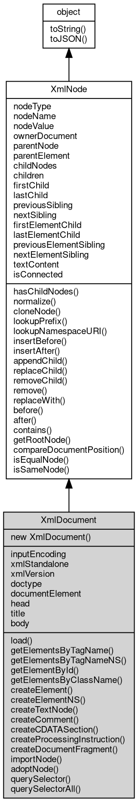

# Object XmlDocument
XmlDocument is the root of the fibjs XML/HTML DOM: it owns the node tree and

provides the factory methods that create nodes, the document-level query methods and the
entry points for parsing and serializing a whole document

A document is created empty in XML mode (`new [xml.Document](../../module/ifs/xml.md#Document)()`), or with an html/head/body
skeleton in HTML mode (`new [xml.Document](../../module/ifs/xml.md#Document)('text/html')`), and is filled by load() or by
appending nodes produced by the create* factories. It is also what [xml.parse](../../module/ifs/xml.md#parse)() returns and
what [XmlNode.ownerDocument](XmlNode.md#ownerDocument) points to. A document node may hold one document element, one
doctype, processing instructions, comments and a document fragment; text is rejected.

Concepts:

- **Document lifecycle**: `new [xml.Document](../../module/ifs/xml.md#Document)()` and the [global](../../module/ifs/global.md) `new XMLDocument()` build an
  empty XML document. In HTML mode the constructor immediately builds an `html` element
  containing `head` and `body`, and load() replaces the whole tree with the parsed one. In
  XML mode load() appends the parsed nodes to the current document - it does not reset it,
  so a second document element is silently dropped and a failed parse leaves the partial
  tree behind. [xml.parse](../../module/ifs/xml.md#parse)() always returns a fresh document.
- **Modes**: the mode is fixed when the document is created (`text/[xml](../../module/ifs/xml.md)` or `text/html`).
  XML mode is case-sensitive and strict (malformed input throws); HTML mode uses a tolerant
  tree builder, upper-cases the tag names of parsed elements, matches tag names
  case-insensitively, wraps a fragment in html/head/body and serializes empty elements with
  the HTML rules. head, title and body exist only in HTML mode and throw an invalid-call
  error (20009) in XML mode.
- **Creating nodes**: createElement/createElementNS, createTextNode, createComment,
  createCDATASection, createProcessingInstruction and createDocumentFragment return nodes
  owned by the document but detached until inserted. String parameters are validated, not
  coerced, so a non-string argument throws a TypeError (20005). An element created with
  createElementNS carries namespaceURI/prefix/localName but no xmlns declaration (see
  [XmlNode](XmlNode.md) for the serialization rule).
- **Import and adopt**: importNode copies a node from another document into this one (deep
  by default) and leaves the source tree unchanged; adoptNode moves it (removing it from
  its old parent and changing ownerDocument). A Document node cannot be imported or
  adopted. Inserting a foreign node directly also adopts it - see [XmlNode](XmlNode.md).
- **Querying**: getElementsByTagName/getElementsByTagNameNS, getElementById,
  getElementsByClassName and querySelector/querySelectorAll search the whole document
  (documentElement included, unlike the [XmlElement](XmlElement.md) methods, which search descendants only).
  getElementById returns the first element in document order whose id attribute matches (an
  empty or unknown id gives null). Every query returns an [XmlNodeList](XmlNodeList.md) snapshot that owns
  strong references to its nodes, so results do not follow later mutations; the
  document-level indexes are invalidated automatically, no refresh call is needed.
- **Serialization**: toString() and [xml.serialize](../../module/ifs/xml.md#serialize)() produce the markup of the whole
  document. The XML declaration is emitted only when the document has declaration
  metadata: inputEncoding is filled by parsing and xmlStandalone is optional, and setting
  xmlVersion (or parsing a declaration) switches the declaration on; the standalone value
  is written only when a version is present. XML mode closes empty elements as `<tag/>`,
  HTML mode uses void tags or `<tag></tag>`.

Obtained from:
- `xml.parse(source[, type][, options])` - parses and returns an XmlDocument;
- `new [xml.Document](../../module/ifs/xml.md#Document)([type])` or the [global](../../module/ifs/global.md) `new XMLDocument([type])` - an empty XML
  document, or an html/head/body skeleton in HTML mode;
- `new [DOMParser](DOMParser.md)().parseFromString(source, mimeType)` - see the [DOMParser](DOMParser.md) interface;
- `document.cloneNode()` - a copy of the whole document, declaration included.

Example 1 - create a document from scratch and serialize it:

```JavaScript
const xml = require('xml');

const doc = new xml.Document();
const root = doc.createElement('note');
root.appendChild(doc.createTextNode('hello'));
root.appendChild(doc.createComment('tail'));
doc.appendChild(root);

console.log(doc.documentElement.nodeName); // note
console.log(doc.toString()); // <note>hello<!--tail--></note>
```

Example 2 - copy a node between documents with importNode:

```JavaScript
const xml = require('xml');

const source = xml.parse('<catalog><book id="1">XML</book></catalog>');
const target = new xml.Document();
const book = target.importNode(source.getElementById('1'), true);

target.appendChild(target.createElement('shelf')).appendChild(book);
console.log(book.ownerDocument === target); // true
console.log(source.documentElement.childNodes.length); // 1 (source unchanged)
console.log(target.toString()); // <shelf><book id="1">XML</book></shelf>
```

Example 3 - work with an HTML document:

```JavaScript
const xml = require('xml');

const doc = xml.parse('<html><head><title>Demo</title></head>' +
    '<body><p class="x">a</p><p>b</p></body></html>', 'text/html');
doc.body.setAttribute('id', 'page');

console.log(doc.title); // Demo
console.log(doc.getElementById('page').nodeName); // BODY
console.log(doc.querySelectorAll('p').length); // 2
console.log(doc.head.parentElement === doc.documentElement); // true
```

## Inheritance


## Constructors
        
### XmlDocument
**Constructs a document in the requested mode**

```JavaScript
new XmlDocument(String type = "text/xml");
```

Parameters:
* type: String, the document mode, either "text/[xml](../../module/ifs/xml.md)" or "text/html"

The optional type selects the parsing mode and is fixed for the life of the document.
`text/[xml](../../module/ifs/xml.md)` (the default) builds an empty XML document; `text/html` immediately builds an
html element with head and body children. Any other MIME type throws an Error (20004).
The [global](../../module/ifs/global.md) `XMLDocument` class is the same constructor.

## Properties
        
### inputEncoding
**String, Returns the [encoding](../../module/ifs/encoding.md) detected while parsing, or null when it is unknown**

```JavaScript
readonly String XmlDocument.inputEncoding;
```

Set from the [encoding](../../module/ifs/encoding.md) pseudo-attribute of the XML declaration or, for a [Buffer](Buffer.md) parsed
in HTML mode, from the charset of a meta tag (both the charset attribute and the
[http](../../module/ifs/http.md)-equiv form are recognized). A document built from a string in HTML mode and a
document parsed without a declaration report null. The property is read-only;
assigning to it is ignored.

--------------------------
### xmlStandalone
**Boolean, Reads or writes the standalone flag of the XML declaration**

```JavaScript
Boolean XmlDocument.xmlStandalone;
```

null when the parsed document had no standalone pseudo-attribute and the member has not
been assigned; assigning stores a boolean value and it is serialized only when the
document also has a version (see toString). It does not affect parsing.

--------------------------
### xmlVersion
**String, Reads or writes the version of the XML declaration**

```JavaScript
String XmlDocument.xmlVersion;
```

Reading returns "1.0" when the document was built without a declaration (the value is
only stored once you assign one). The setter accepts a string only - a non-string
argument throws a TypeError (20005). A non-empty version makes toString() emit the
declaration, so setting it (with xmlStandalone and inputEncoding) documents the whole
declaration.

--------------------------
### doctype
**[XmlDocumentType](XmlDocumentType.md), Returns the document type declaration, or null when the document has none**

```JavaScript
readonly XmlDocumentType XmlDocument.doctype;
```

The returned [XmlDocumentType](XmlDocumentType.md) is the doctype child node itself (the same [object](object.md) as
`childNodes[0]` when the declaration comes first). An HTML document parsed from
`<!DOCTYPE html>` keeps it as well; a document built with the create* factories has
none. A document accepts at most one doctype - appending a second throws an Error
(20024). removeChild clears the slot, while [XmlNode.remove](XmlNode.md#remove)() and adoptNode() detach the
node without clearing it, so this property then keeps reporting the detached doctype.

--------------------------
### documentElement
**[XmlElement](XmlElement.md), Returns the document element, or null when the document has no root element**

```JavaScript
readonly XmlElement XmlDocument.documentElement;
```

A document holds at most one element; appendChild/insertBefore/replaceChild reject a
second one with an Error (20024). removeChild (and replaceChild) release the slot: after
removing the root this property reads null and another element can be appended. The
slot is a document-level field, so the generic [XmlNode.remove](XmlNode.md#remove)() and adoptNode() do not
release it - they detach the element but the document still reports it here and keeps
rejecting a second element; remove the root with removeChild when it must be replaced.

--------------------------
### head
**[XmlElement](XmlElement.md), Returns the head element of an HTML document**

```JavaScript
readonly XmlElement XmlDocument.head;
```

Only valid in HTML mode (an invalid-call error, 20009, is thrown in XML mode). The
constructor and the HTML parser create a head element, so it is normally present; this
member returns the first head element found under the document element.

--------------------------
### title
**String, Returns the text of the first title element of an HTML document**

```JavaScript
readonly String XmlDocument.title;
```

Only valid in HTML mode (20009 in XML mode). Returns the title's textContent, or an
empty string when the document has no title element.

--------------------------
### body
**[XmlElement](XmlElement.md), Returns the body element of an HTML document**

```JavaScript
readonly XmlElement XmlDocument.body;
```

Only valid in HTML mode (20009 in XML mode); the constructor and the HTML parser create
a body element, and parsed content is placed into it.

--------------------------
### nodeType
**Integer, Returns the type of the node, as one of the node type [constants](../../module/ifs/constants.md) of the [xml](../../module/ifs/xml.md)**

```JavaScript
readonly Integer XmlDocument.nodeType;
```

[module](../../module/ifs/module.md)

The value is fixed when the node is created and cannot be changed. See the class
comment for the value of every concrete node class; the deprecated ENTITY_NODE,
ENTITY_REFERENCE_NODE and NOTATION_NODE [constants](../../module/ifs/constants.md) are declared for completeness but no
fibjs node reports them. The [XmlAttr](XmlAttr.md) interface is not an [XmlNode](XmlNode.md) and has no nodeType,
even though its conceptual type is ATTRIBUTE_NODE (2).

--------------------------
### nodeName
**String, Returns the name of the node, which is fixed per node type**

```JavaScript
readonly String XmlDocument.nodeName;
```

The value per concrete class:
- [XmlElement](XmlElement.md): the tag name (tagName; upper-cased for elements parsed in HTML mode);
- [XmlText](XmlText.md): `\#text`;
- [XmlCDATASection](XmlCDATASection.md): `\#cdata-section`;
- [XmlProcessingInstruction](XmlProcessingInstruction.md): the target;
- [XmlComment](XmlComment.md): `\#comment`;
- XmlDocument: `\#document`;
- [XmlDocumentType](XmlDocumentType.md): the doctype name;
- [XmlDocumentFragment](XmlDocumentFragment.md): `\#document-fragment`.
The [XmlAttr](XmlAttr.md) interface declares its own nodeName (the attribute name).

--------------------------
### nodeValue
**String, Reads and writes the data carried by a leaf node**

```JavaScript
String XmlDocument.nodeValue;
```

The value per node type:
- [XmlText](XmlText.md), [XmlCDATASection](XmlCDATASection.md) and [XmlComment](XmlComment.md): the character data;
- [XmlProcessingInstruction](XmlProcessingInstruction.md): the instruction data (not the target);
- [XmlElement](XmlElement.md), XmlDocument, [XmlDocumentType](XmlDocumentType.md) and [XmlDocumentFragment](XmlDocumentFragment.md): null, and
  assigning to them is silently ignored.

The [XmlAttr](XmlAttr.md) interface declares its own nodeValue (the attribute value); the
[XmlCharacterData](XmlCharacterData.md) interface adds data, length and the substring/append/insert/delete/
replace members shared by text, CDATA and comment nodes.

--------------------------
### ownerDocument
**XmlDocument, Returns the document that owns the node**

```JavaScript
readonly XmlDocument XmlDocument.ownerDocument;
```

The owner is the document that created the node, the importing document for importNode,
the target document for an insertion across documents, and the new document after
adoptNode; it survives detaching the node, so a detached node still reports its owner.
A document node returns itself here. Not in the standard: the DOM defines
Document.ownerDocument as null.

--------------------------
### parentNode
**[XmlNode](XmlNode.md), Returns the parent node, or null when the node is the root of its tree or is**

```JavaScript
readonly XmlNode XmlDocument.parentNode;
```

detached

A document node always reports null; the parent of documentElement is the document
itself.

--------------------------
### parentElement
**[XmlElement](XmlElement.md), Returns the parent when it is an element, otherwise null**

```JavaScript
readonly XmlElement XmlDocument.parentElement;
```

A document, document fragment or detached node as parent yields null, so the member
answers "is my parent an element" rather than "what is my parent"; use parentNode for
the parent whatever its type.

--------------------------
### childNodes
**[XmlNodeList](XmlNodeList.md), Returns the live list of the child nodes**

```JavaScript
readonly XmlNodeList XmlDocument.childNodes;
```

The same [XmlNodeList](XmlNodeList.md) [object](object.md) is returned on every access, and it is the structural list
of the node itself, so later insertions and removals are visible immediately
(childNodes.length grows and shrinks). Reading it does not take a snapshot; iterate
with the [XmlNodeList](XmlNodeList.md) members (length, item, the index and iterator members) or
serialize it to markup with toString().

--------------------------
### children
**[XmlNodeList](XmlNodeList.md), Returns the element-only view of the child nodes**

```JavaScript
readonly XmlNodeList XmlDocument.children;
```

Text, CDATA, comment and processing-instruction children are filtered out, so
children.length is the number of child elements. The view is cached and rebuilt after
a mutation; for the live structural list of every child node use childNodes.

--------------------------
### firstChild
**[XmlNode](XmlNode.md), Returns the first child node, or null when the node has no children**

```JavaScript
readonly XmlNode XmlDocument.firstChild;
```

Shorthand for `childNodes[0]`; the child can be of any node type.

--------------------------
### lastChild
**[XmlNode](XmlNode.md), Returns the last child node, or null when the node has no children**

```JavaScript
readonly XmlNode XmlDocument.lastChild;
```

Shorthand for the last entry of childNodes; the child can be of any node type.

--------------------------
### previousSibling
**[XmlNode](XmlNode.md), Returns the sibling immediately before the node at the same tree level, or**

```JavaScript
readonly XmlNode XmlDocument.previousSibling;
```

null when it is the first child or the node is detached

--------------------------
### nextSibling
**[XmlNode](XmlNode.md), Returns the sibling immediately after the node at the same tree level, or**

```JavaScript
readonly XmlNode XmlDocument.nextSibling;
```

null when it is the last child or the node is detached

--------------------------
### firstElementChild
**[XmlNode](XmlNode.md), Returns the first child element, skipping non-element children, or null when**

```JavaScript
readonly XmlNode XmlDocument.firstElementChild;
```

there is none

--------------------------
### lastElementChild
**[XmlNode](XmlNode.md), Returns the last child element, skipping non-element children, or null when**

```JavaScript
readonly XmlNode XmlDocument.lastElementChild;
```

there is none

--------------------------
### previousElementSibling
**[XmlNode](XmlNode.md), Returns the nearest preceding sibling element, or null when there is none**

```JavaScript
readonly XmlNode XmlDocument.previousElementSibling;
```

Non-element siblings between the node and the result are skipped; the walk happens in
the parent's child list.

--------------------------
### nextElementSibling
**[XmlNode](XmlNode.md), Returns the nearest following sibling element, or null when there is none**

```JavaScript
readonly XmlNode XmlDocument.nextElementSibling;
```

Non-element siblings between the node and the result are skipped; the walk happens in
the parent's child list.

--------------------------
### textContent
**String, Reads and writes the text content of the node**

```JavaScript
String XmlDocument.textContent;
```

Reading returns the concatenation of the data of all descendant text nodes in document
order (CDATA sections included); text, CDATA, comment and processing-instruction nodes
return their own data, and document, doctype and fragment nodes return an empty string.
Writing to an element removes all of its children and appends a single new text node
with the given value (an empty value creates an empty text node); writing to a document
is silently ignored. The member never joins adjacent text nodes - call normalize() when
a canonical shape is needed.

--------------------------
### isConnected
**Boolean, Queries whether the node is part of a document tree**

```JavaScript
readonly Boolean XmlDocument.isConnected;
```

A node is connected when the root of its tree is a document, which includes the
document node itself; a freshly created or detached node, and every node of a detached
subtree, is not connected. This is a read-only computed property.

## Methods
        
### load
**Parses XML/HTML data into the document**

```JavaScript
XmlDocument.load(Buffer | String source,
    Object options = {});
```

Parameters:
* source: [Buffer](Buffer.md) | String, the XML or HTML data to parse
* options: Object, the parse limits, default { maxElementDepth: 1000, maxNodeCount: 1000000 }

source may be a string (encoded as utf8) or a [Buffer](Buffer.md). In XML mode the parsed nodes are
appended to the current document: load() does not reset it, a second document element
is silently dropped and a failed parse leaves the partial tree in place - create a
fresh document for a fresh parse. In HTML mode the existing tree is discarded and
rebuilt from the input. A [Buffer](Buffer.md) in HTML mode first detects the charset from a charset
meta tag (this is what fills inputEncoding); string input is taken as utf8. The options
are the same parse limits as [xml.parse](../../module/ifs/xml.md#parse).

options supports the following options (0, a negative value or Infinity disables the
corresponding limit):

```JavaScript
// fragment: options
({
    "maxElementDepth": 1000, // maximum element nesting depth
    "maxNodeCount": 1000000 // maximum number of nodes and attributes
})
```

Exceeding a limit throws an Error (20024); malformed XML throws the same error with the
line and column in the message. A non-number option throws a TypeError (20004), and a
source that is neither string nor [Buffer](Buffer.md) throws a TypeError (20005). The member returns
nothing.

```JavaScript
const xml = require('xml');

const doc = xml.parse('<a><b/></a>');
doc.load('<c/>');
console.log(doc.documentElement.nodeName); // a (XML mode appends; second root dropped)

const page = new xml.Document('text/html');
page.load('<p>first');
page.load('<p>second');
console.log(page.body.textContent); // second (HTML mode reloads)
console.log(page.getElementsByTagName('p').length); // 1
```

--------------------------
### getElementsByTagName
**Returns a snapshot list of all elements with the specified tag name**

```JavaScript
XmlNodeList XmlDocument.getElementsByTagName(String tagName);
```

Parameters:
* tagName: String, the tag name to match, or `*` for every element

Returns:
* [XmlNodeList](XmlNodeList.md), an [XmlNodeList](XmlNodeList.md) of the matching elements in document order

The search covers the whole document, documentElement included (the [XmlElement](XmlElement.md) member
of the same name searches descendants only); `*` matches every element. In XML mode the
name is compared case-sensitively against tagName, so an unprefixed query does not
match `p:name`; in HTML mode tag names are upper-cased and compared
case-insensitively. The returned [XmlNodeList](XmlNodeList.md) is a snapshot that holds strong references
to its nodes: a later insertion or removal does not change it, query again after a
mutation. A document without a root element returns an empty list.

--------------------------
### getElementsByTagNameNS
**Returns a snapshot list of all elements with the specified namespace URI and**

```JavaScript
XmlNodeList XmlDocument.getElementsByTagNameNS(String namespaceURI,
    String localName);
```

Parameters:
* namespaceURI: String, the namespace URI to match, or `*`
* localName: String, the local name to match, or `*`

Returns:
* [XmlNodeList](XmlNodeList.md), an [XmlNodeList](XmlNodeList.md) of the matching elements in document order

local name

Either argument may be `*`; the match uses the namespace URI and the localName, so an
element is found through its namespace regardless of the prefix it was declared with.
Like getElementsByTagName the result is a snapshot in document order.

--------------------------
### getElementById
**Returns the first element whose id attribute has the specified value**

```JavaScript
XmlElement XmlDocument.getElementById(String id);
```

Parameters:
* id: String, the id value to look for

Returns:
* [XmlElement](XmlElement.md), the matching [XmlElement](XmlElement.md), or null when no element has that id

The whole document is searched in document order and the first match wins; matching is
case-sensitive, and an empty or unknown id returns null. The value is read from the
`id` attribute in both modes. The [XmlElement](XmlElement.md) interface exposes a member of the same
name that only searches its descendants.

--------------------------
### getElementsByClassName
**Returns a snapshot list of all elements with the specified class name(s)**

```JavaScript
XmlNodeList XmlDocument.getElementsByClassName(String className);
```

Parameters:
* className: String, one or more class tokens separated by whitespace

Returns:
* [XmlNodeList](XmlNodeList.md), an [XmlNodeList](XmlNodeList.md) of the matching elements in document order

The value is split on whitespace and an element must carry all the tokens to match
(intersection), so `"a b"` selects elements whose class attribute contains both a and
b. Matching is case-sensitive in both modes and covers the whole document; the result
is a snapshot in document order.

--------------------------
### createElement
**Creates a detached element node**

```JavaScript
XmlElement XmlDocument.createElement(String tagName);
```

Parameters:
* tagName: String, the name of the element

Returns:
* [XmlElement](XmlElement.md), returns the new [XmlElement](XmlElement.md)

The element keeps the case of tagName in both modes; in HTML mode tag lookups remain
case-insensitive. The node belongs to the document but has no parent until it is
inserted, and an empty name is accepted. A non-string argument throws a TypeError
(20005). See [XmlElement](XmlElement.md) for the operations available on the result; use createElementNS
when the element has a namespace.

```JavaScript
const xml = require('xml');

const doc = new xml.Document();
const root = doc.createElement('root');
root.appendChild(doc.createTextNode('value'));
doc.appendChild(root);

console.log(doc.documentElement.textContent); // value
console.log(doc.toString()); // <root>value</root>
```

--------------------------
### createElementNS
**Creates a detached element node with a namespace**

```JavaScript
XmlElement XmlDocument.createElementNS(String namespaceURI,
    String qualifiedName);
```

Parameters:
* namespaceURI: String, the namespace URI of the new element
* qualifiedName: String, the qualified name of the new element

Returns:
* [XmlElement](XmlElement.md), returns the new [XmlElement](XmlElement.md)

qualifiedName is split at the first colon into prefix and localName (no colon means an
empty prefix and a localName equal to the name); namespaceURI, prefix and localName are
stored on the element, but no xmlns attribute is added to the tree. Serialization adds
the declaration when it is missing, so lookupPrefix on the detached element returns
null until the subtree has been parsed with an explicit declaration. Either argument
must be a string (TypeError 20005 otherwise).

--------------------------
### createTextNode
**Creates a detached text node**

```JavaScript
XmlText XmlDocument.createTextNode(String data);
```

Parameters:
* data: String, the character data of the new text node

Returns:
* [XmlText](XmlText.md), returns the new [XmlText](XmlText.md)

The data is stored verbatim and adjacent text nodes are not joined (call normalize()
on the parent when a canonical shape is needed, or set textContent instead). A
non-string argument throws a TypeError (20005).

--------------------------
### createComment
**Creates a detached comment node**

```JavaScript
XmlComment XmlDocument.createComment(String data);
```

Parameters:
* data: String, the comment text

Returns:
* [XmlComment](XmlComment.md), returns the new [XmlComment](XmlComment.md)

The data is stored verbatim and appears inside the comment markup when serialized. A
non-string argument throws a TypeError (20005).

--------------------------
### createCDATASection
**Creates a detached CDATA section node**

```JavaScript
XmlCDATASection XmlDocument.createCDATASection(String data);
```

Parameters:
* data: String, the character data of the section

Returns:
* [XmlCDATASection](XmlCDATASection.md), returns the new [XmlCDATASection](XmlCDATASection.md)

Valid in both modes; the data is stored verbatim (no escaping), is not splittable and
serializes as `<![CDATA[data]]>`. A non-string argument throws a TypeError (20005).

--------------------------
### createProcessingInstruction
**Creates a detached processing-instruction node**

```JavaScript
XmlProcessingInstruction XmlDocument.createProcessingInstruction(String target,
    String data);
```

Parameters:
* target: String, the instruction target (the name before the data)
* data: String, the instruction content

Returns:
* [XmlProcessingInstruction](XmlProcessingInstruction.md), returns the new [XmlProcessingInstruction](XmlProcessingInstruction.md)

target names the instruction and data is its content; the returned node exposes target
and data in addition to the [XmlNode](XmlNode.md) members, and serializes as `<?target data?>`. Both
arguments must be strings (TypeError 20005 otherwise).

--------------------------
### createDocumentFragment
**Creates an empty document fragment**

```JavaScript
XmlDocumentFragment XmlDocument.createDocumentFragment();
```

Returns:
* [XmlDocumentFragment](XmlDocumentFragment.md), returns the new [XmlDocumentFragment](XmlDocumentFragment.md); it is owned by this document but stays

A fragment is a lightweight container with no parent: when it is appended, inserted or
used in place of a child, its children are spliced into the target and the fragment is
emptied. It reports nodeName `\#document-fragment` and has no text content of its own.

```JavaScript
const xml = require('xml');

const doc = new xml.Document();
const root = doc.createElement('ul');
const fragment = doc.createDocumentFragment();
fragment.appendChild(doc.createElement('li'));
fragment.appendChild(doc.createElement('li'));

root.appendChild(fragment);
console.log(fragment.childNodes.length); // 0 (children were moved)
console.log(root.childNodes.length); // 2
```

--------------------------
### importNode
**Copies a node from another document into this document**

```JavaScript
XmlNode XmlDocument.importNode(XmlNode importedNode,
    Boolean deep = true);
```

Parameters:
* importedNode: [XmlNode](XmlNode.md), the node to copy into this document
* deep: Boolean, whether to copy the whole subtree (the default is true)

Returns:
* [XmlNode](XmlNode.md), returns the imported node, owned by this document

deep defaults to true, so the whole subtree is copied; false imports only the node
itself (an element still brings its attributes). The source stays in its document and
is unchanged, while the copy and its subtree are owned by this document and have no
parent. A Document node cannot be imported (Error 20024); a non-node argument throws a
TypeError (20005). Use adoptNode to move a node instead of copying it.

```JavaScript
const xml = require('xml');

const source = xml.parse('<a><b>t</b></a>');
const target = xml.parse('<c/>');
const imported = target.importNode(source.documentElement.firstChild, true);

console.log(imported.ownerDocument === target); // true
console.log(source.documentElement.childNodes.length); // 1 (source unchanged)
console.log(xml.serialize(imported)); // <b>t</b>
```

--------------------------
### adoptNode
**Moves a node from another document into this document**

```JavaScript
XmlNode XmlDocument.adoptNode(XmlNode adoptedNode);
```

Parameters:
* adoptedNode: [XmlNode](XmlNode.md), the node to move into this document

Returns:
* [XmlNode](XmlNode.md), returns the adopted node, now owned by this document

The node is removed from its old parent, its ownerDocument becomes this document and
the same [object](object.md) is returned; no copy is made. Adopting the document's own root element
(or doctype) detaches it, but like [XmlNode.remove](XmlNode.md#remove)() this [path](../../module/ifs/path.md) does not release the
document-level slot: documentElement (doctype) keeps reporting the detached node and a
second element (doctype) is rejected - use removeChild first when the node must be
replaced. A Document node cannot be adopted (Error 20024); a non-node argument throws a
TypeError (20005). Inserting a node into another document adopts it implicitly - see
[XmlNode](XmlNode.md).

--------------------------
### querySelector
**Returns the first element matching a CSS selector**

```JavaScript
XmlElement XmlDocument.querySelector(String selectors);
```

Parameters:
* selectors: String, the CSS selector to match

Returns:
* [XmlElement](XmlElement.md), the first matching element, or null when there is no match

The search covers the whole document, documentElement included, and returns the first
match in document order or null when nothing matches; a document without a root element
also returns null. An invalid selector throws a SyntaxError (20024). The supported
selector grammar is listed in the [XmlElement](XmlElement.md) class comment; querySelectorAll returns
every match as a snapshot. See [XmlElement.querySelector](XmlElement.md#querySelector) for the descendant-only variant.

--------------------------
### querySelectorAll
**Returns a snapshot list of all elements matching a CSS selector**

```JavaScript
XmlNodeList XmlDocument.querySelectorAll(String selectors);
```

Parameters:
* selectors: String, the CSS selector to match

Returns:
* [XmlNodeList](XmlNodeList.md), an [XmlNodeList](XmlNodeList.md) of the matching elements in document order

The search covers the whole document, documentElement included. The returned
[XmlNodeList](XmlNodeList.md) is a snapshot in document order that holds strong references to its nodes:
a later mutation does not change it, query again after changing the tree. A document
without a root element returns null; an invalid selector throws a SyntaxError (20024).

--------------------------
### hasChildNodes
**Queries whether the node has at least one child node**

```JavaScript
Boolean XmlDocument.hasChildNodes();
```

Returns:
* Boolean, returns true when the child node list is not empty, otherwise false

Equivalent to `childNodes.length > 0`; text, comment, CDATA, processing-instruction
and element children all count.

--------------------------
### normalize
**Merges adjacent text nodes and removes empty text nodes in the whole subtree**

```JavaScript
XmlDocument.normalize();
```

Every child list of the subtree is normalized, the root's included: runs of directly
adjacent text nodes are merged into the first one (through appendData) and text nodes
whose value is empty are removed. A comment, element, CDATA section or processing
instruction between two text nodes keeps them apart, and whitespace-only text nodes are
preserved because they are not empty. The walk is iterative, so very deep documents do
not overflow the native stack.

```JavaScript
const xml = require('xml');

const doc = xml.parse('<r>a<!--c-->b</r>');
const root = doc.documentElement;
root.appendChild(doc.createTextNode('X'));
root.appendChild(doc.createTextNode(''));

root.normalize();
console.log(root.childNodes.length); // 3
console.log(root.textContent); // abX
```

--------------------------
### cloneNode
**Creates a detached copy of the node**

```JavaScript
XmlNode XmlDocument.cloneNode(Boolean deep = true);
```

Parameters:
* deep: Boolean, whether to copy the subtree of the node as well; the default is a deep copy

Returns:
* [XmlNode](XmlNode.md), returns the copied node

The copy keeps the ownerDocument of the source and has no parent. An element always
carries a copy of its attributes; the deep parameter defaults to true, so
`cloneNode()` copies the whole subtree, while the standard defaults to a shallow copy
(pass `cloneNode(false)` for that). Cloning a document also copies its declaration
(version, [encoding](../../module/ifs/encoding.md), standalone); cloning a document or a fragment produces a detached
tree.

```JavaScript
const xml = require('xml');

const doc = xml.parse('<r x="1"><a>t</a></r>');
const root = doc.documentElement;
const shallow = root.cloneNode(false);
const deep = root.cloneNode();

console.log(shallow.getAttribute('x')); // 1
console.log(shallow.childNodes.length); // 0
console.log(deep.childNodes.length); // 1
console.log(deep.parentNode); // null
```

--------------------------
### lookupPrefix
**Returns the namespace prefix bound to a namespace URI**

```JavaScript
String XmlDocument.lookupPrefix(String namespaceURI);
```

Parameters:
* namespaceURI: String, the namespace URI to match

Returns:
* String, returns the matching prefix, or null when no binding is found

The search starts at the node itself for elements and at the parent for the other node
[types](../../module/ifs/types.md) (only elements store xmlns declarations); it walks up the ancestors and then
falls back to the built-in [xml](../../module/ifs/xml.md) and xmlns bindings. A document checks the built-in
bindings and then its root element. Returns null when nothing matches. A node created
with createElementNS stores the namespace fields without adding an xmlns declaration,
so such a detached element reports null until its subtree is parsed with an explicit
declaration (serialization adds the missing declaration).

--------------------------
### lookupNamespaceURI
**Returns the namespace URI bound to a prefix**

```JavaScript
String XmlDocument.lookupNamespaceURI(String prefix);
```

Parameters:
* prefix: String, the prefix to match

Returns:
* String, returns the matching namespace URI, or null when no binding is found

The walk is the same as lookupPrefix: from the element itself (or from the parent for
the other node [types](../../module/ifs/types.md)) up through the ancestors, with the built-in [xml](../../module/ifs/xml.md) and xmlns
bindings resolved first. A document checks the built-in bindings and then its root
element. Returns null when nothing matches.

--------------------------
### insertBefore
**Inserts a node before an existing child of this node**

```JavaScript
XmlNode XmlDocument.insertBefore(XmlNode newChild,
    XmlNode refChild);
```

Parameters:
* newChild: [XmlNode](XmlNode.md), the node to insert
* refChild: [XmlNode](XmlNode.md), the existing child the new node is inserted before

Returns:
* [XmlNode](XmlNode.md), returns the inserted node

refChild must already be a child of this node, otherwise an Error (20024) is thrown.
If newChild already has a parent it is moved here (it leaves the old tree first), a
DocumentFragment is spliced as its children, and a node owned by another document is
adopted (its ownerDocument changes). Inserting a node into its own descendant is
rejected. A non-node argument, including null, throws a TypeError (20005) - the
argument is not coerced.

--------------------------
### insertAfter
**Inserts a node after an existing child of this node (fibjs extension)**

```JavaScript
XmlNode XmlDocument.insertAfter(XmlNode newChild,
    XmlNode refChild);
```

Parameters:
* newChild: [XmlNode](XmlNode.md), the node to insert
* refChild: [XmlNode](XmlNode.md), the existing child the new node is inserted after

Returns:
* [XmlNode](XmlNode.md), returns the inserted node

This member has no counterpart in the standard DOM (use insertBefore with the next
sibling instead). It behaves like insertBefore, but the node is placed after refChild,
which must already be a child of this node (Error 20024 otherwise). Moving, fragment
splicing and cross-document adoption follow the same rules.

--------------------------
### appendChild
**Appends a node as the last child of this node**

```JavaScript
XmlNode XmlDocument.appendChild(XmlNode newChild);
```

Parameters:
* newChild: [XmlNode](XmlNode.md), the node to append

Returns:
* [XmlNode](XmlNode.md), returns the appended node (for a DocumentFragment, the fragment itself)

If newChild already has a parent it is moved here, a DocumentFragment is spliced as its
children (the fragment is emptied), and a node owned by another document is adopted.
The child rules of the parent still apply: a document accepts one element, one doctype,
processing instructions, comments and a fragment, but no text; an element accepts
elements, text, CDATA, entity references, processing instructions, comments and
fragments. A cycle (inserting an ancestor) or a disallowed node type throws an Error
(20024); a non-node argument throws a TypeError (20005).

```JavaScript
const xml = require('xml');

const doc = new xml.Document();
const list = doc.createElement('list');
doc.appendChild(list);

const added = list.appendChild(doc.createElement('item'));
console.log(added.nodeName); // item
console.log(added.parentNode === list); // true
```

--------------------------
### replaceChild
**Replaces an existing child with another node**

```JavaScript
XmlNode XmlDocument.replaceChild(XmlNode newChild,
    XmlNode oldChild);
```

Parameters:
* newChild: [XmlNode](XmlNode.md), the replacement node
* oldChild: [XmlNode](XmlNode.md), the child to be replaced

Returns:
* [XmlNode](XmlNode.md), returns the replaced (old) child node

oldChild must be a child of this node (Error 20024 otherwise); it is detached and
returned. newChild is inserted at its position under the same rules as insertBefore,
including fragment splicing, moving and cross-document adoption. When newChild equals
oldChild the call is a no-op that returns the node.

--------------------------
### removeChild
**Removes a child node from this node**

```JavaScript
XmlNode XmlDocument.removeChild(XmlNode oldChild);
```

Parameters:
* oldChild: [XmlNode](XmlNode.md), the child to remove

Returns:
* [XmlNode](XmlNode.md), returns the removed node

oldChild must be a child of this node, otherwise an Error (20024) is thrown; the child
is detached with its subtree intact and returned. Removing the document element from a
document sets documentElement to null, after which another element may be appended. A
non-node argument throws a TypeError (20005).

--------------------------
### remove
**Detaches the node from its parent and returns it**

```JavaScript
XmlNode XmlDocument.remove();
```

Returns:
* [XmlNode](XmlNode.md), returns the detached node, or null when the node has no parent

Unlike removeChild, the node knows its parent: the call finds it and removes itself.
When the node has no parent (it is detached, or it is a document) the call has no
effect and returns null. For the document element this member only detaches the node:
the document still reports it through documentElement and refuses to accept another
element, because remove() bypasses the document-level slot release - use
document.removeChild(root) to clear the slot as well (see [XmlDocument.documentElement](XmlDocument.md#documentElement)).
In the standard this convenience lives on ChildNode, not on Node.

--------------------------
### replaceWith
**Replaces the node with one or more nodes**

```JavaScript
XmlDocument.replaceWith(...nodes);
```

Parameters:
* nodes: ..., one or more nodes or strings that replace the current node

The new values are inserted in order before the node, which is then removed. Each
argument may be a node or a string (a string becomes a text node created by the owner
document); values of other [types](../../module/ifs/types.md) are ignored. When the node has no parent the call is a
no-op. The member returns nothing; ChildNode.replaceWith in the standard follows the
same rules.

--------------------------
### before
**Inserts one or more nodes before the current node**

```JavaScript
XmlDocument.before(...nodes);
```

Parameters:
* nodes: ..., one or more nodes or strings to insert before the current node

The values are inserted under the same parent, before this node. Each argument may be a
node or a string (converted to a text node); values of other [types](../../module/ifs/types.md) are ignored, and
with no parent the call is a no-op. See insertBefore for the single-node form.

--------------------------
### after
**Inserts one or more nodes after the current node**

```JavaScript
XmlDocument.after(...nodes);
```

Parameters:
* nodes: ..., one or more nodes or strings to insert after the current node

The values are inserted under the same parent, after this node, in argument order. Each
argument may be a node or a string (converted to a text node); values of other [types](../../module/ifs/types.md)
are ignored, and with no parent the call is a no-op. See insertAfter for the
single-node form.

--------------------------
### contains
**Checks whether this node is the given node or one of its ancestors**

```JavaScript
Boolean XmlDocument.contains(XmlNode node);
```

Parameters:
* node: [XmlNode](XmlNode.md), the node to look for among the descendants

Returns:
* Boolean, returns true when the given node is this node or a descendant, otherwise false

The node itself counts as contained, so `x.contains(x)` is true; the check is
reference-based and does not compare structure. A cross-tree argument simply returns
false; a non-node argument throws a TypeError (20005).

--------------------------
### getRootNode
**Returns the topmost ancestor of the node**

```JavaScript
XmlNode XmlDocument.getRootNode();
```

Returns:
* [XmlNode](XmlNode.md), returns the root of the tree the node belongs to

The result is the document for a connected node and the node itself when it is
detached. For a document the call returns the document, and for the document element it
returns the document as well.

--------------------------
### compareDocumentPosition
**Compares the position of another node against this node**

```JavaScript
Integer XmlDocument.compareDocumentPosition(XmlNode other);
```

Parameters:
* other: [XmlNode](XmlNode.md), the node to compare against

Returns:
* Integer, returns the position bitmask

The result is a bitmask; [test](../../module/ifs/test.md) it with the bits below (they are not exported as
[constants](../../module/ifs/constants.md) by the [xml](../../module/ifs/xml.md) [module](../../module/ifs/module.md)):
- 0: the two references are the same node;
- 4 (FOLLOWING): the other node comes after this node in document order;
- 2 (PRECEDING): the other node comes before this node;
- 8 (CONTAINS): the other node is an ancestor of this node;
- 16 (CONTAINED_BY): the other node is a descendant of this node;
- 1 (DISCONNECTED): the two nodes are not in the same tree;
- 32 (IMPLEMENTATION_SPECIFIC): declared by the standard but never set here.

An ancestor/descendant result also carries the direction bit: 10 = CONTAINS |
PRECEDING when the other node is an ancestor, 20 = CONTAINED_BY | FOLLOWING when it is
a descendant. Two nodes in different trees - for example a detached node - yield
3 = DISCONNECTED | PRECEDING. An [XmlAttr](XmlAttr.md) is not an [XmlNode](XmlNode.md) and cannot be passed here
(TypeError 20005); a non-node argument throws the same error.

```JavaScript
const xml = require('xml');

const doc = xml.parse('<r><a/><b/></r>');
const a = doc.documentElement.firstChild;
const b = doc.documentElement.lastChild;

console.log(a.compareDocumentPosition(b)); // 4 (following)
console.log(b.compareDocumentPosition(a)); // 2 (preceding)
console.log(a.compareDocumentPosition(doc.documentElement)); // 10 (contains)
```

--------------------------
### isEqualNode
**Checks whether two nodes are structurally equal**

```JavaScript
Boolean XmlDocument.isEqualNode(XmlNode other);
```

Parameters:
* other: [XmlNode](XmlNode.md), the node to compare with

Returns:
* Boolean, returns true when the two nodes are structurally equal, otherwise false

Two nodes are equal when they have the same node type and node name, the same node
value, the same attributes (an element's attributes are compared by name and value,
independent of order) and the same child list, compared recursively; text nodes are
compared by their character data, so whitespace and CDATA-versus-text differences are
significant. The comparison ignores the owning document and node identity, and it does
not see namespace declarations as attributes. A non-node argument throws a TypeError
(20005).

--------------------------
### isSameNode
**Checks whether two references point to the same node**

```JavaScript
Boolean XmlDocument.isSameNode(XmlNode other);
```

Parameters:
* other: [XmlNode](XmlNode.md), the node to compare with

Returns:
* Boolean, returns true when both references point to the same node, otherwise false

Equivalent to the `===` operator; use isEqualNode for a structural comparison. A
non-node argument throws a TypeError (20005).

--------------------------
### toString
**Returns the string form of the [object](object.md)**

```JavaScript
String XmlDocument.toString();
```

Returns:
* String, returns the string form of the [object](object.md)

The base implementation reports an error: a native [object](object.md) has no implicit
text form, and only the classes whose value can be written as a string
override the member. [Buffer](Buffer.md) returns its content decoded with the given
[encoding](../../module/ifs/encoding.md), [HttpCookie](HttpCookie.md) returns "name=value", and so on; an override commonly
accepts optional arguments ([Buffer.toString](Buffer.md#toString) takes [encoding](../../module/ifs/encoding.md), start and
end) that are not part of this declaration.

Calling the member on a class that does not override it throws
"<Class>: the [object](object.md) can not be converted to string.", which is the
behavior to rely on when probing whether a value has a string form. See
toJSON for the serialization hook.

--------------------------
### toJSON
**Returns the JSON representation of the [object](object.md)**

```JavaScript
Value XmlDocument.toJSON(String key = "");
```

Parameters:
* key: String, the property name of the value being serialized

Returns:
* Value, returns the JSON-serializable value

JSON.stringify(value) calls value.toJSON(key) when the member exists and
serializes the returned value in its place; the key argument carries the
property name of the value inside its parent [object](object.md) (an empty string at
the top level) and may be used to build a keyed form. The base
implementation returns a plain [object](object.md) holding the readable properties of
the instance, so a native [object](object.md) serializes without per-class code; a
class with a portable shape such as [Buffer](Buffer.md) overrides it, and a JavaScript
class may override it in the same way.

The member is normally reached through JSON.stringify rather than called
directly; calling it returns the same value JSON.stringify would
serialize.

