# 对象 XmlElement
XmlElement 对象表示 XML 文档中的元素

## 继承关系

```dot
digraph {
    node [fontname="Helvetica,sans-Serif", fontsize=10, shape="record", style="filled", fillcolor="white"];

    object [tooltip="object", URL="object.md", label="{object|toString()\ltoJSON()\l}"];
    XmlNode [tooltip="XmlNode", URL="XmlNode.md", label="{XmlNode|nodeType\lnodeName\lnodeValue\lownerDocument\lparentNode\lparentElement\lchildNodes\lchildren\lfirstChild\llastChild\lpreviousSibling\lnextSibling\lfirstElementChild\llastElementChild\lpreviousElementSibling\lnextElementSibling\ltextContent\lisConnected\l|hasChildNodes()\lnormalize()\lcloneNode()\llookupPrefix()\llookupNamespaceURI()\linsertBefore()\linsertAfter()\lappendChild()\lreplaceChild()\lremoveChild()\lremove()\lreplaceWith()\lbefore()\lafter()\lcontains()\lgetRootNode()\lcompareDocumentPosition()\lisEqualNode()\lisSameNode()\l}"];
    XmlElement [tooltip="XmlElement", fillcolor="lightgray", id="me", label="{XmlElement|namespaceURI\lprefix\llocalName\ltagName\lid\linnerHTML\louterHTML\lclassName\lclassList\ldataset\lcontent\lattributes\l|hasAttributes()\lgetAttribute()\lgetAttributeNS()\lgetAttributeNode()\lgetAttributeNodeNS()\lsetAttribute()\lsetAttributeNS()\lsetAttributeNode()\lremoveAttribute()\lremoveAttributeNS()\lremoveAttributeNode()\lhasAttribute()\lhasAttributeNS()\lgetElementsByTagName()\lgetElementsByTagNameNS()\lgetElementById()\lgetElementsByClassName()\lquerySelector()\lquerySelectorAll()\lmatches()\lclosest()\lappend()\lprepend()\lreplaceChildren()\linsertAdjacentElement()\linsertAdjacentHTML()\linsertAdjacentText()\ltoggleAttribute()\l}"];

    object -> XmlNode [dir=back];
    XmlNode -> XmlElement [dir=back];
}
```


## 成员属性
        
### namespaceURI
**String, 查询元素的命名空间的 URI。如果选定的节点无命名空间，则该属性返回 NULL**

```JavaScript
readonly String XmlElement.namespaceURI;
```

--------------------------
### prefix
**String, 查询和设置元素的命名空间前缀。如果选定的节点无命名空间，则该属性返回 NULL**

```JavaScript
String XmlElement.prefix;
```

--------------------------
### localName
**String, 查询元素的本地名称。如果选定的节点无命名空间，则该属性等同于 nodeName**

```JavaScript
readonly String XmlElement.localName;
```

--------------------------
### tagName
**String, 返回元素的标签名**

```JavaScript
readonly String XmlElement.tagName;
```

--------------------------
### id
**String, 查询和设置元素的 id 属性**

```JavaScript
String XmlElement.id;
```

--------------------------
### innerHTML
**String, 查询和设置选定元素后代的 HTML 文本，仅在 html 模式有效。查询时，返回元素节点内所有子节点的 HTML 编码；设置时，删除所有子节点，并用指定的 HTML 解码后替换它们。**

```JavaScript
String XmlElement.innerHTML;
```

--------------------------
### outerHTML
**String, 查询选定元素及其后代的 HTML 文本，仅在 html 模式有效。查询时，返回元素及节点内所有子节点的 HTML 编码。**

```JavaScript
String XmlElement.outerHTML;
```

--------------------------
### className
**String, 查询和设置元素的 class 属性，仅在 html 模式有效**

```JavaScript
String XmlElement.className;
```

--------------------------
### classList
**[DOMTokenList](DOMTokenList.md), 返回一个 [DOMTokenList](DOMTokenList.md) 对象，包含元素的 class 属性的标记列表，仅在 html 模式有效**

```JavaScript
readonly DOMTokenList XmlElement.classList;
```

--------------------------
### dataset
**Object, 返回一个对象，包含元素所有 data-* 属性的键值对，仅在 html 模式有效。属性名会从 data-xxx-yyy 格式转换为 xxxYyy 驼峰格式**

```JavaScript
readonly Object XmlElement.dataset;
```

--------------------------
### content
**[XmlDocumentFragment](XmlDocumentFragment.md), 返回 template 元素的内容，仅对 template 元素有效，返回一个包含其子节点的 DocumentFragment**

```JavaScript
readonly XmlDocumentFragment XmlElement.content;
```

--------------------------
### attributes
**[XmlNamedNodeMap](XmlNamedNodeMap.md), 返回包含被选节点属性的 NamedNodeMap。如果被选节点不是元素，则该属性返回 NULL。**

```JavaScript
readonly XmlNamedNodeMap XmlElement.attributes;
```

--------------------------
### nodeType
**Integer, 返回节点的节点类型**

```JavaScript
readonly Integer XmlElement.nodeType;
```

不同对象的 nodeType 会返回不同的值：
- XmlElement: ELEMENT_NODE(1)
- [XmlAttr](XmlAttr.md): ATTRIBUTE_NODE(2)
- [XmlText](XmlText.md): TEXT_NODE(3)
- [XmlCDATASection](XmlCDATASection.md): CDATA_SECTION_NODE(4)
- [XmlProcessingInstruction](XmlProcessingInstruction.md): PROCESSING_INSTRUCTION_NODE(7)
- [XmlComment](XmlComment.md): COMMENT_NODE(8)
- [XmlDocument](XmlDocument.md): DOCUMENT_NODE(9)
- [XmlDocumentType](XmlDocumentType.md): DOCUMENT_TYPE_NODE(10)

--------------------------
### nodeName
**String, 返回节点的名称，根据其类型**

```JavaScript
readonly String XmlElement.nodeName;
```

不同对象的 nodeName 会返回不同的值：
- XmlElement: element name
- [XmlAttr](XmlAttr.md): 属性名称
- [XmlText](XmlText.md): \#text
- [XmlCDATASection](XmlCDATASection.md): \#cdata-section
- [XmlProcessingInstruction](XmlProcessingInstruction.md): 返回指定目标 target
- [XmlComment](XmlComment.md): \#comment
- [XmlDocument](XmlDocument.md): \#document
- [XmlDocumentType](XmlDocumentType.md): doctype 名称

--------------------------
### nodeValue
**String, 返回节点的名称，根据其类型**

```JavaScript
String XmlElement.nodeValue;
```

不同对象的 nodeName 会返回不同的值：
- XmlElement: null
- [XmlAttr](XmlAttr.md): 属性的值
- [XmlText](XmlText.md): 节点的内容
- [XmlCDATASection](XmlCDATASection.md): 节点的内容
- [XmlProcessingInstruction](XmlProcessingInstruction.md): 返回指定内容 data
- [XmlComment](XmlComment.md): 注释文本
- [XmlDocument](XmlDocument.md): null
- [XmlDocumentType](XmlDocumentType.md): null

--------------------------
### ownerDocument
**[XmlDocument](XmlDocument.md), 返回节点的根元素（[XmlDocument](XmlDocument.md) 对象）**

```JavaScript
readonly XmlDocument XmlElement.ownerDocument;
```

--------------------------
### parentNode
**[XmlNode](XmlNode.md), 可返回某节点的父节点**

```JavaScript
readonly XmlNode XmlElement.parentNode;
```

--------------------------
### parentElement
**XmlElement, 可返回某节点的父元素，如果父节点不是元素节点则返回 null**

```JavaScript
readonly XmlElement XmlElement.parentElement;
```

--------------------------
### childNodes
**[XmlNodeList](XmlNodeList.md), 返回指定节点的子节点的节点列表**

```JavaScript
readonly XmlNodeList XmlElement.childNodes;
```

--------------------------
### children
**[XmlNodeList](XmlNodeList.md), 返回指定节点的子元素节点的节点列表**

```JavaScript
readonly XmlNodeList XmlElement.children;
```

--------------------------
### firstChild
**[XmlNode](XmlNode.md), 返回节点的首个子节点**

```JavaScript
readonly XmlNode XmlElement.firstChild;
```

--------------------------
### lastChild
**[XmlNode](XmlNode.md), 返回节点的最后一个子节点**

```JavaScript
readonly XmlNode XmlElement.lastChild;
```

--------------------------
### previousSibling
**[XmlNode](XmlNode.md), 返回某节点之前紧跟的节点（处于同一树层级），如果没有此节点，那么该属性返回 null**

```JavaScript
readonly XmlNode XmlElement.previousSibling;
```

--------------------------
### nextSibling
**[XmlNode](XmlNode.md), 返回某个元素之后紧跟的节点（处于同一树层级中），如果无此节点，则属性返回 null**

```JavaScript
readonly XmlNode XmlElement.nextSibling;
```

--------------------------
### firstElementChild
**[XmlNode](XmlNode.md), 返回节点的首个子元素节点**

```JavaScript
readonly XmlNode XmlElement.firstElementChild;
```

--------------------------
### lastElementChild
**[XmlNode](XmlNode.md), 返回节点的最后一个子元素节点**

```JavaScript
readonly XmlNode XmlElement.lastElementChild;
```

--------------------------
### previousElementSibling
**[XmlNode](XmlNode.md), 返回某节点之前紧跟的元素节点（处于同一树层级），如果没有此节点，那么该属性返回 null**

```JavaScript
readonly XmlNode XmlElement.previousElementSibling;
```

--------------------------
### nextElementSibling
**[XmlNode](XmlNode.md), 返回某个元素之后紧跟的元素节点（处于同一树层级中），如果无此节点，则属性返回 null**

```JavaScript
readonly XmlNode XmlElement.nextElementSibling;
```

--------------------------
### textContent
**String, 查询和设置选定元素的文本。查询时，返回元素节点内所有文本节点的值；设置时，删除所有子节点，并用单个文本节点来替换它们。**

```JavaScript
String XmlElement.textContent;
```

--------------------------
### isConnected
**Boolean, 返回当前节点是否连接到文档中**

```JavaScript
readonly Boolean XmlElement.isConnected;
```

## 成员函数
        
### hasAttributes
**查询当前元素是否拥有任何属性**

```JavaScript
Boolean XmlElement.hasAttributes();
```

返回结果:
* Boolean, 如果当前元素拥有属性则返回 true，否则返回 false

--------------------------
### getAttribute
**通过名称查询属性的值**

```JavaScript
String XmlElement.getAttribute(String name);
```

调用参数:
* name: String, 指定查询的属性名

返回结果:
* String, 返回属性的值

--------------------------
### getAttributeNS
**通过命名空间 URI 和名称来获取属性值**

```JavaScript
String XmlElement.getAttributeNS(String namespaceURI,
    String localName);
```

调用参数:
* namespaceURI: String, 指定查询的命名空间 URI
* localName: String, 指定查询的属性名

返回结果:
* String, 返回属性的值

--------------------------
### getAttributeNode
**返回指定名称的属性节点**

```JavaScript
XmlAttr XmlElement.getAttributeNode(String name);
```

调用参数:
* name: String, 指定查询的属性名

返回结果:
* [XmlAttr](XmlAttr.md), 返回指定名称的 [XmlAttr](XmlAttr.md) 对象，如果没有具有指定名称的属性，则返回 NULL

该方法返回一个 [XmlAttr](XmlAttr.md) 对象，表示当前元素的指定名称的属性。如果没有具有指定名称的属性，则返回 NULL。

--------------------------
### getAttributeNodeNS
**返回具有命名空间 URI 和名称的属性节点**

```JavaScript
XmlAttr XmlElement.getAttributeNodeNS(String namespaceURI,
    String localName);
```

调用参数:
* namespaceURI: String, 指定查询的命名空间 URI
* localName: String, 指定查询的属性名

返回结果:
* [XmlAttr](XmlAttr.md), 返回指定名称的 [XmlAttr](XmlAttr.md) 对象，如果没有具有指定名称的属性，则返回 NULL

该方法返回一个 [XmlAttr](XmlAttr.md) 对象，表示当前元素的指定命名空间 URI 和名称的属性。如果没有具有指定名称的属性，则返回 NULL。

--------------------------
### setAttribute
**创建或改变某个新属性**

```JavaScript
XmlElement.setAttribute(String name,
    String value);
```

调用参数:
* name: String, 指定要设置的属性名
* value: String, 指定要设置的属性值

该方法把指定的属性设置为指定的值。如果不存在具有指定名称的属性，该方法将创建一个新属性

--------------------------
### setAttributeNS
**创建或改变具有命名空间的属性**

```JavaScript
XmlElement.setAttributeNS(String namespaceURI,
    String qualifiedName,
    String value);
```

调用参数:
* namespaceURI: String, 指定要设置的命名空间 URI
* qualifiedName: String, 指定要设置的属性名
* value: String, 指定要设置的属性值

该方法与 setAttribute 方法类似，只是要创建或设置的属性由命名空间 URI 和限定名（由名字空间前缀、冒号和名字空间中的本地名构成）共同指定。除了可以改变一个属性的值以外，使用该方法还可以改变属性的名字空间前缀

--------------------------
### setAttributeNode
**设置指定的属性对象**

```JavaScript
XmlAttr XmlElement.setAttributeNode(XmlAttr attr);
```

调用参数:
* attr: [XmlAttr](XmlAttr.md), 指定要设置的 [XmlAttr](XmlAttr.md) 对象

返回结果:
* [XmlAttr](XmlAttr.md), 返回被替换的 [XmlAttr](XmlAttr.md) 对象，如果没有被替换则返回 NULL

该方法将指定的 [XmlAttr](XmlAttr.md) 对象设置为当前元素的属性。如果当前元素已经有同名的属性，则该方法将替换它

--------------------------
### removeAttribute
**通过名称删除指定的属性**

```JavaScript
XmlElement.removeAttribute(String name);
```

调用参数:
* name: String, 指定删除的属性名

--------------------------
### removeAttributeNS
**通过命名空间和名称删除指定的属性**

```JavaScript
XmlElement.removeAttributeNS(String namespaceURI,
    String localName);
```

调用参数:
* namespaceURI: String, 指定要删除的命名空间 URI
* localName: String, 指定删除的属性名

--------------------------
### removeAttributeNode
**删除指定的属性节点**

```JavaScript
XmlAttr XmlElement.removeAttributeNode(XmlAttr attr);
```

调用参数:
* attr: [XmlAttr](XmlAttr.md), 指定要删除的 [XmlAttr](XmlAttr.md) 对象

返回结果:
* [XmlAttr](XmlAttr.md), 返回被删除的 [XmlAttr](XmlAttr.md) 对象，如果没有被删除则返回 NULL

该方法将从当前元素的属性列表中删除指定的 [XmlAttr](XmlAttr.md) 对象。如果当前元素没有指定的属性，则该方法无效

--------------------------
### hasAttribute
**查询当前节点是否拥有指定名称的属性**

```JavaScript
Boolean XmlElement.hasAttribute(String name);
```

调用参数:
* name: String, 指定查询的属性名称

返回结果:
* Boolean, 如果当前元素节点拥有指定属性，则返回 true，否则返回 false

--------------------------
### hasAttributeNS
**查询当前节点是否拥有指定命名空间和名称的属性**

```JavaScript
Boolean XmlElement.hasAttributeNS(String namespaceURI,
    String localName);
```

调用参数:
* namespaceURI: String, 指定要查询的命名空间 URI
* localName: String, 指定查询的属性名称

返回结果:
* Boolean, 如果当前元素节点拥有指定属性，则返回 true，否则返回 false

--------------------------
### getElementsByTagName
**返回拥有指定名称的所有元素的 [XmlNodeList](XmlNodeList.md)**

```JavaScript
XmlNodeList XmlElement.getElementsByTagName(String tagName);
```

调用参数:
* tagName: String, 需检索的标签名。值 "*" 匹配所有的标签

返回结果:
* [XmlNodeList](XmlNodeList.md), 节点树中具有指定标记的 XmlElement 节点的 [XmlNodeList](XmlNodeList.md) 集合。返回的元素节点的顺序就是它们在源文档中出现的顺序。

该方法将遍历指定元素的子孙节点，返回一个 XmlElement 节点的 [XmlNodeList](XmlNodeList.md) 对象，表示所有具有指定标签名的文档元素。元素在返回的数组中的顺序就是它们出现在文档源代码中的顺序。

[XmlDocument](XmlDocument.md) 接口也定义了 getElementsByTagName 方法，它与该方法相似，但遍历整个文档，而不是遍历某个元素的子孙节点。

--------------------------
### getElementsByTagNameNS
**返回拥有指定命名空间和名称的所有元素的 [XmlNodeList](XmlNodeList.md)**

```JavaScript
XmlNodeList XmlElement.getElementsByTagNameNS(String namespaceURI,
    String localName);
```

调用参数:
* namespaceURI: String, 指定要查询的命名空间 URI
* localName: String, 需检索的标签名。值 "*" 匹配所有的标签

返回结果:
* [XmlNodeList](XmlNodeList.md), 节点树中具有指定标记的 XmlElement 节点的 [XmlNodeList](XmlNodeList.md) 集合。返回的元素节点的顺序就是它们在源文档中出现的顺序。

该方法与 getElementsByTagName 方法相似，只是想获取的元素的标记名被指定为命名空间 URI 和在命名空间中定义的本地名的组合。

--------------------------
### getElementById
**返回拥有指定 id 属性的元素**

```JavaScript
XmlElement XmlElement.getElementById(String id);
```

调用参数:
* id: String, 需检索的 id

返回结果:
* XmlElement, 节点树中具有指定 id 属性的 XmlElement 节点

该方法将遍历指定元素的子孙节点，返回一个 XmlElement 节点对象，表示第一个具有指定 id 属性的文档元素。。

[XmlDocument](XmlDocument.md) 接口也定义了 getElementsByTagName 方法，它与该方法相似，但遍历整个文档，而不是遍历某个元素的子孙节点。

--------------------------
### getElementsByClassName
**返回带有指定 class 名称的所有元素的一个节点列表**

```JavaScript
XmlNodeList XmlElement.getElementsByClassName(String className);
```

调用参数:
* className: String, 需检索的 class 名称

返回结果:
* [XmlNodeList](XmlNodeList.md), 文档树中具有指定 class 名的 XmlElement 节点的 [XmlNodeList](XmlNodeList.md) 集合。返回的元素节点的顺序就是它们在源文档中出现的顺序。

该方法将返回一个 [XmlNodeList](XmlNodeList.md) 对象（可以作为只读数组处理），该对象存放文档中具有指定 class 名的所有 XmlElement 节点，它们存放的顺序就是在源文档中出现的顺序。 [XmlNodeList](XmlNodeList.md) 对象是“活”的，即如果在文档中添加或删除了指定标签名的元素，它的内容会自动进行必要的更新。

--------------------------
### querySelector
**返回符合指定 CSS 选择器的元素的 [XmlNodeList](XmlNodeList.md)**

```JavaScript
XmlElement XmlElement.querySelector(String selectors);
```

调用参数:
* selectors: String, 指定 CSS 选择器

返回结果:
* XmlElement, 符合指定 CSS 选择器的 XmlElement 节点

该方法将返回一个 [XmlNodeList](XmlNodeList.md) 对象（可以作为只读数组处理），该对象存放文档中符合指定 CSS 选择器的所有 XmlElement 节点，它们存放的顺序就是在源文档中出现的顺序。 [XmlNodeList](XmlNodeList.md) 对象是“活”的，即如果在文档中添加或删除了符合指定选择器的元素，它的内容会自动进行必要的更新。

--------------------------
### querySelectorAll
**返回符合指定 CSS 选择器的所有元素的 [XmlNodeList](XmlNodeList.md)**

```JavaScript
XmlNodeList XmlElement.querySelectorAll(String selectors);
```

调用参数:
* selectors: String, 指定 CSS 选择器

返回结果:
* [XmlNodeList](XmlNodeList.md), 符合指定 CSS 选择器的 XmlElement 节点的 [XmlNodeList](XmlNodeList.md) 集合。返回的元素节点的顺序就是它们在源文档中出现的顺序。

该方法将返回一个 [XmlNodeList](XmlNodeList.md) 对象（可以作为只读数组处理），该对象存放文档中符合指定 CSS 选择器的所有 XmlElement 节点，它们存放的顺序就是在源文档中出现的顺序。 [XmlNodeList](XmlNodeList.md) 对象是“活”的，即如果在文档中添加或删除了符合指定选择器的元素，它的内容会自动进行必要的更新。

--------------------------
### matches
**查询当前元素是否匹配指定的 CSS 选择器**

```JavaScript
Boolean XmlElement.matches(String selectors);
```

调用参数:
* selectors: String, 指定 CSS 选择器

返回结果:
* Boolean, 如果当前元素匹配指定选择器，则返回 true，否则返回 false

--------------------------
### closest
**向上查找匹配指定 CSS 选择器的祖先元素**

```JavaScript
XmlElement XmlElement.closest(String selectors);
```

调用参数:
* selectors: String, 指定 CSS 选择器

返回结果:
* XmlElement, 返回匹配的最近祖先元素，如果没有匹配则返回 null

--------------------------
### append
**在当前元素的子节点末尾添加一个或多个节点**

```JavaScript
XmlElement.append(...nodes);
```

调用参数:
* nodes: ..., 要添加的一个或多个节点，可以是节点对象或字符串

该方法将指定的节点添加到当前元素的子节点列表末尾。字符串参数会自动转换为文本节点。

--------------------------
### prepend
**在当前元素的子节点开头添加一个或多个节点**

```JavaScript
XmlElement.prepend(...nodes);
```

调用参数:
* nodes: ..., 要添加的一个或多个节点，可以是节点对象或字符串

该方法将指定的节点添加到当前元素的子节点列表开头。字符串参数会自动转换为文本节点。

--------------------------
### replaceChildren
**替换当前元素的所有子节点**

```JavaScript
XmlElement.replaceChildren(...nodes);
```

调用参数:
* nodes: ..., 要设置的一个或多个节点，可以是节点对象或字符串

该方法将当前元素的所有子节点替换为指定的节点。字符串参数会自动转换为文本节点。如果不传入任何参数，则清空所有子节点。

--------------------------
### insertAdjacentElement
**在指定位置插入一个元素节点**

```JavaScript
XmlElement XmlElement.insertAdjacentElement(String position,
    XmlElement element);
```

调用参数:
* position: String, 指定插入位置
* element: XmlElement, 要插入的元素节点

返回结果:
* XmlElement, 返回插入的元素，如果插入失败则返回 null

position 参数可以是以下值之一：
- 'beforebegin': 在当前元素之前插入
- 'afterbegin': 在当前元素的第一个子节点之前插入
- 'beforeend': 在当前元素的最后一个子节点之后插入
- 'afterend': 在当前元素之后插入

--------------------------
### insertAdjacentHTML
**在指定位置插入 HTML 文本**

```JavaScript
XmlElement.insertAdjacentHTML(String position,
    String html);
```

调用参数:
* position: String, 指定插入位置
* html: String, 要插入的 HTML 文本

position 参数可以是以下值之一：
- 'beforebegin': 在当前元素之前插入
- 'afterbegin': 在当前元素的第一个子节点之前插入
- 'beforeend': 在当前元素的最后一个子节点之后插入
- 'afterend': 在当前元素之后插入

--------------------------
### insertAdjacentText
**在指定位置插入文本节点**

```JavaScript
XmlElement.insertAdjacentText(String position,
    String text);
```

调用参数:
* position: String, 指定插入位置
* text: String, 要插入的文本

position 参数可以是以下值之一：
- 'beforebegin': 在当前元素之前插入
- 'afterbegin': 在当前元素的第一个子节点之前插入
- 'beforeend': 在当前元素的最后一个子节点之后插入
- 'afterend': 在当前元素之后插入

--------------------------
### toggleAttribute
**切换元素上的布尔属性**

```JavaScript
Boolean XmlElement.toggleAttribute(String name);
```

调用参数:
* name: String, 要切换的属性名称

返回结果:
* Boolean, 如果操作后属性存在则返回 true，否则返回 false

如果属性存在则移除，如果不存在则添加。

--------------------------
**切换元素上的布尔属性**

```JavaScript
Boolean XmlElement.toggleAttribute(String name,
    Boolean force);
```

调用参数:
* name: String, 要切换的属性名称
* force: Boolean, 如果为 true 则强制添加属性，如果为 false 则强制移除属性

返回结果:
* Boolean, 如果操作后属性存在则返回 true，否则返回 false

根据 force 参数强制添加或移除属性。

--------------------------
### hasChildNodes
**查询是否存在子节点**

```JavaScript
Boolean XmlElement.hasChildNodes();
```

返回结果:
* Boolean, 存在任何子节点时返回 true，否则返回 false

--------------------------
### normalize
**合并相邻的 Text 节点并删除空的 Text 节点**

```JavaScript
XmlElement.normalize();
```

这个方法将遍历当前节点的所有子孙节点，通过删除空的 Text 节点，已经合并所有相邻的 Text 节点来规范化文档。该方法在进行节点的插入或删除操作后，对于简化文档树的结构很有用。

--------------------------
### cloneNode
**创建指定的节点的精确拷贝**

```JavaScript
XmlNode XmlElement.cloneNode(Boolean deep = true);
```

调用参数:
* deep: Boolean, 是否深度拷贝，为 true 时，被克隆的节点会克隆原节点的所有子节点

返回结果:
* [XmlNode](XmlNode.md), 返回所复制的节点

该方法将复制并返回调用它的节点的副本。如果传递给它的参数是 true，它还将递归复制当前节点的所有子孙节点。 否则，它只复制当前节点。返回的节点不属于文档树，它的 parentNode 属性为 null。当复制的是 Element 节点时，它的所有属性都将被复制。

--------------------------
### lookupPrefix
**返回在当前节点上匹配指定的命名空间 URI 的前缀**

```JavaScript
String XmlElement.lookupPrefix(String namespaceURI);
```

调用参数:
* namespaceURI: String, 指定匹配的命名空间 URI

返回结果:
* String, 返回匹配的前缀，未匹配到返回 null

--------------------------
### lookupNamespaceURI
**返回在当前节点上匹配指定的前缀的命名空间 URI**

```JavaScript
String XmlElement.lookupNamespaceURI(String prefix);
```

调用参数:
* prefix: String, 指定匹配的前缀

返回结果:
* String, 返回匹配的命名空间 URI，未匹配到返回 null

--------------------------
### insertBefore
**在已有的子节点前插入一个新的子节点**

```JavaScript
XmlNode XmlElement.insertBefore(XmlNode newChild,
    XmlNode refChild);
```

调用参数:
* newChild: [XmlNode](XmlNode.md), 插入新的节点
* refChild: [XmlNode](XmlNode.md), 在此节点前插入新节点

返回结果:
* [XmlNode](XmlNode.md), 返回新的子节点

如果文档树中已经存在了 newChild，它将从文档树中删除，然后重新插入它的新位置。来自一个文档的节点（或由一个文档创建的节点）不能插入另一个文档。也就是说，newChild 的 ownerDocument 属性必须与当前节点的 ownerDocument 属性相同。

--------------------------
### insertAfter
**在已有的子节点后插入一个新的子节点**

```JavaScript
XmlNode XmlElement.insertAfter(XmlNode newChild,
    XmlNode refChild);
```

调用参数:
* newChild: [XmlNode](XmlNode.md), 插入新的节点
* refChild: [XmlNode](XmlNode.md), 在此节点后插入新节点

返回结果:
* [XmlNode](XmlNode.md), 返回新的子节点

如果文档树中已经存在了 newChild，它将从文档树中删除，然后重新插入它的新位置。来自一个文档的节点（或由一个文档创建的节点）不能插入另一个文档。也就是说，newChild 的 ownerDocument 属性必须与当前节点的 ownerDocument 属性相同。

--------------------------
### appendChild
**向节点的子节点列表的末尾添加新的子节点**

```JavaScript
XmlNode XmlElement.appendChild(XmlNode newChild);
```

调用参数:
* newChild: [XmlNode](XmlNode.md), 指定添加的节点

返回结果:
* [XmlNode](XmlNode.md), 返回这个新的子节点

如果文档树中已经存在了 newChild，它将从文档树中删除，然后重新插入它的新位置。来自一个文档的节点（或由一个文档创建的节点）不能插入另一个文档。也就是说，newChild 的 ownerDocument 属性必须与当前节点的 ownerDocument 属性相同。

--------------------------
### replaceChild
**将某个子节点替换为另一个**

```JavaScript
XmlNode XmlElement.replaceChild(XmlNode newChild,
    XmlNode oldChild);
```

调用参数:
* newChild: [XmlNode](XmlNode.md), 指定新的节点
* oldChild: [XmlNode](XmlNode.md), 指定被替换的节点

返回结果:
* [XmlNode](XmlNode.md), 如替换成功，此方法可返回被替换的节点，如替换失败，则返回 null

如果文档树中已经存在了 newChild，它将从文档树中删除，然后重新插入它的新位置。来自一个文档的节点（或由一个文档创建的节点）不能插入另一个文档。也就是说，newChild 的 ownerDocument 属性必须与当前节点的 ownerDocument 属性相同。

--------------------------
### removeChild
**从子节点列表中删除某个节点**

```JavaScript
XmlNode XmlElement.removeChild(XmlNode oldChild);
```

调用参数:
* oldChild: [XmlNode](XmlNode.md), 指定被删除的节点

返回结果:
* [XmlNode](XmlNode.md), 如删除成功，此方法可返回被删除的节点，如失败，则返回 null

--------------------------
### remove
**从当前节点中删除自身**

```JavaScript
XmlNode XmlElement.remove();
```

返回结果:
* [XmlNode](XmlNode.md), 返回被删除的节点

该方法将从当前节点的父节点中删除当前节点，并返回当前节点。注意：如果当前节点没有父节点，则此方法无效。

--------------------------
### replaceWith
**用一个或多个节点替换当前节点**

```JavaScript
XmlElement.replaceWith(...nodes);
```

调用参数:
* nodes: ..., 要替换当前节点的一个或多个节点

该方法将当前节点从其父节点中移除，并在原位置插入指定的新节点。如果当前节点没有父节点，则此方法无效。

--------------------------
### before
**在当前节点之前插入一个或多个节点**

```JavaScript
XmlElement.before(...nodes);
```

调用参数:
* nodes: ..., 要插入的一个或多个节点，可以是节点对象或字符串

该方法将指定的节点插入到当前节点之前，与当前节点处于同一父节点下。如果当前节点没有父节点，则此方法无效。

--------------------------
### after
**在当前节点之后插入一个或多个节点**

```JavaScript
XmlElement.after(...nodes);
```

调用参数:
* nodes: ..., 要插入的一个或多个节点，可以是节点对象或字符串

该方法将指定的节点插入到当前节点之后，与当前节点处于同一父节点下。如果当前节点没有父节点，则此方法无效。

--------------------------
### contains
**检查当前节点是否包含指定的节点**

```JavaScript
Boolean XmlElement.contains(XmlNode node);
```

调用参数:
* node: [XmlNode](XmlNode.md), 要检查的节点

返回结果:
* Boolean, 如果当前节点包含指定节点则返回 true，否则返回 false

--------------------------
### getRootNode
**返回当前节点的根节点**

```JavaScript
XmlNode XmlElement.getRootNode();
```

返回结果:
* [XmlNode](XmlNode.md), 返回根节点

--------------------------
### compareDocumentPosition
**比较两个节点在文档中的位置关系**

```JavaScript
Integer XmlElement.compareDocumentPosition(XmlNode other);
```

调用参数:
* other: [XmlNode](XmlNode.md), 要比较的节点

返回结果:
* Integer, 返回位掩码表示的位置关系

返回一个位掩码，表示两个节点的位置关系：
- DOCUMENT_POSITION_DISCONNECTED (1): 两个节点不在同一文档中
- DOCUMENT_POSITION_PRECEDING (2): 参数节点在当前节点之前
- DOCUMENT_POSITION_FOLLOWING (4): 参数节点在当前节点之后
- DOCUMENT_POSITION_CONTAINS (8): 参数节点包含当前节点
- DOCUMENT_POSITION_CONTAINED_BY (16): 当前节点包含参数节点
- DOCUMENT_POSITION_IMPLEMENTATION_SPECIFIC (32): 位置关系由实现决定

--------------------------
### isEqualNode
**检查两个节点是否结构相等**

```JavaScript
Boolean XmlElement.isEqualNode(XmlNode other);
```

调用参数:
* other: [XmlNode](XmlNode.md), 要比较的节点

返回结果:
* Boolean, 如果两个节点结构相等则返回 true，否则返回 false

两个节点结构相等意味着它们具有相同的类型、相同的属性值、相同的子节点结构等。

--------------------------
### isSameNode
**检查两个节点是否是同一个节点**

```JavaScript
Boolean XmlElement.isSameNode(XmlNode other);
```

调用参数:
* other: [XmlNode](XmlNode.md), 要比较的节点

返回结果:
* Boolean, 如果是同一节点则返回 true，否则返回 false

与 === 运算符作用相同，检查两个引用是否指向同一对象。

--------------------------
### toString
**返回对象的字符串表示，一般返回 "[Native Object]"，对象可以根据自己的特性重新实现**

```JavaScript
String XmlElement.toString();
```

返回结果:
* String, 返回对象的字符串表示

--------------------------
### toJSON
**返回对象的 JSON 格式表示，一般返回对象定义的可读属性集合**

```JavaScript
Value XmlElement.toJSON(String key = "");
```

调用参数:
* key: String, 未使用

返回结果:
* Value, 返回包含可 JSON 序列化的值

