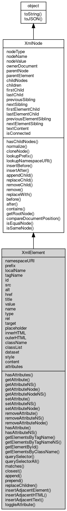

# Object XmlElement
XmlElement is the element node type of the fibjs XML/HTML DOM: the only node that

carries a tag name, namespace information and attributes, and the main handle used to
navigate, query, mutate and serialize a document

XmlElement extends [XmlNode](XmlNode.md); use the [XmlNode](XmlNode.md) members for the generic tree operations
(parentNode, childNodes, siblings, cloneNode, insertBefore, removeChild and so on) and the
XmlElement members below when a subtree is identified by an element — reading or changing
its attributes, searching its descendants or producing markup. Text, comment, attribute
and document nodes are separate interfaces.

Concepts:

- **XML and HTML mode**: the document chooses the mode when it is parsed or created. In XML
  mode tag and attribute names are case-sensitive, selectors are case-sensitive and empty
  elements serialize as `<tag/>`. In HTML mode tagName is upper-cased, attribute names are
  lower-cased, tag lookups and type selectors are case-insensitive and empty elements
  serialize as `<tag></tag>` or as a void tag such as `<br>`. Some members exist only in
  HTML mode (outerHTML, classList, style and dataset) and throw an invalid-call error
  (20009) in XML mode, and template content is null outside HTML mode; innerHTML, the
  attribute methods and the query methods work in both modes.
- **Node tree and ownership**: an element becomes part of a tree only when it is inserted.
  A node created by createElement has no parent until then, and every node records its
  ownerDocument. Inserting a node that belongs to another document adopts it (the
  ownerDocument changes and the node leaves the old tree); inserting a node that contains
  the element itself is rejected; re-inserting an existing node moves it.
- **Attributes vs properties**: attributes form an ordered map accessible through
  attributes, getAttribute, setAttribute and removeAttribute. Names are used as-is in XML
  mode and lower-cased in HTML mode. The reflection properties (id, src, className and the
  other name reflectors) are convenience views of the same attributes: reading an absent
  one gives an empty string and writing an empty string removes the attribute. fibjs
  exposes the ten HTML name reflectors on every element in both modes, so they also work on
  XML elements; the standard defines them only on specific HTML elements.
- **Namespaces**: namespaceURI, prefix and localName describe an element's namespace; an
  element without a namespace reports null for namespaceURI and prefix, and its localName
  equals tagName. The `*NS` attribute and query methods match a namespace URI plus local
  name (`*` is a wildcard for either), and a prefix is only a serialization detail:
  declarations missing on the ancestors are added when the subtree is serialized.
- **Querying**: getElementsByTagName, getElementsByClassName, getElementById, querySelector
  and querySelectorAll search the descendants of the element and never return the element
  itself; matches tests the element itself and closest walks from the element up through
  its ancestors. Selectors support type, `#id`, `.class`, `[attr]` with `=`, `^=`, `$=`,
  `*=`, `~=`, `|=`, the descendant/`>`/`+`/`~` combinators and the `:first-child`,
  `:last-child`, `:nth-child()`, `:only-child`, `:not()`, `:is()`, `:where()` and `:has()`
  pseudo-classes; pseudo-elements never match. Query results are snapshots: they do not
  change when the document is mutated, so query again afterwards.
- **Insertion and serialization**: append, prepend, replaceChildren and the insertAdjacent*
  family accept nodes and strings (strings become text nodes) and ignore values of any
  other type. Most return undefined; insertAdjacentElement returns the inserted element.
  Serialize with innerHTML (children only), outerHTML (the element and its children, HTML
  only), toString()/String(el) (a fibjs extension shared by the whole document model, the
  element and its children) or the [XMLSerializer](XMLSerializer.md) interface.
- **No events and no layout**: fibjs has no DOM dispatch pipeline and no rendering, so an
  XmlElement is not an EventTarget (no addEventListener, on or emit) and has no geometry
  members such as getBoundingClientRect. See the [DOMEvent](DOMEvent.md) interface for the standalone
  event [object](object.md).

Obtained from:
- `xml.parse(source[, type][, options])` — returns an [XmlDocument](XmlDocument.md); `documentElement` and
  the document query methods give XmlElement objects;
- `new [xml.Document](../../module/ifs/xml.md#Document)([type])` or `new XMLDocument([type])` — then createElement(name) /
  createElementNS(namespaceURI, qualifiedName) and insert the result yourself;
- `new [DOMParser](DOMParser.md)().parseFromString(source, mimeType)` — the same document API applies;
- tree operations: navigation properties (parentElement, children, firstElementChild,
  nextElementSibling ...), cloneNode, importNode, adoptNode and the [XmlNodeList](XmlNodeList.md) items
  returned by the query methods.

Example 1 — parse inline XML and read an element's name and attributes:

```JavaScript
const xml = require('xml');

const doc = xml.parse('<library><book id="b1" lang="en" pages="320">Dune</book></library>');
const book = doc.documentElement.firstElementChild;

console.log(book.tagName); // book
console.log(book.localName); // book
console.log(book.getAttribute('id')); // b1
console.log(book.getAttribute('missing')); // null
console.log(book.hasAttribute('pages')); // true
console.log(book.attributes.length); // 3
console.log(book.textContent); // Dune
```

Example 2 — navigate and query the tree:

```JavaScript
const xml = require('xml');

const doc = xml.parse('<catalog>' +
    '<book id="b1" class="fiction sale"><title>Dune</title></book>' +
    '<book id="b2" class="fiction"><title>Neuromancer</title></book>' +
    '</catalog>');
const catalog = doc.documentElement;

console.log(catalog.children.length); // 2
console.log(catalog.getElementsByTagName('book').length); // 2
console.log(catalog.getElementsByClassName('sale').length); // 1
console.log(catalog.querySelector('book.sale > title').textContent); // Dune
console.log(catalog.querySelectorAll('book').length); // 2

const second = catalog.getElementById('b2');
console.log(second.matches('book.fiction')); // true
console.log(second.closest('catalog') === catalog); // true
```

Example 3 — mutate attributes and children, then serialize:

```JavaScript
const xml = require('xml');

const doc = xml.parse('<menu><item>tea</item></menu>');
const menu = doc.documentElement;
const item = menu.firstElementChild;

item.setAttribute('price', '3');
item.append(' + milk');
item.insertAdjacentHTML('afterend', '<item>coffee</item>');
item.toggleAttribute('sold-out');

console.log(String(menu));
// <menu><item price="3" sold-out="">tea + milk</item><item>coffee</item></menu>
console.log(menu.querySelector('item[price]').textContent); // tea + milk
```

Example 4 — HTML mode reflection objects:

```JavaScript
const xml = require('xml');

const doc = xml.parse('<html><body>' +
    '<div id="hero" class="card wide" data-role="banner">Hi</div>' +
    '</body></html>', 'text/html');
const hero = doc.getElementById('hero');

console.log(hero.tagName); // DIV
console.log(hero.classList.contains('wide')); // true
console.log(hero.dataset.role); // banner

hero.classList.add('active');
hero.style.color = 'red';
console.log(hero.outerHTML);
// <div id="hero" class="card wide active" data-role="banner" style="color: red;">Hi</div>
```

## Inheritance

```dot
digraph {
    node [fontname="Helvetica,sans-Serif", fontsize=10, shape="record", style="filled", fillcolor="white"];

    object [tooltip="object", URL="object.md", label="{object|toString()\ltoJSON()\l}"];
    XmlNode [tooltip="XmlNode", URL="XmlNode.md", label="{XmlNode|nodeType\lnodeName\lnodeValue\lownerDocument\lparentNode\lparentElement\lchildNodes\lchildren\lfirstChild\llastChild\lpreviousSibling\lnextSibling\lfirstElementChild\llastElementChild\lpreviousElementSibling\lnextElementSibling\ltextContent\lisConnected\l|hasChildNodes()\lnormalize()\lcloneNode()\llookupPrefix()\llookupNamespaceURI()\linsertBefore()\linsertAfter()\lappendChild()\lreplaceChild()\lremoveChild()\lremove()\lreplaceWith()\lbefore()\lafter()\lcontains()\lgetRootNode()\lcompareDocumentPosition()\lisEqualNode()\lisSameNode()\l}"];
    XmlElement [tooltip="XmlElement", fillcolor="lightgray", id="me", label="{XmlElement|namespaceURI\lprefix\llocalName\ltagName\lid\lsrc\lalt\lhref\ltitle\lvalue\lname\ltype\lrel\ltarget\lplaceholder\linnerHTML\louterHTML\lclassName\lclassList\ldataset\lstyle\lcontent\lattributes\l|hasAttributes()\lgetAttribute()\lgetAttributeNS()\lgetAttributeNode()\lgetAttributeNodeNS()\lsetAttribute()\lsetAttributeNS()\lsetAttributeNode()\lremoveAttribute()\lremoveAttributeNS()\lremoveAttributeNode()\lhasAttribute()\lhasAttributeNS()\lgetElementsByTagName()\lgetElementsByTagNameNS()\lgetElementById()\lgetElementsByClassName()\lquerySelector()\lquerySelectorAll()\lmatches()\lclosest()\lappend()\lprepend()\lreplaceChildren()\linsertAdjacentElement()\linsertAdjacentHTML()\linsertAdjacentText()\ltoggleAttribute()\l}"];

    object -> XmlNode [dir=back];
    XmlNode -> XmlElement [dir=back];
}
```

## Properties
        
### namespaceURI
**String, The namespace URI of the element, or null when the element has no namespace**

```JavaScript
readonly String XmlElement.namespaceURI;
```

The URI identifies the namespace; the prefix is only a serialization detail, so
elements with different prefixes and the same URI are in the same namespace. Elements
created with createElement(name) and elements of an HTML document report null
(browsers put HTML elements in http://www.w3.org/1999/xhtml instead). Read it together
with localName and prefix, and use the NS query and attribute methods to match by URI.

--------------------------
### prefix
**String, Queries and sets the namespace prefix of the element**

```JavaScript
String XmlElement.prefix;
```

The value is null when the element has no namespace. The prefix is the short name
written before the colon (`p` in `<p:item>`); the pair namespaceURI plus localName
identifies the element. Assigning a non-empty prefix makes the serializer declare
`xmlns:<prefix>` when the prefix is not already in scope (walking up the ancestor
chain), and assigning an empty string clears the prefix. The value is not validated
against the URI, and assigning null or a non-string throws a type error (20005).

--------------------------
### localName
**String, The local name of the element, without the namespace prefix**

```JavaScript
readonly String XmlElement.localName;
```

For a prefixed element localName is the part after the colon (`item` for `<p:item>`);
for an element without a namespace it equals tagName. In HTML mode the name is
lower-cased (div for `<DIV>`) while tagName is upper-cased; in XML mode the parsed case
is preserved.

--------------------------
### tagName
**String, The tag name of the element, including the namespace prefix**

```JavaScript
readonly String XmlElement.tagName;
```

In HTML mode the name is upper-cased (DIV for `<div>`); in XML mode the parsed case is
preserved, so `<Item>` and `<item>` are different elements. tagName equals nodeName;
use localName when the prefix must be excluded and the NS query methods to match by
namespace.

--------------------------
### id
**String, Queries and sets the id attribute of the element**

```JavaScript
String XmlElement.id;
```

A reflection of the id attribute: reading is equivalent to getAttribute('id') and
returns an empty string when the attribute is absent; assigning an empty string removes
the attribute, any other string creates or updates it. The id is used by
getElementById and by the `#name` CSS selector; matches are exact and case-sensitive in
both modes. Works on XML elements as well.

--------------------------
### src
**String, Queries and sets the src attribute of the element**

```JavaScript
String XmlElement.src;
```

One of the ten HTML attribute reflectors that fibjs exposes on every element (see the
XmlElement class notes): reading is equivalent to getAttribute('src') and returns an
empty string when the attribute is absent, writing creates or updates it and writing an
empty string removes it. Unlike a browser the value is not resolved against the
document base URL and no element-specific processing (loading, decoding) happens, so it
behaves like a plain string attribute on any element and in XML mode as well.

--------------------------
### alt
**String, Queries and sets the alt attribute of the element**

```JavaScript
String XmlElement.alt;
```

Generic attribute reflection like src: reading gives the raw attribute value or an
empty string, writing syncs to the attribute and an empty string removes it. No
element-specific behavior is applied, so it works on any element in both XML and HTML
mode.

--------------------------
### href
**String, Queries and sets the href attribute of the element**

```JavaScript
String XmlElement.href;
```

Generic attribute reflection like src: reading gives the raw attribute value or an
empty string, writing syncs to the attribute and an empty string removes it. The value
is not resolved against the document base URL. Works on any element and in both modes.

--------------------------
### title
**String, Queries and sets the title attribute of the element**

```JavaScript
String XmlElement.title;
```

Generic attribute reflection like src; it never falls back to an ancestor title or to
the text content the way a browser tooltip would. Reading an absent attribute gives an
empty string and writing an empty string removes it.

--------------------------
### value
**String, Queries and sets the value attribute of the element**

```JavaScript
String XmlElement.value;
```

Generic attribute reflection like src, with one difference from browsers: it always
reads and writes the value attribute and never the current form value property
(input.value in a browser changes with typing without touching the attribute). Works on
any element and in both modes.

--------------------------
### name
**String, Queries and sets the name attribute of the element**

```JavaScript
String XmlElement.name;
```

Generic attribute reflection like src: the raw attribute is read and written, and no
element-specific semantics (form submission, radio grouping, window lookup) are
applied. Works on any element and in both modes.

--------------------------
### type
**String, Queries and sets the type attribute of the element**

```JavaScript
String XmlElement.type;
```

Generic attribute reflection like src: the attribute string is read and written as-is;
no known-values validation is performed (a browser reflects input.type only for the
values in its type table). Works on any element and in both modes.

--------------------------
### rel
**String, Queries and sets the rel attribute of the element**

```JavaScript
String XmlElement.rel;
```

Generic attribute reflection like src: the raw attribute is read and written, with no
link-type parsing. Works on any element and in both modes.

--------------------------
### target
**String, Queries and sets the target attribute of the element**

```JavaScript
String XmlElement.target;
```

Generic attribute reflection like src: the raw attribute is read and written, with no
browsing-context resolution. Works on any element and in both modes.

--------------------------
### placeholder
**String, Queries and sets the placeholder attribute of the element**

```JavaScript
String XmlElement.placeholder;
```

Generic attribute reflection like src: the raw attribute is read and written, with no
element applicability checks. Works on any element and in both modes.

--------------------------
### innerHTML
**String, Queries and sets the markup of the element's children**

```JavaScript
String XmlElement.innerHTML;
```

Reading serializes all child nodes (an empty string when there are none); empty
elements follow the document mode (`<b/>` in XML, `<b></b>` or a void tag such as
`<br>` in HTML) and special characters are escaped. Assigning replaces every child
node with the parsed content: in XML mode the fragment is parsed inside a temporary
root element, so it must be well-formed XML and a parse error (20024) leaves the
element unchanged; in HTML mode the fragment is parsed as HTML. Assigning a non-string
throws a type error (20005), and an empty string only clears the children. For a
`<template>` element in HTML mode, reading returns the serialization of the children
kept in content.

Example — replace the children and read the result back:

```JavaScript
const xml = require('xml');

const doc = xml.parse('<div><i>old</i></div>');
const div = doc.documentElement;

console.log(div.innerHTML); // <i>old</i>
div.innerHTML = '<b>new</b><u>text</u>';
console.log(div.innerHTML); // <b>new</b><u>text</u>
div.innerHTML = '';
console.log(String(div)); // <div/>
console.log(div.childNodes.length); // 0
```

--------------------------
### outerHTML
**String, Queries and sets the markup of the element and its children; HTML mode only**

```JavaScript
String XmlElement.outerHTML;
```

Reading serializes the element like toString(): HTML void elements are written without
an end tag (`<br>`) and empty non-void elements as `<tag></tag>`. Assigning parses the
HTML fragment and replaces the element in its parent with the parsed nodes; when the
element has no parent the assignment does nothing, and assigning to the document
element (a direct child of the document) throws an error (20024). XML mode has no
concept of HTML fragments, so both reading and writing throw an invalid-call error
(20009); use toString or the [XMLSerializer](XMLSerializer.md) interface instead.

--------------------------
### className
**String, Queries and sets the class attribute of the element**

```JavaScript
String XmlElement.className;
```

A reflection of the class attribute: reading is equivalent to getAttribute('class') and
returns an empty string when absent, writing an empty string removes the attribute.
The value is an opaque string here; the classList [object](object.md) tokenizes it in HTML mode.
Works on XML elements as well.

--------------------------
### classList
**[DOMTokenList](DOMTokenList.md), Returns the [DOMTokenList](DOMTokenList.md) wrapping the element's class attribute; HTML mode only**

```JavaScript
readonly DOMTokenList XmlElement.classList;
```

The [object](object.md) is created on first access and cached for the lifetime of the element, so
repeated reads return the same reference; changes made through it (add, remove,
toggle, replace) are written back to the class attribute and appear in the
serialization immediately. Reading the property in XML mode throws an invalid-call
error (20009); use className to read or write the whole attribute there.

Example — token-level class manipulation:

```JavaScript
const xml = require('xml');

const doc = xml.parse('<html><body><div class="card wide">Hi</div></body></html>',
    'text/html');
const div = doc.querySelector('div');

console.log(div.className); // card wide
console.log(div.classList.contains('wide')); // true
div.classList.remove('wide');
div.classList.add('active');
console.log(div.className); // card active
console.log(String(div)); // <div class="card active">Hi</div>
```

--------------------------
### dataset
**[DOMStringMap](DOMStringMap.md), Returns the [DOMStringMap](DOMStringMap.md) exposing the element's data-* attributes; HTML mode only**

```JavaScript
readonly DOMStringMap XmlElement.dataset;
```

Keys are the data-* attribute names converted to camelCase (data-user-id becomes
userId) and values are strings; assigning a value creates or updates the attribute,
assigning an empty string or deleting the key removes it, and a non-string assignment
is converted with String(). The [object](object.md) is cached per element and stays in sync with
attributes changed through the attribute methods. Reading the property in XML mode
throws an invalid-call error (20009).

Example — read and write data-* attributes through dataset:

```JavaScript
const xml = require('xml');

const doc = xml.parse('<html><body><div data-role="banner">Hi</div></body></html>',
    'text/html');
const div = doc.querySelector('div');

console.log(div.dataset.role); // banner
div.dataset.role = 'main';
div.dataset.count = 2;
console.log(String(div));
// <div data-role="main" data-count="2">Hi</div>
```

--------------------------
### style
**[CSSStyleDeclaration](CSSStyleDeclaration.md), Returns the [CSSStyleDeclaration](CSSStyleDeclaration.md) of the element's style attribute; HTML mode only**

```JavaScript
readonly CSSStyleDeclaration XmlElement.style;
```

The [object](object.md) is cached per element and is a live view of the inline style: changing a
camelCase property (style.maxWidth) or cssText updates the style attribute, and
changes made to the attribute are visible through the [object](object.md). Declarations are
serialized back into the attribute in the order they were set, and values set through
the [object](object.md) keep a trailing semicolon (`color: red;`) while a parsed attribute may not
have one. Reading the property in XML mode throws an invalid-call error (20009).

Example — read a parsed declaration and add one:

```JavaScript
const xml = require('xml');

const doc = xml.parse('<html><body><div style="margin: 0">Hi</div></body></html>',
    'text/html');
const div = doc.querySelector('div');

console.log(div.style.margin); // 0
div.style.color = 'red';
console.log(div.getAttribute('style')); // margin: 0; color: red;
```

--------------------------
### content
**[XmlDocumentFragment](XmlDocumentFragment.md), Returns the fragment holding the children of a template element; HTML mode only**

```JavaScript
readonly XmlDocumentFragment XmlElement.content;
```

For a `<template>` element the children are moved into the returned fragment on first
access and `childNodes` on the template itself becomes empty; modifying the fragment
changes what innerHTML returns, and the same fragment is returned on every access. For
any other element, and for XML documents, the property is null.

--------------------------
### attributes
**[XmlNamedNodeMap](XmlNamedNodeMap.md), Returns the named node map containing all attributes of the element**

```JavaScript
readonly XmlNamedNodeMap XmlElement.attributes;
```

The attributes are in document order. The returned [XmlNamedNodeMap](XmlNamedNodeMap.md) is live: it is the
element's attribute storage, so setAttribute/removeAttribute calls and attribute value
assignments are visible through it (and vice versa), and indexed access
(`attributes[0]`), length, item() and getNamedItem() all work. setNamedItem() and
removeNamedItem() are not implemented — mutate through setAttribute/removeAttribute
instead. It is empty (length 0) for an element without attributes; namespace
declarations are ordinary attributes here.

Example — read the map and change a value through it:

```JavaScript
const xml = require('xml');

const doc = xml.parse('<book id="b1" lang="en"/>');
const book = doc.documentElement;

console.log(book.attributes.length); // 2
console.log(book.attributes[0].name); // id
console.log(book.attributes.getNamedItem('lang').value); // en

book.attributes[0].value = 'b2';
console.log(book.getAttribute('id')); // b2
```

--------------------------
### nodeType
**Integer, Returns the type of the node, as one of the node type [constants](../../module/ifs/constants.md) of the [xml](../../module/ifs/xml.md)**

```JavaScript
readonly Integer XmlElement.nodeType;
```

[module](../../module/ifs/module.md)

The value is fixed when the node is created and cannot be changed. See the class
comment for the value of every concrete node class; the deprecated ENTITY_NODE,
ENTITY_REFERENCE_NODE and NOTATION_NODE [constants](../../module/ifs/constants.md) are declared for completeness but no
fibjs node reports them. The [XmlAttr](XmlAttr.md) interface is not an [XmlNode](XmlNode.md) and has no nodeType,
even though its conceptual type is ATTRIBUTE_NODE (2).

--------------------------
### nodeName
**String, Returns the name of the node, which is fixed per node type**

```JavaScript
readonly String XmlElement.nodeName;
```

The value per concrete class:
- XmlElement: the tag name (tagName; upper-cased for elements parsed in HTML mode);
- [XmlText](XmlText.md): `\#text`;
- [XmlCDATASection](XmlCDATASection.md): `\#cdata-section`;
- [XmlProcessingInstruction](XmlProcessingInstruction.md): the target;
- [XmlComment](XmlComment.md): `\#comment`;
- [XmlDocument](XmlDocument.md): `\#document`;
- [XmlDocumentType](XmlDocumentType.md): the doctype name;
- [XmlDocumentFragment](XmlDocumentFragment.md): `\#document-fragment`.
The [XmlAttr](XmlAttr.md) interface declares its own nodeName (the attribute name).

--------------------------
### nodeValue
**String, Reads and writes the data carried by a leaf node**

```JavaScript
String XmlElement.nodeValue;
```

The value per node type:
- [XmlText](XmlText.md), [XmlCDATASection](XmlCDATASection.md) and [XmlComment](XmlComment.md): the character data;
- [XmlProcessingInstruction](XmlProcessingInstruction.md): the instruction data (not the target);
- XmlElement, [XmlDocument](XmlDocument.md), [XmlDocumentType](XmlDocumentType.md) and [XmlDocumentFragment](XmlDocumentFragment.md): null, and
  assigning to them is silently ignored.

The [XmlAttr](XmlAttr.md) interface declares its own nodeValue (the attribute value); the
[XmlCharacterData](XmlCharacterData.md) interface adds data, length and the substring/append/insert/delete/
replace members shared by text, CDATA and comment nodes.

--------------------------
### ownerDocument
**[XmlDocument](XmlDocument.md), Returns the document that owns the node**

```JavaScript
readonly XmlDocument XmlElement.ownerDocument;
```

The owner is the document that created the node, the importing document for importNode,
the target document for an insertion across documents, and the new document after
adoptNode; it survives detaching the node, so a detached node still reports its owner.
A document node returns itself here. Not in the standard: the DOM defines
Document.ownerDocument as null.

--------------------------
### parentNode
**[XmlNode](XmlNode.md), Returns the parent node, or null when the node is the root of its tree or is**

```JavaScript
readonly XmlNode XmlElement.parentNode;
```

detached

A document node always reports null; the parent of documentElement is the document
itself.

--------------------------
### parentElement
**XmlElement, Returns the parent when it is an element, otherwise null**

```JavaScript
readonly XmlElement XmlElement.parentElement;
```

A document, document fragment or detached node as parent yields null, so the member
answers "is my parent an element" rather than "what is my parent"; use parentNode for
the parent whatever its type.

--------------------------
### childNodes
**[XmlNodeList](XmlNodeList.md), Returns the live list of the child nodes**

```JavaScript
readonly XmlNodeList XmlElement.childNodes;
```

The same [XmlNodeList](XmlNodeList.md) [object](object.md) is returned on every access, and it is the structural list
of the node itself, so later insertions and removals are visible immediately
(childNodes.length grows and shrinks). Reading it does not take a snapshot; iterate
with the [XmlNodeList](XmlNodeList.md) members (length, item, the index and iterator members) or
serialize it to markup with toString().

--------------------------
### children
**[XmlNodeList](XmlNodeList.md), Returns the element-only view of the child nodes**

```JavaScript
readonly XmlNodeList XmlElement.children;
```

Text, CDATA, comment and processing-instruction children are filtered out, so
children.length is the number of child elements. The view is cached and rebuilt after
a mutation; for the live structural list of every child node use childNodes.

--------------------------
### firstChild
**[XmlNode](XmlNode.md), Returns the first child node, or null when the node has no children**

```JavaScript
readonly XmlNode XmlElement.firstChild;
```

Shorthand for `childNodes[0]`; the child can be of any node type.

--------------------------
### lastChild
**[XmlNode](XmlNode.md), Returns the last child node, or null when the node has no children**

```JavaScript
readonly XmlNode XmlElement.lastChild;
```

Shorthand for the last entry of childNodes; the child can be of any node type.

--------------------------
### previousSibling
**[XmlNode](XmlNode.md), Returns the sibling immediately before the node at the same tree level, or**

```JavaScript
readonly XmlNode XmlElement.previousSibling;
```

null when it is the first child or the node is detached

--------------------------
### nextSibling
**[XmlNode](XmlNode.md), Returns the sibling immediately after the node at the same tree level, or**

```JavaScript
readonly XmlNode XmlElement.nextSibling;
```

null when it is the last child or the node is detached

--------------------------
### firstElementChild
**[XmlNode](XmlNode.md), Returns the first child element, skipping non-element children, or null when**

```JavaScript
readonly XmlNode XmlElement.firstElementChild;
```

there is none

--------------------------
### lastElementChild
**[XmlNode](XmlNode.md), Returns the last child element, skipping non-element children, or null when**

```JavaScript
readonly XmlNode XmlElement.lastElementChild;
```

there is none

--------------------------
### previousElementSibling
**[XmlNode](XmlNode.md), Returns the nearest preceding sibling element, or null when there is none**

```JavaScript
readonly XmlNode XmlElement.previousElementSibling;
```

Non-element siblings between the node and the result are skipped; the walk happens in
the parent's child list.

--------------------------
### nextElementSibling
**[XmlNode](XmlNode.md), Returns the nearest following sibling element, or null when there is none**

```JavaScript
readonly XmlNode XmlElement.nextElementSibling;
```

Non-element siblings between the node and the result are skipped; the walk happens in
the parent's child list.

--------------------------
### textContent
**String, Reads and writes the text content of the node**

```JavaScript
String XmlElement.textContent;
```

Reading returns the concatenation of the data of all descendant text nodes in document
order (CDATA sections included); text, CDATA, comment and processing-instruction nodes
return their own data, and document, doctype and fragment nodes return an empty string.
Writing to an element removes all of its children and appends a single new text node
with the given value (an empty value creates an empty text node); writing to a document
is silently ignored. The member never joins adjacent text nodes - call normalize() when
a canonical shape is needed.

--------------------------
### isConnected
**Boolean, Queries whether the node is part of a document tree**

```JavaScript
readonly Boolean XmlElement.isConnected;
```

A node is connected when the root of its tree is a document, which includes the
document node itself; a freshly created or detached node, and every node of a detached
subtree, is not connected. This is a read-only computed property.

## Methods
        
### hasAttributes
**Checks whether the element has any attributes**

```JavaScript
Boolean XmlElement.hasAttributes();
```

Returns:
* Boolean, returns true if the current element has attributes, otherwise returns false

Equivalent to `attributes.length > 0`; a freshly created element has none. Namespace
declarations (xmlns and xmlns:*) count as attributes.

--------------------------
### getAttribute
**Returns the value of an attribute by name**

```JavaScript
String XmlElement.getAttribute(String name);
```

Parameters:
* name: String, the name of the attribute to query

Returns:
* String, returns the value of the attribute, or null if there is no such attribute

Returns null when the attribute is absent, the same as a browser. Names are matched
exactly in XML mode and lower-cased in HTML mode, so getAttribute('ID') finds the id
attribute of an HTML element; an empty name returns null. The raw attribute text is
returned — no URL resolution or element-specific conversion is applied. Use
hasAttribute when only the presence matters.

Example — read present and absent attributes:

```JavaScript
const xml = require('xml');

const img = xml.parse('').documentElement;

console.log(img.getAttribute('src')); // a.png
console.log(img.getAttribute('title')); // null
console.log(img.hasAttribute('alt')); // true
```

--------------------------
### getAttributeNS
**Returns the value of an attribute by namespace URI and local name**

```JavaScript
String XmlElement.getAttributeNS(String namespaceURI,
    String localName);
```

Parameters:
* namespaceURI: String, the namespace URI to query
* localName: String, the name of the attribute to query

Returns:
* String, returns the value of the attribute, or null if there is no such attribute

The lookup uses the namespace identity instead of the serialized prefix, so an
attribute written as `x:k` is found by its URI regardless of the prefix used in the
markup. Pass the empty string or null as namespaceURI to match an attribute without a
namespace. Returns null when no matching attribute exists.

--------------------------
### getAttributeNode
**Returns the attribute node with the specified name**

```JavaScript
XmlAttr XmlElement.getAttributeNode(String name);
```

Parameters:
* name: String, the name of the attribute to query

Returns:
* [XmlAttr](XmlAttr.md), returns the [XmlAttr](XmlAttr.md) [object](object.md) with the specified name, or null if there is no such attribute

Returns the [XmlAttr](XmlAttr.md) [object](object.md) owned by the element (its name, value and namespace
properties are readable and value is writable) or null when the attribute is absent.
The name is matched like getAttribute. Detach the node with removeAttributeNode to move
it to another element; an attribute still owned by an element cannot be attached
elsewhere.

--------------------------
### getAttributeNodeNS
**Returns the attribute node with the specified namespace URI and local name**

```JavaScript
XmlAttr XmlElement.getAttributeNodeNS(String namespaceURI,
    String localName);
```

Parameters:
* namespaceURI: String, the namespace URI to query
* localName: String, the name of the attribute to query

Returns:
* [XmlAttr](XmlAttr.md), returns the [XmlAttr](XmlAttr.md) [object](object.md) with the specified name, or null if there is no such attribute

Like getAttributeNode but matching by namespace URI and local name instead of the
serialized name; returns null when no attribute matches. A namespace URI with an empty
local name (or vice versa) never matches.

--------------------------
### setAttribute
**Creates or changes an attribute**

```JavaScript
XmlElement.setAttribute(String name,
    String value);
```

Parameters:
* name: String, the name of the attribute to set
* value: String, the value of the attribute to set

If the element already has an attribute with that name its value is replaced in place
(the position in the attribute list is kept); otherwise a new attribute is appended.
The name is used as-is in XML mode and lower-cased in HTML mode. Both arguments must be
strings: a number, boolean, null or undefined throws a type error (20005) instead of
being converted, which differs from the Web IDL coercion browsers apply — convert the
value explicitly.

--------------------------
### setAttributeNS
**Creates or changes an attribute with a namespace**

```JavaScript
XmlElement.setAttributeNS(String namespaceURI,
    String qualifiedName,
    String value);
```

Parameters:
* namespaceURI: String, the namespace URI to set
* qualifiedName: String, the name of the attribute to set
* value: String, the value of the attribute to set

Like setAttribute, but the attribute is identified by namespace URI plus qualified name
(prefix:localName): an existing attribute with the same URI and local name gets the new
value and prefix, otherwise a new attribute is created. The prefix is a serialization
hint only — getAttributeNS matches by URI and local name. Declarations for the reserved
`xml` and `xmlns` prefixes are ignored. All three arguments must be strings or a type
error (20005) is thrown.

Example — create a namespaced attribute and read it back:

```JavaScript
const xml = require('xml');

const doc = xml.parse('<root xmlns:p="urn:p"><p:item/></root>');
const item = doc.documentElement.firstElementChild;

item.setAttributeNS('urn:p', 'p:code', 'X1');
console.log(item.getAttributeNS('urn:p', 'code')); // X1
console.log(item.getAttribute('p:code')); // X1
console.log(String(item)); // <p:item p:code="X1"/>
```

--------------------------
### setAttributeNode
**Attaches an [XmlAttr](XmlAttr.md) [object](object.md) to the element**

```JavaScript
XmlAttr XmlElement.setAttributeNode(XmlAttr attr);
```

Parameters:
* attr: [XmlAttr](XmlAttr.md), the [XmlAttr](XmlAttr.md) [object](object.md) to set

Returns:
* [XmlAttr](XmlAttr.md), returns the replaced [XmlAttr](XmlAttr.md) [object](object.md), or NULL if nothing was replaced

The attribute's name and namespace decide which attribute it replaces: when the element
already has one with the same name, the replaced [XmlAttr](XmlAttr.md) is returned, otherwise null is
returned. The attribute must belong to no element or to this one; an attribute owned by
another element is rejected with an error (20024) — remove it there first — and passing
one of the element's own attributes just returns it without changing anything.

--------------------------
### removeAttribute
**Removes an attribute by name**

```JavaScript
XmlElement.removeAttribute(String name);
```

Parameters:
* name: String, the name of the attribute to remove

Does nothing (no error) when the element has no attribute with that name; the name is
lower-cased first in HTML mode. Use removeAttributeNS to remove by namespace URI and
local name, or removeAttributeNode to remove a specific [XmlAttr](XmlAttr.md) [object](object.md).

--------------------------
### removeAttributeNS
**Removes an attribute by namespace URI and local name**

```JavaScript
XmlElement.removeAttributeNS(String namespaceURI,
    String localName);
```

Parameters:
* namespaceURI: String, the namespace URI to remove
* localName: String, the name of the attribute to remove

The attribute is located by namespace identity, not by the serialized prefix, so it is
removed regardless of how the prefix was written; nothing happens when no attribute
matches. Pass the empty string or null as namespaceURI for an attribute without a
namespace.

--------------------------
### removeAttributeNode
**Detaches an attribute node from the element**

```JavaScript
XmlAttr XmlElement.removeAttributeNode(XmlAttr attr);
```

Parameters:
* attr: [XmlAttr](XmlAttr.md), the [XmlAttr](XmlAttr.md) [object](object.md) to remove

Returns:
* [XmlAttr](XmlAttr.md), returns the removed [XmlAttr](XmlAttr.md) [object](object.md)

The [XmlAttr](XmlAttr.md) [object](object.md) must currently belong to this element: the removed node is returned
and becomes detached, so it can be attached to another element with setAttributeNode.
An attribute owned by another element, or one that was already removed, throws an error
(20024), which is stricter than a browser's DOMException — check hasAttribute or
getAttributeNode before calling.

--------------------------
### hasAttribute
**Checks whether the element has an attribute with the specified name**

```JavaScript
Boolean XmlElement.hasAttribute(String name);
```

Parameters:
* name: String, the name of the attribute to query

Returns:
* Boolean, returns true if the current element node has the specified attribute, otherwise returns false

Matching follows getAttribute: exact in XML mode, lower-cased in HTML mode; an empty
name is never present. Namespace declarations count as attributes.

--------------------------
### hasAttributeNS
**Checks whether the element has an attribute with the given namespace and name**

```JavaScript
Boolean XmlElement.hasAttributeNS(String namespaceURI,
    String localName);
```

Parameters:
* namespaceURI: String, the namespace URI to query
* localName: String, the name of the attribute to query

Returns:
* Boolean, returns true if the current element node has the specified attribute, otherwise returns false

The namespace URI takes precedence over the serialized prefix; pass the empty string or
null as namespaceURI to [test](../../module/ifs/test.md) an attribute without a namespace.

--------------------------
### getElementsByTagName
**Returns a snapshot list of all descendant elements with the specified tag name**

```JavaScript
XmlNodeList XmlElement.getElementsByTagName(String tagName);
```

Parameters:
* tagName: String, the tag name to retrieve. The value "*" matches all tags

Returns:
* [XmlNodeList](XmlNodeList.md), an [XmlNodeList](XmlNodeList.md) collection of XmlElement nodes with the specified tag in the node tree

Only descendants are returned — the element itself is never part of the result — and
the value "*" matches every element. HTML mode compares tag names case-insensitively
(`DIV` and `div` both match) while XML mode is case-sensitive. The returned [XmlNodeList](XmlNodeList.md)
is a snapshot taken at call time, so later insertions, removals and renames are not
reflected in the same list: query again after mutating. getElementsByTagNameNS matches
by namespace and local name, getElementsByClassName by class, and the querySelector
methods by arbitrary CSS selectors.

Example — subtree scope and the wildcard:

```JavaScript
const xml = require('xml');

const doc = xml.parse('<root><a><b><c/></b></a><b/><d/></root>');
const root = doc.documentElement;

console.log(root.getElementsByTagName('b').length); // 2
console.log(root.getElementsByTagName('*').length); // 5
console.log(root.getElementsByTagName('root').length); // 0: self is not searched
```

--------------------------
### getElementsByTagNameNS
**Returns a snapshot list of all descendant elements matching a namespace and name**

```JavaScript
XmlNodeList XmlElement.getElementsByTagNameNS(String namespaceURI,
    String localName);
```

Parameters:
* namespaceURI: String, the namespace URI to query
* localName: String, the tag name to retrieve. The value "*" matches all tags

Returns:
* [XmlNodeList](XmlNodeList.md), an [XmlNodeList](XmlNodeList.md) collection of XmlElement nodes with the specified tag in the node tree

Element names are matched by namespace identity rather than the serialized prefix, and
"*" works as a wildcard for either argument: "*" as namespaceURI matches elements in
any namespace including none, and "*" as localName matches every local name. Like
getElementsByTagName the result is a snapshot and excludes the element itself. Elements
created by createElement(name) have no namespace, so they only match the "*" namespace
form.

--------------------------
### getElementById
**Returns the first descendant element with the specified id attribute**

```JavaScript
XmlElement XmlElement.getElementById(String id);
```

Parameters:
* id: String, the id to retrieve

Returns:
* XmlElement, the XmlElement node with the specified id attribute, or null if there is no match

A fibjs extension: the DOM standard defines getElementById on Document only; here the
search is limited to the descendants of this element, so the element itself and its
ancestors can never be returned. The value is compared exactly and case-sensitively in
both modes, the first element in document order wins when an id is duplicated, and null
is returned for an empty id or no match. Elements whose id was assigned through the id
property or setAttribute are found.

Example — element-scoped lookup does not see ancestors:

```JavaScript
const xml = require('xml');

const doc = xml.parse('<root><item id="i1"/><section><item id="i2"/></section></root>');
const section = doc.getElementsByTagName('section')[0];

console.log(String(section.getElementById('i2'))); // <item id="i2"/>
console.log(section.getElementById('i1')); // null: i1 is outside the subtree
console.log(doc.getElementById('i1') !== null); // true
```

--------------------------
### getElementsByClassName
**Returns a snapshot list of all descendant elements with the specified class name**

```JavaScript
XmlNodeList XmlElement.getElementsByClassName(String className);
```

Parameters:
* className: String, the class name to retrieve

Returns:
* [XmlNodeList](XmlNodeList.md), an [XmlNodeList](XmlNodeList.md) collection of XmlElement nodes with the specified class name in the document tree

The element itself is excluded. The argument may list several class names separated by
whitespace; an element matches only when it carries every one of them. Class names are
compared case-sensitively in both XML and HTML mode. The returned [XmlNodeList](XmlNodeList.md) is a
snapshot rather than a live collection, so query again after changing the tree or the
class attributes.

--------------------------
### querySelector
**Returns the first descendant element matching a CSS selector**

```JavaScript
XmlElement XmlElement.querySelector(String selectors);
```

Parameters:
* selectors: String, the CSS selector

Returns:
* XmlElement, the XmlElement node matching the specified CSS selector, or null if there is no match

The element itself is not a candidate and the first match in document order is
returned; when nothing matches, null is returned. An empty selector throws an error
(20024); other malformed selectors either throw the same error or yield no match,
depending on where the parse fails. Selector support: type, `#id`, `.class`, `[attr]`
with `=`, `^=`, `$=`, `*=`, `~=`, `|=`, the descendant/`>`/`+`/`~` combinators and the
`:first-child`, `:last-child`, `:nth-child()`, `:only-child`, `:not()`, `:is()`,
`:where()` and `:has()` pseudo-classes; pseudo-elements never match. Tag matching is
case-insensitive in HTML mode and case-sensitive in XML mode, while class and id
matching is case-sensitive in both modes. Use querySelectorAll for every match.

Example — select descendants by tag, class and position:

```JavaScript
const xml = require('xml');

const doc = xml.parse('<list><item class="odd">a</item><item class="even">b</item></list>');
const list = doc.documentElement;

console.log(list.querySelector('item.odd').textContent); // a
console.log(list.querySelector('item:nth-child(2)').textContent); // b
console.log(list.querySelectorAll('item').length); // 2
console.log(list.querySelector('list')); // null: self is not searched
```

--------------------------
### querySelectorAll
**Returns a snapshot list of all descendant elements matching a CSS selector**

```JavaScript
XmlNodeList XmlElement.querySelectorAll(String selectors);
```

Parameters:
* selectors: String, the CSS selector

Returns:
* [XmlNodeList](XmlNodeList.md), an [XmlNodeList](XmlNodeList.md) collection of XmlElement nodes matching the specified CSS selector

The results are in document order and exclude the element itself; the list is a
snapshot, so elements added after the call do not appear in it and nodes removed from
the document stay reachable through it while it is referenced. The selector syntax and
error behavior are those of querySelector; an empty selector throws (20024). The list
supports iteration, indexed access and a toString() that serializes the matched
elements.

--------------------------
### matches
**Tests whether the element itself matches a CSS selector**

```JavaScript
Boolean XmlElement.matches(String selectors);
```

Parameters:
* selectors: String, the CSS selector

Returns:
* Boolean, returns true if the current element matches the specified selector, otherwise returns false

Unlike querySelector this method does not search the descendants: it answers whether
the element would be selected by the selector, which makes it useful for conditional
logic. Selector syntax and case rules match querySelector, and a pseudo-element
selector always returns false. An empty or malformed selector throws (20024), and only
a string is accepted — a non-string argument throws a type error (20005) instead of
being converted. Use closest to find the nearest ancestor that matches.

Example — [test](../../module/ifs/test.md) the element and find a matching ancestor:

```JavaScript
const xml = require('xml');

const doc = xml.parse('<list><item class="odd">x</item></list>');
const item = doc.querySelector('item');

console.log(item.matches('item.odd')); // true
console.log(item.matches('item.even')); // false
console.log(item.matches('list > item')); // true
console.log(item.closest('list') !== null); // true
console.log(item.closest('missing')); // null
```

--------------------------
### closest
**Searches the element and its ancestors for the nearest one matching a CSS selector**

```JavaScript
XmlElement XmlElement.closest(String selectors);
```

Parameters:
* selectors: String, the CSS selector

Returns:
* XmlElement, returns the nearest matching ancestor element (possibly the element itself), or null if there is no match

The walk starts at the element itself (so closest can return the element) and continues
through parent elements until a match is found; null is returned when the root is
reached without a match, and non-element ancestors (a document or document fragment)
end the walk. The selector syntax and the error behavior are those of matches: an empty
selector throws (20024) and a non-string argument throws a type error (20005).

--------------------------
### append
**Appends one or more nodes to the end of the element's children**

```JavaScript
XmlElement.append(...nodes);
```

Parameters:
* nodes: ..., one or more nodes to add; can be node objects or strings

Each argument is either a node — which is moved here from its previous position — or a
string, which becomes a new text node; arguments of any other type (number, boolean,
null, undefined, plain [object](object.md)) are ignored silently, and a node that contains the
element is rejected. Arguments keep their order, so append('a', node) puts the text
node before the moved node. The method returns undefined. See prepend to insert at the
beginning, insertAdjacentElement/HTML/Text for the four relative positions, and
replaceChildren to replace the whole child list.

Example — append nodes and strings in order:

```JavaScript
const xml = require('xml');

const doc = xml.parse('<ul><li>1</li></ul>');
const ul = doc.documentElement;
const li = doc.createElement('li');
li.append('2');

ul.append(li, 'tail');
ul.prepend(doc.createElement('head'));
console.log(String(ul));
// <ul><head/><li>1</li><li>2</li>tail</ul>
```

--------------------------
### prepend
**Inserts one or more nodes at the beginning of the element's children**

```JavaScript
XmlElement.prepend(...nodes);
```

Parameters:
* nodes: ..., one or more nodes to add; can be node objects or strings

Like append but the arguments are inserted before the current first child; their order
is preserved, so prepend('a', 'b') produces the text "ab" in front of the previous
children. Strings become text nodes, other non-node values are ignored, and the method
returns undefined. Use append to insert at the end.

--------------------------
### replaceChildren
**Replaces all children of the element with the specified nodes**

```JavaScript
XmlElement.replaceChildren(...nodes);
```

Parameters:
* nodes: ..., one or more nodes to set; can be node objects or strings

Every existing child is removed first, then the arguments are appended exactly as
append does (strings become text nodes, other non-node values are ignored, nodes are
moved from their previous position). Called with no arguments it just empties the
element. Returns undefined.

--------------------------
### insertAdjacentElement
**Inserts an element node at a position relative to this element**

```JavaScript
XmlElement XmlElement.insertAdjacentElement(String position,
    XmlElement element);
```

Parameters:
* position: String, the insertion position
* element: XmlElement, the element node to insert

Returns:
* XmlElement, returns the inserted element, or null if there is no parent to insert into

The position argument is case-insensitive; the four values follow the DOM. 'beforebegin'
and 'afterend' insert into the parent at the sibling position and return null when the
element has no parent; 'afterbegin' and 'beforeend' insert as the first or last child.
On success the inserted element is returned. An unknown position throws an error
(20024) and a non-element argument throws a type error (20005). Use insertAdjacentText
for text and insertAdjacentHTML for markup; the [XmlNode](XmlNode.md) methods before/after handle the
general case.

--------------------------
### insertAdjacentHTML
**Parses markup and inserts the resulting nodes at a position relative to this element**

```JavaScript
XmlElement.insertAdjacentHTML(String position,
    String html);
```

Parameters:
* position: String, the insertion position
* html: String, the HTML text to insert

The position values are those of insertAdjacentElement ('beforebegin', 'afterbegin',
'beforeend', 'afterend', case-insensitive); 'beforebegin' and 'afterend' need a parent
— with a detached element they do not return (fibjs limitation, avoid that call) —
while 'afterbegin' and 'beforeend' always work. The markup is parsed according to the
document mode: an XML document parses the fragment as well-formed XML (a parse error
throws 20024 and nothing is inserted) and an HTML document parses it as HTML, so
several top-level nodes and unclosed tags are accepted. The parsed nodes are inserted
in order. An empty string does nothing and an unknown position throws (20024) before
any parsing. Use insertAdjacentElement for one element [object](object.md) and insertAdjacentText
for plain text.

Example — insert parsed markup as first and last child:

```JavaScript
const xml = require('xml');

const doc = xml.parse('<p><b>x</b></p>');
const p = doc.documentElement;

p.insertAdjacentHTML('afterbegin', '<i>a</i>');
p.insertAdjacentHTML('beforeend', '<i>b</i>');
console.log(String(p)); // <p><i>a</i><b>x</b><i>b</i></p>
```

--------------------------
### insertAdjacentText
**Inserts a text node at a position relative to this element**

```JavaScript
XmlElement.insertAdjacentText(String position,
    String text);
```

Parameters:
* position: String, the insertion position
* text: String, the text to insert

The text becomes one new text node at the position (the same four case-insensitive
values as insertAdjacentElement); characters are stored literally and escaped only when
the tree is serialized, so markup-looking text is safe. Inserts at
'beforebegin'/'afterend' are skipped when the element has no parent (the call still
returns). The method returns undefined.

--------------------------
### toggleAttribute
**Toggles a boolean attribute on the element**

```JavaScript
Boolean XmlElement.toggleAttribute(String name);
```

Parameters:
* name: String, the name of the attribute to toggle

Returns:
* Boolean, returns true if the attribute exists after the operation, otherwise returns false

If the attribute exists it is removed, otherwise it is added with an empty value — the
serialization shows `name=""`, which is how browsers represent boolean attributes. In
HTML mode the name is lower-cased first. Returns whether the attribute exists after the
operation. Use the two-argument form to force the state instead of toggling.

Example — toggle and force:

```JavaScript
const xml = require('xml');

const input = xml.parse('<input/>').documentElement;

console.log(input.toggleAttribute('checked')); // true: added
console.log(input.getAttribute('checked')); // "" (empty string)
console.log(input.toggleAttribute('checked')); // false: removed
console.log(input.toggleAttribute('checked', true)); // true: forced on
```

--------------------------
**Toggles a boolean attribute on the element with an explicit state**

```JavaScript
Boolean XmlElement.toggleAttribute(String name,
    Boolean force);
```

Parameters:
* name: String, the name of the attribute to toggle
* force: Boolean, if true, adds the attribute forcibly; if false, removes the attribute forcibly

Returns:
* Boolean, returns true if the attribute exists after the operation, otherwise returns false

`force` true adds the attribute with an empty value when it is missing and keeps it
otherwise; `force` false removes it when present and does nothing otherwise. The return
value is the resulting existence, so a force-true call always returns true and a
force-false call always returns false. In HTML mode the name is lower-cased first.

--------------------------
### hasChildNodes
**Queries whether the node has at least one child node**

```JavaScript
Boolean XmlElement.hasChildNodes();
```

Returns:
* Boolean, returns true when the child node list is not empty, otherwise false

Equivalent to `childNodes.length > 0`; text, comment, CDATA, processing-instruction
and element children all count.

--------------------------
### normalize
**Merges adjacent text nodes and removes empty text nodes in the whole subtree**

```JavaScript
XmlElement.normalize();
```

Every child list of the subtree is normalized, the root's included: runs of directly
adjacent text nodes are merged into the first one (through appendData) and text nodes
whose value is empty are removed. A comment, element, CDATA section or processing
instruction between two text nodes keeps them apart, and whitespace-only text nodes are
preserved because they are not empty. The walk is iterative, so very deep documents do
not overflow the native stack.

```JavaScript
const xml = require('xml');

const doc = xml.parse('<r>a<!--c-->b</r>');
const root = doc.documentElement;
root.appendChild(doc.createTextNode('X'));
root.appendChild(doc.createTextNode(''));

root.normalize();
console.log(root.childNodes.length); // 3
console.log(root.textContent); // abX
```

--------------------------
### cloneNode
**Creates a detached copy of the node**

```JavaScript
XmlNode XmlElement.cloneNode(Boolean deep = true);
```

Parameters:
* deep: Boolean, whether to copy the subtree of the node as well; the default is a deep copy

Returns:
* [XmlNode](XmlNode.md), returns the copied node

The copy keeps the ownerDocument of the source and has no parent. An element always
carries a copy of its attributes; the deep parameter defaults to true, so
`cloneNode()` copies the whole subtree, while the standard defaults to a shallow copy
(pass `cloneNode(false)` for that). Cloning a document also copies its declaration
(version, [encoding](../../module/ifs/encoding.md), standalone); cloning a document or a fragment produces a detached
tree.

```JavaScript
const xml = require('xml');

const doc = xml.parse('<r x="1"><a>t</a></r>');
const root = doc.documentElement;
const shallow = root.cloneNode(false);
const deep = root.cloneNode();

console.log(shallow.getAttribute('x')); // 1
console.log(shallow.childNodes.length); // 0
console.log(deep.childNodes.length); // 1
console.log(deep.parentNode); // null
```

--------------------------
### lookupPrefix
**Returns the namespace prefix bound to a namespace URI**

```JavaScript
String XmlElement.lookupPrefix(String namespaceURI);
```

Parameters:
* namespaceURI: String, the namespace URI to match

Returns:
* String, returns the matching prefix, or null when no binding is found

The search starts at the node itself for elements and at the parent for the other node
[types](../../module/ifs/types.md) (only elements store xmlns declarations); it walks up the ancestors and then
falls back to the built-in [xml](../../module/ifs/xml.md) and xmlns bindings. A document checks the built-in
bindings and then its root element. Returns null when nothing matches. A node created
with createElementNS stores the namespace fields without adding an xmlns declaration,
so such a detached element reports null until its subtree is parsed with an explicit
declaration (serialization adds the missing declaration).

--------------------------
### lookupNamespaceURI
**Returns the namespace URI bound to a prefix**

```JavaScript
String XmlElement.lookupNamespaceURI(String prefix);
```

Parameters:
* prefix: String, the prefix to match

Returns:
* String, returns the matching namespace URI, or null when no binding is found

The walk is the same as lookupPrefix: from the element itself (or from the parent for
the other node [types](../../module/ifs/types.md)) up through the ancestors, with the built-in [xml](../../module/ifs/xml.md) and xmlns
bindings resolved first. A document checks the built-in bindings and then its root
element. Returns null when nothing matches.

--------------------------
### insertBefore
**Inserts a node before an existing child of this node**

```JavaScript
XmlNode XmlElement.insertBefore(XmlNode newChild,
    XmlNode refChild);
```

Parameters:
* newChild: [XmlNode](XmlNode.md), the node to insert
* refChild: [XmlNode](XmlNode.md), the existing child the new node is inserted before

Returns:
* [XmlNode](XmlNode.md), returns the inserted node

refChild must already be a child of this node, otherwise an Error (20024) is thrown.
If newChild already has a parent it is moved here (it leaves the old tree first), a
DocumentFragment is spliced as its children, and a node owned by another document is
adopted (its ownerDocument changes). Inserting a node into its own descendant is
rejected. A non-node argument, including null, throws a TypeError (20005) - the
argument is not coerced.

--------------------------
### insertAfter
**Inserts a node after an existing child of this node (fibjs extension)**

```JavaScript
XmlNode XmlElement.insertAfter(XmlNode newChild,
    XmlNode refChild);
```

Parameters:
* newChild: [XmlNode](XmlNode.md), the node to insert
* refChild: [XmlNode](XmlNode.md), the existing child the new node is inserted after

Returns:
* [XmlNode](XmlNode.md), returns the inserted node

This member has no counterpart in the standard DOM (use insertBefore with the next
sibling instead). It behaves like insertBefore, but the node is placed after refChild,
which must already be a child of this node (Error 20024 otherwise). Moving, fragment
splicing and cross-document adoption follow the same rules.

--------------------------
### appendChild
**Appends a node as the last child of this node**

```JavaScript
XmlNode XmlElement.appendChild(XmlNode newChild);
```

Parameters:
* newChild: [XmlNode](XmlNode.md), the node to append

Returns:
* [XmlNode](XmlNode.md), returns the appended node (for a DocumentFragment, the fragment itself)

If newChild already has a parent it is moved here, a DocumentFragment is spliced as its
children (the fragment is emptied), and a node owned by another document is adopted.
The child rules of the parent still apply: a document accepts one element, one doctype,
processing instructions, comments and a fragment, but no text; an element accepts
elements, text, CDATA, entity references, processing instructions, comments and
fragments. A cycle (inserting an ancestor) or a disallowed node type throws an Error
(20024); a non-node argument throws a TypeError (20005).

```JavaScript
const xml = require('xml');

const doc = new xml.Document();
const list = doc.createElement('list');
doc.appendChild(list);

const added = list.appendChild(doc.createElement('item'));
console.log(added.nodeName); // item
console.log(added.parentNode === list); // true
```

--------------------------
### replaceChild
**Replaces an existing child with another node**

```JavaScript
XmlNode XmlElement.replaceChild(XmlNode newChild,
    XmlNode oldChild);
```

Parameters:
* newChild: [XmlNode](XmlNode.md), the replacement node
* oldChild: [XmlNode](XmlNode.md), the child to be replaced

Returns:
* [XmlNode](XmlNode.md), returns the replaced (old) child node

oldChild must be a child of this node (Error 20024 otherwise); it is detached and
returned. newChild is inserted at its position under the same rules as insertBefore,
including fragment splicing, moving and cross-document adoption. When newChild equals
oldChild the call is a no-op that returns the node.

--------------------------
### removeChild
**Removes a child node from this node**

```JavaScript
XmlNode XmlElement.removeChild(XmlNode oldChild);
```

Parameters:
* oldChild: [XmlNode](XmlNode.md), the child to remove

Returns:
* [XmlNode](XmlNode.md), returns the removed node

oldChild must be a child of this node, otherwise an Error (20024) is thrown; the child
is detached with its subtree intact and returned. Removing the document element from a
document sets documentElement to null, after which another element may be appended. A
non-node argument throws a TypeError (20005).

--------------------------
### remove
**Detaches the node from its parent and returns it**

```JavaScript
XmlNode XmlElement.remove();
```

Returns:
* [XmlNode](XmlNode.md), returns the detached node, or null when the node has no parent

Unlike removeChild, the node knows its parent: the call finds it and removes itself.
When the node has no parent (it is detached, or it is a document) the call has no
effect and returns null. For the document element this member only detaches the node:
the document still reports it through documentElement and refuses to accept another
element, because remove() bypasses the document-level slot release - use
document.removeChild(root) to clear the slot as well (see [XmlDocument.documentElement](XmlDocument.md#documentElement)).
In the standard this convenience lives on ChildNode, not on Node.

--------------------------
### replaceWith
**Replaces the node with one or more nodes**

```JavaScript
XmlElement.replaceWith(...nodes);
```

Parameters:
* nodes: ..., one or more nodes or strings that replace the current node

The new values are inserted in order before the node, which is then removed. Each
argument may be a node or a string (a string becomes a text node created by the owner
document); values of other [types](../../module/ifs/types.md) are ignored. When the node has no parent the call is a
no-op. The member returns nothing; ChildNode.replaceWith in the standard follows the
same rules.

--------------------------
### before
**Inserts one or more nodes before the current node**

```JavaScript
XmlElement.before(...nodes);
```

Parameters:
* nodes: ..., one or more nodes or strings to insert before the current node

The values are inserted under the same parent, before this node. Each argument may be a
node or a string (converted to a text node); values of other [types](../../module/ifs/types.md) are ignored, and
with no parent the call is a no-op. See insertBefore for the single-node form.

--------------------------
### after
**Inserts one or more nodes after the current node**

```JavaScript
XmlElement.after(...nodes);
```

Parameters:
* nodes: ..., one or more nodes or strings to insert after the current node

The values are inserted under the same parent, after this node, in argument order. Each
argument may be a node or a string (converted to a text node); values of other [types](../../module/ifs/types.md)
are ignored, and with no parent the call is a no-op. See insertAfter for the
single-node form.

--------------------------
### contains
**Checks whether this node is the given node or one of its ancestors**

```JavaScript
Boolean XmlElement.contains(XmlNode node);
```

Parameters:
* node: [XmlNode](XmlNode.md), the node to look for among the descendants

Returns:
* Boolean, returns true when the given node is this node or a descendant, otherwise false

The node itself counts as contained, so `x.contains(x)` is true; the check is
reference-based and does not compare structure. A cross-tree argument simply returns
false; a non-node argument throws a TypeError (20005).

--------------------------
### getRootNode
**Returns the topmost ancestor of the node**

```JavaScript
XmlNode XmlElement.getRootNode();
```

Returns:
* [XmlNode](XmlNode.md), returns the root of the tree the node belongs to

The result is the document for a connected node and the node itself when it is
detached. For a document the call returns the document, and for the document element it
returns the document as well.

--------------------------
### compareDocumentPosition
**Compares the position of another node against this node**

```JavaScript
Integer XmlElement.compareDocumentPosition(XmlNode other);
```

Parameters:
* other: [XmlNode](XmlNode.md), the node to compare against

Returns:
* Integer, returns the position bitmask

The result is a bitmask; [test](../../module/ifs/test.md) it with the bits below (they are not exported as
[constants](../../module/ifs/constants.md) by the [xml](../../module/ifs/xml.md) [module](../../module/ifs/module.md)):
- 0: the two references are the same node;
- 4 (FOLLOWING): the other node comes after this node in document order;
- 2 (PRECEDING): the other node comes before this node;
- 8 (CONTAINS): the other node is an ancestor of this node;
- 16 (CONTAINED_BY): the other node is a descendant of this node;
- 1 (DISCONNECTED): the two nodes are not in the same tree;
- 32 (IMPLEMENTATION_SPECIFIC): declared by the standard but never set here.

An ancestor/descendant result also carries the direction bit: 10 = CONTAINS |
PRECEDING when the other node is an ancestor, 20 = CONTAINED_BY | FOLLOWING when it is
a descendant. Two nodes in different trees - for example a detached node - yield
3 = DISCONNECTED | PRECEDING. An [XmlAttr](XmlAttr.md) is not an [XmlNode](XmlNode.md) and cannot be passed here
(TypeError 20005); a non-node argument throws the same error.

```JavaScript
const xml = require('xml');

const doc = xml.parse('<r><a/><b/></r>');
const a = doc.documentElement.firstChild;
const b = doc.documentElement.lastChild;

console.log(a.compareDocumentPosition(b)); // 4 (following)
console.log(b.compareDocumentPosition(a)); // 2 (preceding)
console.log(a.compareDocumentPosition(doc.documentElement)); // 10 (contains)
```

--------------------------
### isEqualNode
**Checks whether two nodes are structurally equal**

```JavaScript
Boolean XmlElement.isEqualNode(XmlNode other);
```

Parameters:
* other: [XmlNode](XmlNode.md), the node to compare with

Returns:
* Boolean, returns true when the two nodes are structurally equal, otherwise false

Two nodes are equal when they have the same node type and node name, the same node
value, the same attributes (an element's attributes are compared by name and value,
independent of order) and the same child list, compared recursively; text nodes are
compared by their character data, so whitespace and CDATA-versus-text differences are
significant. The comparison ignores the owning document and node identity, and it does
not see namespace declarations as attributes. A non-node argument throws a TypeError
(20005).

--------------------------
### isSameNode
**Checks whether two references point to the same node**

```JavaScript
Boolean XmlElement.isSameNode(XmlNode other);
```

Parameters:
* other: [XmlNode](XmlNode.md), the node to compare with

Returns:
* Boolean, returns true when both references point to the same node, otherwise false

Equivalent to the `===` operator; use isEqualNode for a structural comparison. A
non-node argument throws a TypeError (20005).

--------------------------
### toString
**Returns the string form of the [object](object.md)**

```JavaScript
String XmlElement.toString();
```

Returns:
* String, returns the string form of the [object](object.md)

The base implementation reports an error: a native [object](object.md) has no implicit
text form, and only the classes whose value can be written as a string
override the member. [Buffer](Buffer.md) returns its content decoded with the given
[encoding](../../module/ifs/encoding.md), [HttpCookie](HttpCookie.md) returns "name=value", and so on; an override commonly
accepts optional arguments ([Buffer.toString](Buffer.md#toString) takes [encoding](../../module/ifs/encoding.md), start and
end) that are not part of this declaration.

Calling the member on a class that does not override it throws
"<Class>: the [object](object.md) can not be converted to string.", which is the
behavior to rely on when probing whether a value has a string form. See
toJSON for the serialization hook.

--------------------------
### toJSON
**Returns the JSON representation of the [object](object.md)**

```JavaScript
Value XmlElement.toJSON(String key = "");
```

Parameters:
* key: String, the property name of the value being serialized

Returns:
* Value, returns the JSON-serializable value

JSON.stringify(value) calls value.toJSON(key) when the member exists and
serializes the returned value in its place; the key argument carries the
property name of the value inside its parent [object](object.md) (an empty string at
the top level) and may be used to build a keyed form. The base
implementation returns a plain [object](object.md) holding the readable properties of
the instance, so a native [object](object.md) serializes without per-class code; a
class with a portable shape such as [Buffer](Buffer.md) overrides it, and a JavaScript
class may override it in the same way.

The member is normally reached through JSON.stringify rather than called
directly; calling it returns the same value JSON.stringify would
serialize.

