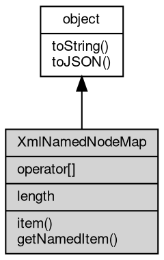

# Object XmlNamedNodeMap
The XmlNamedNodeMap [object](object.md) represents the attributes of an element as an

index- and name-addressable collection

fibjs keeps the attributes of every element in a map [object](object.md) and returns the same live
map from `element.attributes`. The map is not a node list: its entries are [XmlAttr](XmlAttr.md)
objects, and an element without attributes yields an empty map, not null.

Concepts:

- **Live collection**: the [object](object.md) is the attribute storage itself, not a copy.
  setAttribute, removeAttribute, setAttributeNode and value writes through an [XmlAttr](XmlAttr.md)
  are immediately visible in length and item(); the [object](object.md) identity does not change.
  Indexes follow document order (the order in which the attributes were set or
  parsed), even though the standard describes a NamedNodeMap as unordered.
- **Subset of the standard**: only length, item(), indexed access and getNamedItem()
  are exposed. setNamedItem, removeNamedItem, getNamedItemNS and the other
  NamedNodeMap methods of the standard are not available in fibjs; use the element
  methods setAttribute, setAttributeNS, removeAttribute, getAttributeNode and
  getAttributeNodeNS instead. The map is not iterable (no Symbol.iterator, forEach or
  entries).
- **Name lookup**: getNamedItem matches the qualified name as written (`n:v`,
  `xmlns:p`). In XML mode the comparison is exact and case-sensitive; in HTML mode a
  namespace-less attribute is matched case-insensitively (the parser lower-cases names
  anyway). A missing name returns null.
- **Namespace declarations** are ordinary entries of the map, so `xmlns` and `xmlns:p`
  can be found with getNamedItem and removed with removeAttribute.

Obtained from:
- `element.attributes` — the live attribute map of that element (the same [object](object.md) on
  every access); there is no constructor and no [global](../../module/ifs/global.md) export.

Example 1 — enumerate the attributes of an element:

```JavaScript
const xml = require('xml');

const doc = xml.parse('<book id="b1" lang="en" pages="320"/>');
const book = doc.documentElement;

console.log(book.attributes.length); // 3
for (let i = 0; i < book.attributes.length; i++) {
    const attr = book.attributes.item(i);
    console.log(attr.name + '=' + attr.value); // id=b1, lang=en, pages=320
}
console.log(book.attributes[1].name); // lang
console.log(book.attributes.getNamedItem('pages').value); // 320
console.log(book.attributes.getNamedItem('missing')); // null
```

Example 2 — the map is live and follows the element methods:

```JavaScript
const xml = require('xml');

const doc = xml.parse('<a x="1"/>');
const element = doc.documentElement;
const map = element.attributes;

console.log(map.length); // 1

element.setAttribute('y', '2');
console.log(map.length); // 2
console.log(map.item(1).name); // y
console.log(map === element.attributes); // true

element.removeAttribute('x');
console.log(map.length); // 1
console.log(map.item(0).name); // y
```

Example 3 — getNamedItem and qualified names:

```JavaScript
const xml = require('xml');

const doc = xml.parse('<svg xmlns:xlink="http://www.w3.org/1999/xlink" ' +
    'xlink:href="#a" viewBox="0 0 8 8"/>');
const map = doc.documentElement.attributes;

console.log(map.getNamedItem('xlink:href').value); // #a
console.log(map.getNamedItem('viewBox').value); // 0 0 8 8
console.log(map.getNamedItem('viewbox')); // null, XML is case-sensitive
console.log(map.getNamedItem('xmlns:xlink').namespaceURI);
// the xmlns namespace URI, http://www.w3.org/2000/xmlns/
```

## Inheritance


## Operators
        
### operator[]
**Data can be accessed directly with an index**

```JavaScript
readonly XmlAttr XmlNamedNodeMap[];
```

Equivalent to item(index) except that an out-of-range index yields undefined
rather than null.

## Properties
        
### length
**Integer, Returns the number of attributes in the attribute list**

```JavaScript
readonly Integer XmlNamedNodeMap.length;
```

The number is read live from the element, so it follows setAttribute,
removeAttribute and attribute removals performed through the map entries.

## Methods
        
### item
**Returns the attribute at the given index in the attribute list**

```JavaScript
XmlAttr XmlNamedNodeMap.item(Integer index);
```

Parameters:
* index: Integer, the index to query

Returns:
* [XmlAttr](XmlAttr.md), the attribute at the given index

Attributes are in document order; a negative index or an index greater than or
equal to length returns null, while indexed access returns undefined. A numeric
string is accepted.

--------------------------
### getNamedItem
**Queries the attribute with the given name**

```JavaScript
XmlAttr XmlNamedNodeMap.getNamedItem(String name);
```

Parameters:
* name: String, the name to query

Returns:
* [XmlAttr](XmlAttr.md), returns the queried attribute

The name is the qualified name (`v`, `n:v`, `xmlns:p`). The lookup is exact in XML
mode and case-insensitive in HTML mode for namespace-less attributes; a missing
attribute returns null. Use getAttributeNodeNS on the element for a lookup by
namespace URI plus local name, which the map does not provide.

Example — look up a namespaced attribute:

```JavaScript
const xml = require('xml');

const doc = xml.parse('<r xmlns:n="urn:k" n:v="1" v="2"/>');
const map = doc.documentElement.attributes;

console.log(map.getNamedItem('n:v').value); // 1
console.log(map.getNamedItem('v').value); // 2
console.log(map.getNamedItem('urn:k:v')); // null
```

--------------------------
### toString
**Returns the string form of the [object](object.md)**

```JavaScript
String XmlNamedNodeMap.toString();
```

Returns:
* String, returns the string form of the [object](object.md)

The base implementation reports an error: a native [object](object.md) has no implicit
text form, and only the classes whose value can be written as a string
override the member. [Buffer](Buffer.md) returns its content decoded with the given
[encoding](../../module/ifs/encoding.md), [HttpCookie](HttpCookie.md) returns "name=value", and so on; an override commonly
accepts optional arguments ([Buffer.toString](Buffer.md#toString) takes [encoding](../../module/ifs/encoding.md), start and
end) that are not part of this declaration.

Calling the member on a class that does not override it throws
"<Class>: the [object](object.md) can not be converted to string.", which is the
behavior to rely on when probing whether a value has a string form. See
toJSON for the serialization hook.

--------------------------
### toJSON
**Returns the JSON representation of the [object](object.md)**

```JavaScript
Value XmlNamedNodeMap.toJSON(String key = "");
```

Parameters:
* key: String, the property name of the value being serialized

Returns:
* Value, returns the JSON-serializable value

JSON.stringify(value) calls value.toJSON(key) when the member exists and
serializes the returned value in its place; the key argument carries the
property name of the value inside its parent [object](object.md) (an empty string at
the top level) and may be used to build a keyed form. The base
implementation returns a plain [object](object.md) holding the readable properties of
the instance, so a native [object](object.md) serializes without per-class code; a
class with a portable shape such as [Buffer](Buffer.md) overrides it, and a JavaScript
class may override it in the same way.

The member is normally reached through JSON.stringify rather than called
directly; calling it returns the same value JSON.stringify would
serialize.

