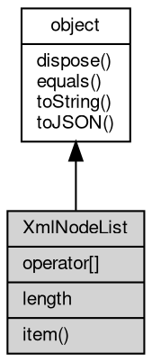

# 对象 XmlNodeList
XmlNodeList 对象代表一个有顺序的节点列表

## 继承关系


## 下标操作
        
**可使用下标直接访问数据**

```JavaScript
readonly XmlNode XmlNodeList[];
```

## 成员属性
        
### length
**Integer, 返回节点列表中的节点数目**

```JavaScript
readonly Integer XmlNodeList.length;
```

## 成员函数
        
### item
**返回节点列表中处于指定的索引号的节点**

```JavaScript
XmlNode XmlNodeList.item(Integer index);
```

调用参数:
* index: Integer, 指定要查询的索引

返回结果:
* [XmlNode](XmlNode.md), 指定索引号的节点

--------------------------
### dispose
**强制回收对象，调用此方法后，对象资源将立即释放**

```JavaScript
XmlNodeList.dispose();
```

--------------------------
### equals
**比较当前对象与给定的对象是否相等**

```JavaScript
Boolean XmlNodeList.equals(object expected);
```

调用参数:
* expected: [object](object.md), 制定比较的目标对象

返回结果:
* Boolean, 返回对象比较的结果

--------------------------
### toString
**返回对象的字符串表示，一般返回 "[Native Object]"，对象可以根据自己的特性重新实现**

```JavaScript
String XmlNodeList.toString();
```

返回结果:
* String, 返回对象的字符串表示

--------------------------
### toJSON
**返回对象的 JSON 格式表示，一般返回对象定义的可读属性集合**

```JavaScript
Value XmlNodeList.toJSON(String key = "");
```

调用参数:
* key: String, 未使用

返回结果:
* Value, 返回包含可 JSON 序列化的值

