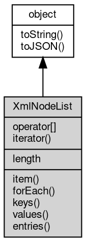

# 对象 XmlNodeList
XmlNodeList 对象代表一个有顺序的节点列表

## 继承关系

```dot
digraph {
    node [fontname="Helvetica,sans-Serif", fontsize=10, shape="record", style="filled", fillcolor="white"];

    object [tooltip="object", URL="object.md", label="{object|toString()\ltoJSON()\l}"];
    XmlNodeList [tooltip="XmlNodeList", fillcolor="lightgray", id="me", label="{XmlNodeList|operator[]\literator()\l|length\l|item()\lforEach()\lkeys()\lvalues()\lentries()\l}"];

    object -> XmlNodeList [dir=back];
}
```

## 操作符
        
### operator[]
**可使用下标直接访问数据**

```JavaScript
readonly XmlNode XmlNodeList[];
```

--------------------------
### @iterator
**查询当前对象元素的迭代器**

```JavaScript
Iterator XmlNodeList.@iterator();
```

返回结果:
* [Iterator](Iterator.md), 返回当前对象元素的迭代器

## 成员属性
        
### length
**Integer, 返回节点列表中的节点数目**

```JavaScript
readonly Integer XmlNodeList.length;
```

## 成员函数
        
### item
**返回节点列表中处于指定的索引号的节点**

```JavaScript
XmlNode XmlNodeList.item(Integer index);
```

调用参数:
* index: Integer, 指定要查询的索引

返回结果:
* [XmlNode](XmlNode.md), 指定索引号的节点

--------------------------
### forEach
**对列表中的每个节点执行一次指定的回调函数**

```JavaScript
XmlNodeList.forEach(Function callback);
```

调用参数:
* callback: Function, 对每个节点执行的回调函数，接收三个参数：当前节点、索引、节点列表本身

--------------------------
### keys
**返回一个迭代器，用于遍历节点列表中每个节点的索引**

```JavaScript
Iterator XmlNodeList.keys();
```

返回结果:
* [Iterator](Iterator.md), 返回索引迭代器

--------------------------
### values
**返回一个迭代器，用于遍历节点列表中每个节点的值**

```JavaScript
Iterator XmlNodeList.values();
```

返回结果:
* [Iterator](Iterator.md), 返回值迭代器

--------------------------
### entries
**返回一个迭代器，用于遍历节点列表中每个节点的 [索引, 值] 对**

```JavaScript
Iterator XmlNodeList.entries();
```

返回结果:
* [Iterator](Iterator.md), 返回键值对迭代器

--------------------------
### toString
**返回对象的字符串表示，一般返回 "[Native Object]"，对象可以根据自己的特性重新实现**

```JavaScript
String XmlNodeList.toString();
```

返回结果:
* String, 返回对象的字符串表示

--------------------------
### toJSON
**返回对象的 JSON 格式表示，一般返回对象定义的可读属性集合**

```JavaScript
Value XmlNodeList.toJSON(String key = "");
```

调用参数:
* key: String, 未使用

返回结果:
* Value, 返回包含可 JSON 序列化的值

