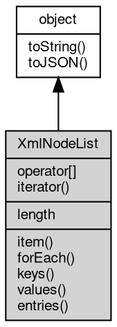

# Object XmlNodeList
The XmlNodeList [object](object.md) represents an ordered list of nodes, 0-based and

accessible by index

XmlNodeList is the collection type of the fibjs XML DOM. Two kinds of lists exist: the
live structural list of a node (`childNodes`) and the snapshot result lists returned by
the query methods. The interface is not constructible and not exported as a [global](../../module/ifs/global.md)
(typeof XmlNodeList is undefined).

Concepts:

- **Live and snapshot lists**: `node.childNodes` is the live storage of the child list
  - reading the property again returns the same [object](object.md) and later insertions and
  removals are reflected in its length and items. `node.children` is an element-only
  list computed at access time (a snapshot), and getElementsByTagName,
  getElementsByClassName, getElementsByTagNameNS and querySelectorAll return snapshot
  XmlNodeList objects that hold strong references to their nodes: they do not change
  when the document is mutated, so query again after a change. getElementById and
  querySelector return a single node, not a list.
- **Access**: item() returns null for an out-of-range index while indexed access
  returns undefined; there is no negative indexing. The list is not a JavaScript Array:
  it has no map/filter/slice methods, but it is iterable and provides forEach, keys,
  values and entries.
- **Iteration**: keys() yields the indexes, values() the nodes and entries() the
  [index, node] pairs; forEach invokes the callback synchronously with (node, index,
  list) and ignores its return value. The iterators are synchronous and the same
  protocol is exposed as the standard Symbol.iterator, so for...of walks the nodes.

Obtained from:
- `node.childNodes` — the live child list (the same [object](object.md) on every access);
- `node.children` — a snapshot of the element children;
- the document and element query methods getElementsByTagName, getElementsByTagNameNS,
  getElementsByClassName and querySelectorAll — snapshots in document order.

Example 1 — walk a live child list while mutating it:

```JavaScript
const xml = require('xml');

const doc = xml.parse('<list><item>a</item><item>b</item></list>');
const list = doc.documentElement;
const children = list.childNodes;

console.log(children.length); // 2
console.log(children.item(0).textContent); // a
list.appendChild(doc.createElement('item'));
console.log(children.length); // 3, the same object is live
console.log(children[2].nodeName); // item
```

Example 2 — a query result is a snapshot:

```JavaScript
const xml = require('xml');

const doc = xml.parse('<catalog><book/></catalog>');
const before = doc.getElementsByTagName('book');

doc.documentElement.appendChild(doc.createElement('book'));
console.log(before.length); // 1
console.log(doc.getElementsByTagName('book').length); // 2
```

Example 3 — iterate nodes, indexes and pairs:

```JavaScript
const xml = require('xml');

const doc = xml.parse('<r><a/><b/><c/></r>');
const nodes = doc.documentElement.childNodes;

for (const node of nodes) {
    console.log(node.nodeName); // a, then b, then c
}
console.log([...nodes.keys()].join(',')); // 0,1,2
console.log([...nodes.values()].length); // 3
console.log([...nodes.entries()][1][0]); // 1
nodes.forEach((node, index) => console.log(index, node.nodeName));
```

## Inheritance

```dot
digraph {
    node [fontname="Helvetica,sans-Serif", fontsize=10, shape="record", style="filled", fillcolor="white"];

    object [tooltip="object", URL="object.md", label="{object|toString()\ltoJSON()\l}"];
    XmlNodeList [tooltip="XmlNodeList", fillcolor="lightgray", id="me", label="{XmlNodeList|operator[]\literator()\l|length\l|item()\lforEach()\lkeys()\lvalues()\lentries()\l}"];

    object -> XmlNodeList [dir=back];
}
```

## Operators
        
### operator[]
**Data can be accessed directly with an index**

```JavaScript
readonly XmlNode XmlNodeList[];
```

Equivalent to item(index) except that an out-of-range index yields undefined
rather than null. The list is read-only.

--------------------------
### @iterator
**Queries the iterator of the elements of the current [object](object.md)**

```JavaScript
Iterator < XmlNode > XmlNodeList.@iterator();
```

Returns:
* [Iterator](Iterator.md)<[XmlNode](XmlNode.md)>, returns the iterator of the elements of the current [object](object.md)

The returned iterator yields the nodes in order and can be used with for...of and
the standard iterator protocol; the same [object](object.md) is exported as Symbol.iterator.

## Properties
        
### length
**Integer, Returns the number of nodes in the node list**

```JavaScript
readonly Integer XmlNodeList.length;
```

For a live list the value changes with the document; for a snapshot it is fixed at
the time the list was produced.

## Methods
        
### item
**Returns the node at the given index in the node list**

```JavaScript
XmlNode XmlNodeList.item(Integer index);
```

Parameters:
* index: Integer, the index to query

Returns:
* [XmlNode](XmlNode.md), the node at the given index

The index is 0-based and a numeric string is accepted. An out-of-range index
(including a negative one) returns null, while indexed access returns undefined in
the same case.

--------------------------
### forEach
**Calls the given callback function once for each node in the list**

```JavaScript
XmlNodeList.forEach(Function(XmlNode node, Integer index, XmlNodeList list) callback);
```

Parameters:
* callback: Function([XmlNode](XmlNode.md) node, Integer index, XmlNodeList list), the function called for each node with (node, index, list)

The callback receives the current node, its zero-based index and the list itself;
the return value of the callback is ignored and the whole list is visited unless
the callback throws.

Example — collect the names of the nodes in a child list:

```JavaScript
const xml = require('xml');

const doc = xml.parse('<r><a/><b/><c/></r>');
const names = [];

doc.documentElement.childNodes.forEach((node, index, list) => {
    names.push(index + ':' + node.nodeName);
    console.log(list === doc.documentElement.childNodes); // true
});
console.log(names.join(' ')); // 0:a 1:b 2:c
```

--------------------------
### keys
**Returns an iterator for traversing the index of each node in the node list**

```JavaScript
Iterator < Number > XmlNodeList.keys();
```

Returns:
* [Iterator](Iterator.md)<Number>, returns the index iterator

The indexes are yielded in ascending order, from 0 to length - 1. The iterator is
synchronous and can be used with for...of.

--------------------------
### values
**Returns an iterator for traversing the value of each node in the node list**

```JavaScript
Iterator < XmlNode > XmlNodeList.values();
```

Returns:
* [Iterator](Iterator.md)<[XmlNode](XmlNode.md)>, returns the value iterator

The nodes are yielded in document order, the same sequence as iterating the list
directly with for...of.

--------------------------
### entries
**Returns an iterator for traversing the [index, value] pairs of the nodes**

```JavaScript
Iterator XmlNodeList.entries();
```

Returns:
* [Iterator](Iterator.md), returns the key-value pair iterator

Example — pair each node with its index:

```JavaScript
const xml = require('xml');

const doc = xml.parse('<r><a/><b/></r>');

for (const pair of doc.documentElement.childNodes.entries()) {
    console.log(pair[0], pair[1].nodeName); // 0 a, then 1 b
}
```

--------------------------
### toString
**Returns the string form of the [object](object.md)**

```JavaScript
String XmlNodeList.toString();
```

Returns:
* String, returns the string form of the [object](object.md)

The base implementation reports an error: a native [object](object.md) has no implicit
text form, and only the classes whose value can be written as a string
override the member. [Buffer](Buffer.md) returns its content decoded with the given
[encoding](../../module/ifs/encoding.md), [HttpCookie](HttpCookie.md) returns "name=value", and so on; an override commonly
accepts optional arguments ([Buffer.toString](Buffer.md#toString) takes [encoding](../../module/ifs/encoding.md), start and
end) that are not part of this declaration.

Calling the member on a class that does not override it throws
"<Class>: the [object](object.md) can not be converted to string.", which is the
behavior to rely on when probing whether a value has a string form. See
toJSON for the serialization hook.

--------------------------
### toJSON
**Returns the JSON representation of the [object](object.md)**

```JavaScript
Value XmlNodeList.toJSON(String key = "");
```

Parameters:
* key: String, the property name of the value being serialized

Returns:
* Value, returns the JSON-serializable value

JSON.stringify(value) calls value.toJSON(key) when the member exists and
serializes the returned value in its place; the key argument carries the
property name of the value inside its parent [object](object.md) (an empty string at
the top level) and may be used to build a keyed form. The base
implementation returns a plain [object](object.md) holding the readable properties of
the instance, so a native [object](object.md) serializes without per-class code; a
class with a portable shape such as [Buffer](Buffer.md) overrides it, and a JavaScript
class may override it in the same way.

The member is normally reached through JSON.stringify rather than called
directly; calling it returns the same value JSON.stringify would
serialize.

