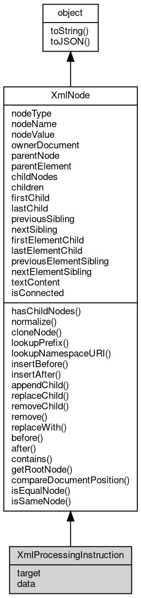

# Object XmlProcessingInstruction
The XmlProcessingInstruction [object](object.md) represents a processing instruction

(`<?target data?>`) in a document

A processing instruction carries the application target and an opaque string of
instruction data; the parser stores both as written and never interprets the data.
The XML declaration is not a processing instruction: the parser consumes
`<?[xml](../../module/ifs/xml.md) ...?>` as document metadata (see xmlVersion and the other declaration members
of [XmlDocument](XmlDocument.md)) and the declaration never appears in childNodes.

Concepts:

- **Content**: target is the name between `<?` and the first whitespace or `?>`; data
  is everything after the first whitespace up to `?>`, as a raw string (entities are
  not expanded and the value is not parsed as markup). data is read-write and
  nodeValue is an alias of it. The standard's textContent returns the data for this
  node type, but fibjs returns an empty string and ignores assignments, so use data.
- **Creation and validation**: document.createProcessingInstruction(target, data)
  creates a detached node that must be inserted to be serialized. fibjs validates
  neither argument: an empty target and a data string containing `?>` are accepted
  and can produce malformed markup, where the standard throws InvalidCharacterError.
  The reserved target `xml` is not rejected either.
- **Serialization**: String(pi) produces `<?target data?>` with a single space
  between target and data, and the class is not exported as a [global](../../module/ifs/global.md).

Obtained from:
- `xml.parse('<?[xml](../../module/ifs/xml.md)-stylesheet ...?><r/>')` — a processing instruction is a child of
  the document or of an element;
- `document.createProcessingInstruction(target, data)`;
- `node.cloneNode()` of another processing instruction.

Example 1 — read a stylesheet instruction from a parsed document:

```JavaScript
const xml = require('xml');

const doc = xml.parse('<?xml-stylesheet type="text/xsl" href="style.xsl"?><r/>');
const pi = doc.firstChild;

console.log(pi.nodeType); // 7
console.log(pi.target); // xml-stylesheet
console.log(pi.data); // type="text/xsl" href="style.xsl"
console.log(pi.nodeName); // xml-stylesheet
console.log(String(pi)); // <?xml-stylesheet type="text/xsl" href="style.xsl"?>
```

Example 2 — create, insert and update an instruction:

```JavaScript
const xml = require('xml');

const doc = xml.parse('<root/>');
const pi = doc.createProcessingInstruction('php', 'echo "hi";');

doc.documentElement.appendChild(pi);
console.log(String(doc)); // <root><?php echo "hi";?></root>

pi.data = 'echo "bye";';
console.log(String(doc)); // <root><?php echo "bye";?></root>
```

Example 3 — the XML declaration is not a node:

```JavaScript
const xml = require('xml');

const doc = xml.parse('<?xml version="1.0" encoding="utf-8"?><r/>');

console.log(doc.xmlVersion); // 1.0
console.log(doc.childNodes.length); // 1, the root element only
console.log(doc.firstChild.nodeName); // r
console.log(String(doc)); // <?xml version="1.0" encoding="utf-8"?><r/>
```

## Inheritance


## Properties
        
### target
**String, Returns the target of this processing instruction**

```JavaScript
readonly String XmlProcessingInstruction.target;
```

The name between `<?` and the first whitespace or `?>` (for example `php` or
`[xml](../../module/ifs/xml.md)-stylesheet`); nodeName returns the same string. Read-only.

--------------------------
### data
**String, Sets or returns the content of this processing instruction**

```JavaScript
String XmlProcessingInstruction.data;
```

The data is the raw string after the target up to `?>`; it is stored verbatim and
only string values are accepted (a non-string throws 20005). nodeValue is an alias
of this property and textContent is always an empty string.

Example — update the data and watch the serialization:

```JavaScript
const xml = require('xml');

const doc = xml.parse('<?xml-stylesheet href="a.css"?><r/>');

doc.firstChild.data = 'href="b.css"';
console.log(String(doc.firstChild)); // <?xml-stylesheet href="b.css"?>
```

--------------------------
### nodeType
**Integer, Returns the type of the node, as one of the node type [constants](../../module/ifs/constants.md) of the [xml](../../module/ifs/xml.md)**

```JavaScript
readonly Integer XmlProcessingInstruction.nodeType;
```

[module](../../module/ifs/module.md)

The value is fixed when the node is created and cannot be changed. See the class
comment for the value of every concrete node class; the deprecated ENTITY_NODE,
ENTITY_REFERENCE_NODE and NOTATION_NODE [constants](../../module/ifs/constants.md) are declared for completeness but no
fibjs node reports them. The [XmlAttr](XmlAttr.md) interface is not an [XmlNode](XmlNode.md) and has no nodeType,
even though its conceptual type is ATTRIBUTE_NODE (2).

--------------------------
### nodeName
**String, Returns the name of the node, which is fixed per node type**

```JavaScript
readonly String XmlProcessingInstruction.nodeName;
```

The value per concrete class:
- [XmlElement](XmlElement.md): the tag name (tagName; upper-cased for elements parsed in HTML mode);
- [XmlText](XmlText.md): `\#text`;
- [XmlCDATASection](XmlCDATASection.md): `\#cdata-section`;
- XmlProcessingInstruction: the target;
- [XmlComment](XmlComment.md): `\#comment`;
- [XmlDocument](XmlDocument.md): `\#document`;
- [XmlDocumentType](XmlDocumentType.md): the doctype name;
- [XmlDocumentFragment](XmlDocumentFragment.md): `\#document-fragment`.
The [XmlAttr](XmlAttr.md) interface declares its own nodeName (the attribute name).

--------------------------
### nodeValue
**String, Reads and writes the data carried by a leaf node**

```JavaScript
String XmlProcessingInstruction.nodeValue;
```

The value per node type:
- [XmlText](XmlText.md), [XmlCDATASection](XmlCDATASection.md) and [XmlComment](XmlComment.md): the character data;
- XmlProcessingInstruction: the instruction data (not the target);
- [XmlElement](XmlElement.md), [XmlDocument](XmlDocument.md), [XmlDocumentType](XmlDocumentType.md) and [XmlDocumentFragment](XmlDocumentFragment.md): null, and
  assigning to them is silently ignored.

The [XmlAttr](XmlAttr.md) interface declares its own nodeValue (the attribute value); the
[XmlCharacterData](XmlCharacterData.md) interface adds data, length and the substring/append/insert/delete/
replace members shared by text, CDATA and comment nodes.

--------------------------
### ownerDocument
**[XmlDocument](XmlDocument.md), Returns the document that owns the node**

```JavaScript
readonly XmlDocument XmlProcessingInstruction.ownerDocument;
```

The owner is the document that created the node, the importing document for importNode,
the target document for an insertion across documents, and the new document after
adoptNode; it survives detaching the node, so a detached node still reports its owner.
A document node returns itself here. Not in the standard: the DOM defines
Document.ownerDocument as null.

--------------------------
### parentNode
**[XmlNode](XmlNode.md), Returns the parent node, or null when the node is the root of its tree or is**

```JavaScript
readonly XmlNode XmlProcessingInstruction.parentNode;
```

detached

A document node always reports null; the parent of documentElement is the document
itself.

--------------------------
### parentElement
**[XmlElement](XmlElement.md), Returns the parent when it is an element, otherwise null**

```JavaScript
readonly XmlElement XmlProcessingInstruction.parentElement;
```

A document, document fragment or detached node as parent yields null, so the member
answers "is my parent an element" rather than "what is my parent"; use parentNode for
the parent whatever its type.

--------------------------
### childNodes
**[XmlNodeList](XmlNodeList.md), Returns the live list of the child nodes**

```JavaScript
readonly XmlNodeList XmlProcessingInstruction.childNodes;
```

The same [XmlNodeList](XmlNodeList.md) [object](object.md) is returned on every access, and it is the structural list
of the node itself, so later insertions and removals are visible immediately
(childNodes.length grows and shrinks). Reading it does not take a snapshot; iterate
with the [XmlNodeList](XmlNodeList.md) members (length, item, the index and iterator members) or
serialize it to markup with toString().

--------------------------
### children
**[XmlNodeList](XmlNodeList.md), Returns the element-only view of the child nodes**

```JavaScript
readonly XmlNodeList XmlProcessingInstruction.children;
```

Text, CDATA, comment and processing-instruction children are filtered out, so
children.length is the number of child elements. The view is cached and rebuilt after
a mutation; for the live structural list of every child node use childNodes.

--------------------------
### firstChild
**[XmlNode](XmlNode.md), Returns the first child node, or null when the node has no children**

```JavaScript
readonly XmlNode XmlProcessingInstruction.firstChild;
```

Shorthand for `childNodes[0]`; the child can be of any node type.

--------------------------
### lastChild
**[XmlNode](XmlNode.md), Returns the last child node, or null when the node has no children**

```JavaScript
readonly XmlNode XmlProcessingInstruction.lastChild;
```

Shorthand for the last entry of childNodes; the child can be of any node type.

--------------------------
### previousSibling
**[XmlNode](XmlNode.md), Returns the sibling immediately before the node at the same tree level, or**

```JavaScript
readonly XmlNode XmlProcessingInstruction.previousSibling;
```

null when it is the first child or the node is detached

--------------------------
### nextSibling
**[XmlNode](XmlNode.md), Returns the sibling immediately after the node at the same tree level, or**

```JavaScript
readonly XmlNode XmlProcessingInstruction.nextSibling;
```

null when it is the last child or the node is detached

--------------------------
### firstElementChild
**[XmlNode](XmlNode.md), Returns the first child element, skipping non-element children, or null when**

```JavaScript
readonly XmlNode XmlProcessingInstruction.firstElementChild;
```

there is none

--------------------------
### lastElementChild
**[XmlNode](XmlNode.md), Returns the last child element, skipping non-element children, or null when**

```JavaScript
readonly XmlNode XmlProcessingInstruction.lastElementChild;
```

there is none

--------------------------
### previousElementSibling
**[XmlNode](XmlNode.md), Returns the nearest preceding sibling element, or null when there is none**

```JavaScript
readonly XmlNode XmlProcessingInstruction.previousElementSibling;
```

Non-element siblings between the node and the result are skipped; the walk happens in
the parent's child list.

--------------------------
### nextElementSibling
**[XmlNode](XmlNode.md), Returns the nearest following sibling element, or null when there is none**

```JavaScript
readonly XmlNode XmlProcessingInstruction.nextElementSibling;
```

Non-element siblings between the node and the result are skipped; the walk happens in
the parent's child list.

--------------------------
### textContent
**String, Reads and writes the text content of the node**

```JavaScript
String XmlProcessingInstruction.textContent;
```

Reading returns the concatenation of the data of all descendant text nodes in document
order (CDATA sections included); text, CDATA, comment and processing-instruction nodes
return their own data, and document, doctype and fragment nodes return an empty string.
Writing to an element removes all of its children and appends a single new text node
with the given value (an empty value creates an empty text node); writing to a document
is silently ignored. The member never joins adjacent text nodes - call normalize() when
a canonical shape is needed.

--------------------------
### isConnected
**Boolean, Queries whether the node is part of a document tree**

```JavaScript
readonly Boolean XmlProcessingInstruction.isConnected;
```

A node is connected when the root of its tree is a document, which includes the
document node itself; a freshly created or detached node, and every node of a detached
subtree, is not connected. This is a read-only computed property.

## Methods
        
### hasChildNodes
**Queries whether the node has at least one child node**

```JavaScript
Boolean XmlProcessingInstruction.hasChildNodes();
```

Returns:
* Boolean, returns true when the child node list is not empty, otherwise false

Equivalent to `childNodes.length > 0`; text, comment, CDATA, processing-instruction
and element children all count.

--------------------------
### normalize
**Merges adjacent text nodes and removes empty text nodes in the whole subtree**

```JavaScript
XmlProcessingInstruction.normalize();
```

Every child list of the subtree is normalized, the root's included: runs of directly
adjacent text nodes are merged into the first one (through appendData) and text nodes
whose value is empty are removed. A comment, element, CDATA section or processing
instruction between two text nodes keeps them apart, and whitespace-only text nodes are
preserved because they are not empty. The walk is iterative, so very deep documents do
not overflow the native stack.

```JavaScript
const xml = require('xml');

const doc = xml.parse('<r>a<!--c-->b</r>');
const root = doc.documentElement;
root.appendChild(doc.createTextNode('X'));
root.appendChild(doc.createTextNode(''));

root.normalize();
console.log(root.childNodes.length); // 3
console.log(root.textContent); // abX
```

--------------------------
### cloneNode
**Creates a detached copy of the node**

```JavaScript
XmlNode XmlProcessingInstruction.cloneNode(Boolean deep = true);
```

Parameters:
* deep: Boolean, whether to copy the subtree of the node as well; the default is a deep copy

Returns:
* [XmlNode](XmlNode.md), returns the copied node

The copy keeps the ownerDocument of the source and has no parent. An element always
carries a copy of its attributes; the deep parameter defaults to true, so
`cloneNode()` copies the whole subtree, while the standard defaults to a shallow copy
(pass `cloneNode(false)` for that). Cloning a document also copies its declaration
(version, [encoding](../../module/ifs/encoding.md), standalone); cloning a document or a fragment produces a detached
tree.

```JavaScript
const xml = require('xml');

const doc = xml.parse('<r x="1"><a>t</a></r>');
const root = doc.documentElement;
const shallow = root.cloneNode(false);
const deep = root.cloneNode();

console.log(shallow.getAttribute('x')); // 1
console.log(shallow.childNodes.length); // 0
console.log(deep.childNodes.length); // 1
console.log(deep.parentNode); // null
```

--------------------------
### lookupPrefix
**Returns the namespace prefix bound to a namespace URI**

```JavaScript
String XmlProcessingInstruction.lookupPrefix(String namespaceURI);
```

Parameters:
* namespaceURI: String, the namespace URI to match

Returns:
* String, returns the matching prefix, or null when no binding is found

The search starts at the node itself for elements and at the parent for the other node
[types](../../module/ifs/types.md) (only elements store xmlns declarations); it walks up the ancestors and then
falls back to the built-in [xml](../../module/ifs/xml.md) and xmlns bindings. A document checks the built-in
bindings and then its root element. Returns null when nothing matches. A node created
with createElementNS stores the namespace fields without adding an xmlns declaration,
so such a detached element reports null until its subtree is parsed with an explicit
declaration (serialization adds the missing declaration).

--------------------------
### lookupNamespaceURI
**Returns the namespace URI bound to a prefix**

```JavaScript
String XmlProcessingInstruction.lookupNamespaceURI(String prefix);
```

Parameters:
* prefix: String, the prefix to match

Returns:
* String, returns the matching namespace URI, or null when no binding is found

The walk is the same as lookupPrefix: from the element itself (or from the parent for
the other node [types](../../module/ifs/types.md)) up through the ancestors, with the built-in [xml](../../module/ifs/xml.md) and xmlns
bindings resolved first. A document checks the built-in bindings and then its root
element. Returns null when nothing matches.

--------------------------
### insertBefore
**Inserts a node before an existing child of this node**

```JavaScript
XmlNode XmlProcessingInstruction.insertBefore(XmlNode newChild,
    XmlNode refChild);
```

Parameters:
* newChild: [XmlNode](XmlNode.md), the node to insert
* refChild: [XmlNode](XmlNode.md), the existing child the new node is inserted before

Returns:
* [XmlNode](XmlNode.md), returns the inserted node

refChild must already be a child of this node, otherwise an Error (20024) is thrown.
If newChild already has a parent it is moved here (it leaves the old tree first), a
DocumentFragment is spliced as its children, and a node owned by another document is
adopted (its ownerDocument changes). Inserting a node into its own descendant is
rejected. A non-node argument, including null, throws a TypeError (20005) - the
argument is not coerced.

--------------------------
### insertAfter
**Inserts a node after an existing child of this node (fibjs extension)**

```JavaScript
XmlNode XmlProcessingInstruction.insertAfter(XmlNode newChild,
    XmlNode refChild);
```

Parameters:
* newChild: [XmlNode](XmlNode.md), the node to insert
* refChild: [XmlNode](XmlNode.md), the existing child the new node is inserted after

Returns:
* [XmlNode](XmlNode.md), returns the inserted node

This member has no counterpart in the standard DOM (use insertBefore with the next
sibling instead). It behaves like insertBefore, but the node is placed after refChild,
which must already be a child of this node (Error 20024 otherwise). Moving, fragment
splicing and cross-document adoption follow the same rules.

--------------------------
### appendChild
**Appends a node as the last child of this node**

```JavaScript
XmlNode XmlProcessingInstruction.appendChild(XmlNode newChild);
```

Parameters:
* newChild: [XmlNode](XmlNode.md), the node to append

Returns:
* [XmlNode](XmlNode.md), returns the appended node (for a DocumentFragment, the fragment itself)

If newChild already has a parent it is moved here, a DocumentFragment is spliced as its
children (the fragment is emptied), and a node owned by another document is adopted.
The child rules of the parent still apply: a document accepts one element, one doctype,
processing instructions, comments and a fragment, but no text; an element accepts
elements, text, CDATA, entity references, processing instructions, comments and
fragments. A cycle (inserting an ancestor) or a disallowed node type throws an Error
(20024); a non-node argument throws a TypeError (20005).

```JavaScript
const xml = require('xml');

const doc = new xml.Document();
const list = doc.createElement('list');
doc.appendChild(list);

const added = list.appendChild(doc.createElement('item'));
console.log(added.nodeName); // item
console.log(added.parentNode === list); // true
```

--------------------------
### replaceChild
**Replaces an existing child with another node**

```JavaScript
XmlNode XmlProcessingInstruction.replaceChild(XmlNode newChild,
    XmlNode oldChild);
```

Parameters:
* newChild: [XmlNode](XmlNode.md), the replacement node
* oldChild: [XmlNode](XmlNode.md), the child to be replaced

Returns:
* [XmlNode](XmlNode.md), returns the replaced (old) child node

oldChild must be a child of this node (Error 20024 otherwise); it is detached and
returned. newChild is inserted at its position under the same rules as insertBefore,
including fragment splicing, moving and cross-document adoption. When newChild equals
oldChild the call is a no-op that returns the node.

--------------------------
### removeChild
**Removes a child node from this node**

```JavaScript
XmlNode XmlProcessingInstruction.removeChild(XmlNode oldChild);
```

Parameters:
* oldChild: [XmlNode](XmlNode.md), the child to remove

Returns:
* [XmlNode](XmlNode.md), returns the removed node

oldChild must be a child of this node, otherwise an Error (20024) is thrown; the child
is detached with its subtree intact and returned. Removing the document element from a
document sets documentElement to null, after which another element may be appended. A
non-node argument throws a TypeError (20005).

--------------------------
### remove
**Detaches the node from its parent and returns it**

```JavaScript
XmlNode XmlProcessingInstruction.remove();
```

Returns:
* [XmlNode](XmlNode.md), returns the detached node, or null when the node has no parent

Unlike removeChild, the node knows its parent: the call finds it and removes itself.
When the node has no parent (it is detached, or it is a document) the call has no
effect and returns null. For the document element this member only detaches the node:
the document still reports it through documentElement and refuses to accept another
element, because remove() bypasses the document-level slot release - use
document.removeChild(root) to clear the slot as well (see [XmlDocument.documentElement](XmlDocument.md#documentElement)).
In the standard this convenience lives on ChildNode, not on Node.

--------------------------
### replaceWith
**Replaces the node with one or more nodes**

```JavaScript
XmlProcessingInstruction.replaceWith(...nodes);
```

Parameters:
* nodes: ..., one or more nodes or strings that replace the current node

The new values are inserted in order before the node, which is then removed. Each
argument may be a node or a string (a string becomes a text node created by the owner
document); values of other [types](../../module/ifs/types.md) are ignored. When the node has no parent the call is a
no-op. The member returns nothing; ChildNode.replaceWith in the standard follows the
same rules.

--------------------------
### before
**Inserts one or more nodes before the current node**

```JavaScript
XmlProcessingInstruction.before(...nodes);
```

Parameters:
* nodes: ..., one or more nodes or strings to insert before the current node

The values are inserted under the same parent, before this node. Each argument may be a
node or a string (converted to a text node); values of other [types](../../module/ifs/types.md) are ignored, and
with no parent the call is a no-op. See insertBefore for the single-node form.

--------------------------
### after
**Inserts one or more nodes after the current node**

```JavaScript
XmlProcessingInstruction.after(...nodes);
```

Parameters:
* nodes: ..., one or more nodes or strings to insert after the current node

The values are inserted under the same parent, after this node, in argument order. Each
argument may be a node or a string (converted to a text node); values of other [types](../../module/ifs/types.md)
are ignored, and with no parent the call is a no-op. See insertAfter for the
single-node form.

--------------------------
### contains
**Checks whether this node is the given node or one of its ancestors**

```JavaScript
Boolean XmlProcessingInstruction.contains(XmlNode node);
```

Parameters:
* node: [XmlNode](XmlNode.md), the node to look for among the descendants

Returns:
* Boolean, returns true when the given node is this node or a descendant, otherwise false

The node itself counts as contained, so `x.contains(x)` is true; the check is
reference-based and does not compare structure. A cross-tree argument simply returns
false; a non-node argument throws a TypeError (20005).

--------------------------
### getRootNode
**Returns the topmost ancestor of the node**

```JavaScript
XmlNode XmlProcessingInstruction.getRootNode();
```

Returns:
* [XmlNode](XmlNode.md), returns the root of the tree the node belongs to

The result is the document for a connected node and the node itself when it is
detached. For a document the call returns the document, and for the document element it
returns the document as well.

--------------------------
### compareDocumentPosition
**Compares the position of another node against this node**

```JavaScript
Integer XmlProcessingInstruction.compareDocumentPosition(XmlNode other);
```

Parameters:
* other: [XmlNode](XmlNode.md), the node to compare against

Returns:
* Integer, returns the position bitmask

The result is a bitmask; [test](../../module/ifs/test.md) it with the bits below (they are not exported as
[constants](../../module/ifs/constants.md) by the [xml](../../module/ifs/xml.md) [module](../../module/ifs/module.md)):
- 0: the two references are the same node;
- 4 (FOLLOWING): the other node comes after this node in document order;
- 2 (PRECEDING): the other node comes before this node;
- 8 (CONTAINS): the other node is an ancestor of this node;
- 16 (CONTAINED_BY): the other node is a descendant of this node;
- 1 (DISCONNECTED): the two nodes are not in the same tree;
- 32 (IMPLEMENTATION_SPECIFIC): declared by the standard but never set here.

An ancestor/descendant result also carries the direction bit: 10 = CONTAINS |
PRECEDING when the other node is an ancestor, 20 = CONTAINED_BY | FOLLOWING when it is
a descendant. Two nodes in different trees - for example a detached node - yield
3 = DISCONNECTED | PRECEDING. An [XmlAttr](XmlAttr.md) is not an [XmlNode](XmlNode.md) and cannot be passed here
(TypeError 20005); a non-node argument throws the same error.

```JavaScript
const xml = require('xml');

const doc = xml.parse('<r><a/><b/></r>');
const a = doc.documentElement.firstChild;
const b = doc.documentElement.lastChild;

console.log(a.compareDocumentPosition(b)); // 4 (following)
console.log(b.compareDocumentPosition(a)); // 2 (preceding)
console.log(a.compareDocumentPosition(doc.documentElement)); // 10 (contains)
```

--------------------------
### isEqualNode
**Checks whether two nodes are structurally equal**

```JavaScript
Boolean XmlProcessingInstruction.isEqualNode(XmlNode other);
```

Parameters:
* other: [XmlNode](XmlNode.md), the node to compare with

Returns:
* Boolean, returns true when the two nodes are structurally equal, otherwise false

Two nodes are equal when they have the same node type and node name, the same node
value, the same attributes (an element's attributes are compared by name and value,
independent of order) and the same child list, compared recursively; text nodes are
compared by their character data, so whitespace and CDATA-versus-text differences are
significant. The comparison ignores the owning document and node identity, and it does
not see namespace declarations as attributes. A non-node argument throws a TypeError
(20005).

--------------------------
### isSameNode
**Checks whether two references point to the same node**

```JavaScript
Boolean XmlProcessingInstruction.isSameNode(XmlNode other);
```

Parameters:
* other: [XmlNode](XmlNode.md), the node to compare with

Returns:
* Boolean, returns true when both references point to the same node, otherwise false

Equivalent to the `===` operator; use isEqualNode for a structural comparison. A
non-node argument throws a TypeError (20005).

--------------------------
### toString
**Returns the string form of the [object](object.md)**

```JavaScript
String XmlProcessingInstruction.toString();
```

Returns:
* String, returns the string form of the [object](object.md)

The base implementation reports an error: a native [object](object.md) has no implicit
text form, and only the classes whose value can be written as a string
override the member. [Buffer](Buffer.md) returns its content decoded with the given
[encoding](../../module/ifs/encoding.md), [HttpCookie](HttpCookie.md) returns "name=value", and so on; an override commonly
accepts optional arguments ([Buffer.toString](Buffer.md#toString) takes [encoding](../../module/ifs/encoding.md), start and
end) that are not part of this declaration.

Calling the member on a class that does not override it throws
"<Class>: the [object](object.md) can not be converted to string.", which is the
behavior to rely on when probing whether a value has a string form. See
toJSON for the serialization hook.

--------------------------
### toJSON
**Returns the JSON representation of the [object](object.md)**

```JavaScript
Value XmlProcessingInstruction.toJSON(String key = "");
```

Parameters:
* key: String, the property name of the value being serialized

Returns:
* Value, returns the JSON-serializable value

JSON.stringify(value) calls value.toJSON(key) when the member exists and
serializes the returned value in its place; the key argument carries the
property name of the value inside its parent [object](object.md) (an empty string at
the top level) and may be used to build a keyed form. The base
implementation returns a plain [object](object.md) holding the readable properties of
the instance, so a native [object](object.md) serializes without per-class code; a
class with a portable shape such as [Buffer](Buffer.md) overrides it, and a JavaScript
class may override it in the same way.

The member is normally reached through JSON.stringify rather than called
directly; calling it returns the same value JSON.stringify would
serialize.

