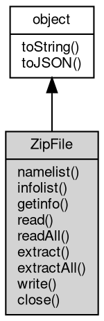

# 对象 ZipFile
ZipFile 对象是 [zip](../../module/ifs/zip.md) 格式文件压缩解压模块中的重要对象，提供了对 [zip](../../module/ifs/zip.md) 文件的读写访问

ZipFile 对象继承自[Stream](Stream.md) 对象，因此可以通过 [Stream](Stream.md) 对象一样的方式进行操作。

常用的静态函数有：

- [zip.open](../../module/ifs/zip.md#open)：打开一个 [zip](../../module/ifs/zip.md) 文件或 stream
- [zip.isZipFile](../../module/ifs/zip.md#isZipFile)：判断文件是否是 [zip](../../module/ifs/zip.md) 文件
- [fs.setZipFS](../../module/ifs/fs.md#setZipFS)：设置 [zip](../../module/ifs/zip.md) 文件虚拟文件系统
- [fs.clearZipFS](../../module/ifs/fs.md#clearZipFS)：清除 [zip](../../module/ifs/zip.md) 文件虚拟文件系统

ZipFile 对象的常用实例函数及方法有：

- NArray [ZipFile.namelist](ZipFile.md#namelist)()：获取文件名列表
- NObject [ZipFile.getinfo](ZipFile.md#getinfo)(String member)：获取文件信息
- [Buffer](Buffer.md) [ZipFile.read](ZipFile.md#read)(String member, String password = "")：读取指定文件
- NArray [ZipFile.readAll](ZipFile.md#readAll)(String password = "")：读取所有文件
- void [ZipFile.extract](ZipFile.md#extract)(String member, String [path](../../module/ifs/path.md), String password = "")：解压文件到指定路径中
- void [ZipFile.extract](ZipFile.md#extract)(String member, [SeekableStream](SeekableStream.md) strm, String password = "")：解压文件到流中
- void [ZipFile.extractAll](ZipFile.md#extractAll)(String [path](../../module/ifs/path.md), String password = "")：解压所有文件到指定路径
- void [ZipFile.write](ZipFile.md#write)(String filename, String inZipName, String password = "")：写入指定文件到压缩文件
- void [ZipFile.write](ZipFile.md#write)([Buffer](Buffer.md) data, String inZipName, String password = "")：写入指定文件到压缩文件
- void [ZipFile.write](ZipFile.md#write)([SeekableStream](SeekableStream.md) strm, String inZipName, String password = "")：写入指定文件到压缩文件
- void [ZipFile.close](ZipFile.md#close)()：关闭打开的[zip](../../module/ifs/zip.md)文件

代码实例如下：

```JavaScript
var zip = require('zip');
var path = require('path');
var fs = require('fs');

var zipfile = zip.open(path.join(__dirname, 'unzip_test.zip'), 'w');

// write a file
var buf = new Buffer('test data');
zipfile.write(buf, 'test.txt');

// read a file
buf = zipfile.read("unzip_test.js");
console.log(buf);

zipfile.close();
```

## 继承关系


## 成员函数
        
### namelist
**获取文件名列表**

```JavaScript
NArray ZipFile.namelist() async;
```

返回结果:
* NArray, 返回包含文件名的列表对象

--------------------------
### infolist
**获取文件信息列表**

```JavaScript
NArray ZipFile.infolist() async;
```

返回结果:
* NArray, 返回包含文件信息的列表对象

文件信息包含字段有：filename, date, compress_type, compress_size, file_size, password, data

--------------------------
### getinfo
**获取文件信息**

```JavaScript
NObject ZipFile.getinfo(String member) async;
```

调用参数:
* member: String, 指定要获取信息的文件名

返回结果:
* NObject, 返回文件信息对象

文件信息包含字段有：filename, date, compress_type, compress_size, file_size, password, data

--------------------------
### read
**返回从压缩文件读取的数据**

```JavaScript
Buffer ZipFile.read(String member,
    String password = "") async;
```

调用参数:
* member: String, 指定要读取的文件名
* password: String, 解压密码, 默认没有密码

返回结果:
* [Buffer](Buffer.md), 返回文件的所有数据

--------------------------
### readAll
**解压所有文件**

```JavaScript
NArray ZipFile.readAll(String password = "") async;
```

调用参数:
* password: String, 解压密码, 默认没有密码

返回结果:
* NArray, 包含所有文件数据及信息的列表

--------------------------
### extract
**解压指定文件**

```JavaScript
ZipFile.extract(String member,
    String path,
    String password = "") async;
```

调用参数:
* member: String, 指定要解压的文件名
* path: String, 指定要解压到的路径
* password: String, 解压密码, 默认没有密码

--------------------------
**解压指定文件到流**

```JavaScript
ZipFile.extract(String member,
    SeekableStream strm,
    String password = "") async;
```

调用参数:
* member: String, 指定要解压的文件名
* strm: [SeekableStream](SeekableStream.md), 指定要解压到的流
* password: String, 解压密码, 默认没有密码

--------------------------
### extractAll
**解压所有文件到指定路径**

```JavaScript
ZipFile.extractAll(String path,
    String password = "") async;
```

调用参数:
* path: String, 指定要解压到的路径
* password: String, 解压密码, 默认没有密码

--------------------------
### write
**写入指定文件到压缩文件**

```JavaScript
ZipFile.write(String filename,
    String inZipName,
    String password = "") async;
```

调用参数:
* filename: String, 指定要写入的文件
* inZipName: String, 压缩在[zip](../../module/ifs/zip.md)文件内的文件名
* password: String, 解压密码, 默认没有密码

--------------------------
**写入指定文件到压缩文件**

```JavaScript
ZipFile.write(Buffer data,
    String inZipName,
    String password = "") async;
```

调用参数:
* data: [Buffer](Buffer.md), 指定要写入的文件数据
* inZipName: String, 压缩在[zip](../../module/ifs/zip.md)文件内的文件名
* password: String, 解压密码, 默认没有密码

--------------------------
**写入指定文件到压缩文件**

```JavaScript
ZipFile.write(SeekableStream strm,
    String inZipName,
    String password = "") async;
```

调用参数:
* strm: [SeekableStream](SeekableStream.md), 指定要写入文件数据流
* inZipName: String, 压缩在[zip](../../module/ifs/zip.md)文件内的文件名
* password: String, 解压密码, 默认没有密码

--------------------------
### close
**关闭打开的[zip](../../module/ifs/zip.md)文件**

```JavaScript
ZipFile.close() async;
```

--------------------------
### toString
**返回对象的字符串表示，一般返回 "[Native Object]"，对象可以根据自己的特性重新实现**

```JavaScript
String ZipFile.toString();
```

返回结果:
* String, 返回对象的字符串表示

--------------------------
### toJSON
**返回对象的 JSON 格式表示，一般返回对象定义的可读属性集合**

```JavaScript
Value ZipFile.toJSON(String key = "");
```

调用参数:
* key: String, 未使用

返回结果:
* Value, 返回包含可 JSON 序列化的值

