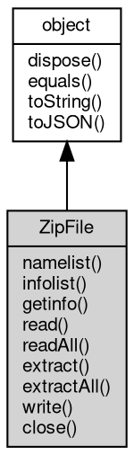

# 对象 ZipFile
[zip](../../module/ifs/zip.md) 文件访问对象

## 继承关系


## 成员函数
        
### namelist
**获取文件名列表**

```JavaScript
List ZipFile.namelist() async;
```

返回结果:
* [List](List.md), 返回包含文件名的列表对象

--------------------------
### infolist
**获取文件信息列表**

```JavaScript
List ZipFile.infolist() async;
```

返回结果:
* [List](List.md), 返回包含文件信息的列表对象

--------------------------
### getinfo
**获取文件信息**

```JavaScript
ZipInfo ZipFile.getinfo(String member) async;
```

调用参数:
* member: String, 指定要获取信息的文件名

返回结果:
* [ZipInfo](ZipInfo.md), 返回文件信息对象

--------------------------
### read
**返回从压缩文件读取的数据**

```JavaScript
Buffer ZipFile.read(String member,
    String password = "") async;
```

调用参数:
* member: String, 指定要读取的文件名
* password: String, 解压密码, 默认没有密码

返回结果:
* [Buffer](Buffer.md), 返回文件的所有数据

--------------------------
### readAll
**解压所有文件**

```JavaScript
List ZipFile.readAll(String password = "") async;
```

调用参数:
* password: String, 解压密码, 默认没有密码

返回结果:
* [List](List.md), 包含所有文件数据及信息的列表

--------------------------
### extract
**解压指定文件**

```JavaScript
ZipFile.extract(String member,
    String path,
    String password = "") async;
```

调用参数:
* member: String, 指定要解压的文件名
* path: String, 指定要解压到的路径
* password: String, 解压密码, 默认没有密码

--------------------------
**解压指定文件到流**

```JavaScript
ZipFile.extract(String member,
    SeekableStream strm,
    String password = "") async;
```

调用参数:
* member: String, 指定要解压的文件名
* strm: [SeekableStream](SeekableStream.md), 指定要解压到的流
* password: String, 解压密码, 默认没有密码

--------------------------
### extractAll
**解压所有文件到指定路径**

```JavaScript
ZipFile.extractAll(String path,
    String password = "") async;
```

调用参数:
* path: String, 指定要解压到的路径
* password: String, 解压密码, 默认没有密码

--------------------------
### write
**写入指定文件到压缩文件**

```JavaScript
ZipFile.write(String filename,
    String inZipName,
    String password = "") async;
```

调用参数:
* filename: String, 指定要写入的文件
* inZipName: String, 压缩在[zip](../../module/ifs/zip.md)文件内的文件名
* password: String, 解压密码, 默认没有密码

--------------------------
**写入指定文件到压缩文件**

```JavaScript
ZipFile.write(Buffer data,
    String inZipName,
    String password = "") async;
```

调用参数:
* data: [Buffer](Buffer.md), 指定要写入的文件数据
* inZipName: String, 压缩在[zip](../../module/ifs/zip.md)文件内的文件名
* password: String, 解压密码, 默认没有密码

--------------------------
**写入指定文件到压缩文件**

```JavaScript
ZipFile.write(SeekableStream strm,
    String inZipName,
    String password = "") async;
```

调用参数:
* strm: [SeekableStream](SeekableStream.md), 指定要写入文件数据流
* inZipName: String, 压缩在[zip](../../module/ifs/zip.md)文件内的文件名
* password: String, 解压密码, 默认没有密码

--------------------------
### close
**关闭打开的[zip](../../module/ifs/zip.md)文件**

```JavaScript
ZipFile.close() async;
```

--------------------------
### dispose
**强制回收对象，调用此方法后，对象资源将立即释放**

```JavaScript
ZipFile.dispose();
```

--------------------------
### equals
**比较当前对象与给定的对象是否相等**

```JavaScript
Boolean ZipFile.equals(object expected);
```

调用参数:
* expected: [object](object.md), 制定比较的目标对象

返回结果:
* Boolean, 返回对象比较的结果

--------------------------
### toString
**返回对象的字符串表示，一般返回 "[Native Object]"，对象可以根据自己的特性重新实现**

```JavaScript
String ZipFile.toString();
```

返回结果:
* String, 返回对象的字符串表示

--------------------------
### toJSON
**返回对象的 JSON 格式表示，一般返回对象定义的可读属性集合**

```JavaScript
Value ZipFile.toJSON(String key = "");
```

调用参数:
* key: String, 未使用

返回结果:
* Value, 返回包含可 JSON 序列化的值

