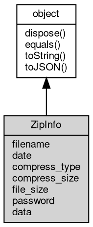

# 对象 ZipInfo
[zip](../../module/ifs/zip.md) 文件访问对象

## 继承关系


## 成员属性
        
### filename
**String, 只读属性成员, 文件名**

```JavaScript
readonly String ZipInfo.filename;
```

--------------------------
### date
**Date, 只读属性成员, 文件日期**

```JavaScript
readonly Date ZipInfo.date;
```

--------------------------
### compress_type
**String, 只读属性成员, 文件压缩类型**

```JavaScript
readonly String ZipInfo.compress_type;
```

--------------------------
### compress_size
**Long, 只读属性成员, 文件压缩后大小**

```JavaScript
readonly Long ZipInfo.compress_size;
```

--------------------------
### file_size
**Long, 只读属性成员, 文件大小**

```JavaScript
readonly Long ZipInfo.file_size;
```

--------------------------
### password
**Boolean, 只读属性成员, 密码**

```JavaScript
readonly Boolean ZipInfo.password;
```

--------------------------
### data
**[Buffer](Buffer.md), 只读属性成员, 文件数据**

```JavaScript
readonly Buffer ZipInfo.data;
```

## 成员函数
        
### dispose
**强制回收对象，调用此方法后，对象资源将立即释放**

```JavaScript
ZipInfo.dispose();
```

--------------------------
### equals
**比较当前对象与给定的对象是否相等**

```JavaScript
Boolean ZipInfo.equals(object expected);
```

调用参数:
* expected: [object](object.md), 制定比较的目标对象

返回结果:
* Boolean, 返回对象比较的结果

--------------------------
### toString
**返回对象的字符串表示，一般返回 "[Native Object]"，对象可以根据自己的特性重新实现**

```JavaScript
String ZipInfo.toString();
```

返回结果:
* String, 返回对象的字符串表示

--------------------------
### toJSON
**返回对象的 JSON 格式表示，一般返回对象定义的可读属性集合**

```JavaScript
Value ZipInfo.toJSON(String key = "");
```

调用参数:
* key: String, 未使用

返回结果:
* Value, 返回包含可 JSON 序列化的值

