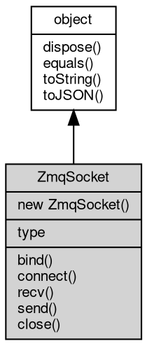

# 对象 ZmqSocket
ZeroMQ 套接口对象

## 继承关系


## 构造函数
        
### ZmqSocket
**ZmqSocket 对象构造函数**

```JavaScript
new ZmqSocket(Integer type = zmq.PAIR);
```

调用参数:
* type: Integer, 指定 socket 类型，缺省为 [zmq.PAIR](../../module/ifs/zmq.md#PAIR)

## 成员属性
        
### type
**Integer, 查询当前 socket 类型**

```JavaScript
readonly Integer ZmqSocket.type;
```

## 成员函数
        
### bind
**绑定指定地址和端口**

```JavaScript
ZmqSocket.bind(String addr);
```

调用参数:
* addr: String, 指定绑定的地址，如："tcp://*:3000"

--------------------------
### connect
**连接到指定地址的服务器**

```JavaScript
ZmqSocket.connect(String addr);
```

调用参数:
* addr: String, 指定连接的地址，如："tcp://*:3000"

--------------------------
### recv
**接收一个数据包**

```JavaScript
Buffer ZmqSocket.recv() async;
```

返回结果:
* [Buffer](Buffer.md), 返回接收到的数据包

--------------------------
### send
**发送一个数据包**

```JavaScript
ZmqSocket.send(Buffer data);
```

调用参数:
* data: [Buffer](Buffer.md), 指定发送的数据包

--------------------------
### close
**关闭当前 socket**

```JavaScript
ZmqSocket.close();
```

--------------------------
### dispose
**强制回收对象，调用此方法后，对象资源将立即释放**

```JavaScript
ZmqSocket.dispose();
```

--------------------------
### equals
**比较当前对象与给定的对象是否相等**

```JavaScript
Boolean ZmqSocket.equals(object expected);
```

调用参数:
* expected: [object](object.md), 制定比较的目标对象

返回结果:
* Boolean, 返回对象比较的结果

--------------------------
### toString
**返回对象的字符串表示，一般返回 "[Native Object]"，对象可以根据自己的特性重新实现**

```JavaScript
String ZmqSocket.toString();
```

返回结果:
* String, 返回对象的字符串表示

--------------------------
### toJSON
**返回对象的 JSON 格式表示，一般返回对象定义的可读属性集合**

```JavaScript
Value ZmqSocket.toJSON(String key = "");
```

调用参数:
* key: String, 未使用

返回结果:
* Value, 返回包含可 JSON 序列化的值

