# 对象 object
基础对象，所有对象均继承于此

## 继承关系

```dot
digraph {
    node [fontname="Helvetica,sans-Serif", fontsize=10, shape="record", style="filled", fillcolor="white"];

    object [tooltip="object", fillcolor="lightgray", id="me", label="{object|toString()\ltoJSON()\l}"];
    Buffer [tooltip="Buffer", URL="Buffer.md", label="{Buffer}"];
    Cipher [tooltip="Cipher", URL="Cipher.md", label="{Cipher}"];
    DbConnection [tooltip="DbConnection", URL="DbConnection.md", label="{DbConnection}"];
    MySQL [tooltip="MySQL", URL="MySQL.md", label="{MySQL}"];
    Odbc [tooltip="Odbc", URL="Odbc.md", label="{Odbc}"];
    SQLite [tooltip="SQLite", URL="SQLite.md", label="{SQLite}"];
    Digest [tooltip="Digest", URL="Digest.md", label="{Digest}"];
    EventEmitter [tooltip="EventEmitter", URL="EventEmitter.md", label="{EventEmitter}"];
    ChildProcess [tooltip="ChildProcess", URL="ChildProcess.md", label="{ChildProcess}"];
    DgramSocket [tooltip="DgramSocket", URL="DgramSocket.md", label="{DgramSocket}"];
    FSWatcher [tooltip="FSWatcher", URL="FSWatcher.md", label="{FSWatcher}"];
    LruCache [tooltip="LruCache", URL="LruCache.md", label="{LruCache}"];
    Service [tooltip="Service", URL="Service.md", label="{Service}"];
    StatsWatcher [tooltip="StatsWatcher", URL="StatsWatcher.md", label="{StatsWatcher}"];
    WebSocket [tooltip="WebSocket", URL="WebSocket.md", label="{WebSocket}"];
    WebView [tooltip="WebView", URL="WebView.md", label="{WebView}"];
    Worker [tooltip="Worker", URL="Worker.md", label="{Worker}"];
    Fiber [tooltip="Fiber", URL="Fiber.md", label="{Fiber}"];
    FileHandle [tooltip="FileHandle", URL="FileHandle.md", label="{FileHandle}"];
    Handler [tooltip="Handler", URL="Handler.md", label="{Handler}"];
    Chain [tooltip="Chain", URL="Chain.md", label="{Chain}"];
    HttpHandler [tooltip="HttpHandler", URL="HttpHandler.md", label="{HttpHandler}"];
    HttpRepeater [tooltip="HttpRepeater", URL="HttpRepeater.md", label="{HttpRepeater}"];
    Routing [tooltip="Routing", URL="Routing.md", label="{Routing}"];
    SslHandler [tooltip="SslHandler", URL="SslHandler.md", label="{SslHandler}"];
    HeapGraphEdge [tooltip="HeapGraphEdge", URL="HeapGraphEdge.md", label="{HeapGraphEdge}"];
    HeapGraphNode [tooltip="HeapGraphNode", URL="HeapGraphNode.md", label="{HeapGraphNode}"];
    HeapSnapshot [tooltip="HeapSnapshot", URL="HeapSnapshot.md", label="{HeapSnapshot}"];
    HttpClient [tooltip="HttpClient", URL="HttpClient.md", label="{HttpClient}"];
    HttpCollection [tooltip="HttpCollection", URL="HttpCollection.md", label="{HttpCollection}"];
    HttpCookie [tooltip="HttpCookie", URL="HttpCookie.md", label="{HttpCookie}"];
    HttpUploadData [tooltip="HttpUploadData", URL="HttpUploadData.md", label="{HttpUploadData}"];
    Iterator [tooltip="Iterator", URL="Iterator.md", label="{Iterator}"];
    KeyObject [tooltip="KeyObject", URL="KeyObject.md", label="{KeyObject}"];
    LevelDB [tooltip="LevelDB", URL="LevelDB.md", label="{LevelDB}"];
    Lock [tooltip="Lock", URL="Lock.md", label="{Lock}"];
    Condition [tooltip="Condition", URL="Condition.md", label="{Condition}"];
    Event [tooltip="Event", URL="Event.md", label="{Event}"];
    Semaphore [tooltip="Semaphore", URL="Semaphore.md", label="{Semaphore}"];
    Message [tooltip="Message", URL="Message.md", label="{Message}"];
    HttpMessage [tooltip="HttpMessage", URL="HttpMessage.md", label="{HttpMessage}"];
    HttpRequest [tooltip="HttpRequest", URL="HttpRequest.md", label="{HttpRequest}"];
    HttpResponse [tooltip="HttpResponse", URL="HttpResponse.md", label="{HttpResponse}"];
    WebSocketMessage [tooltip="WebSocketMessage", URL="WebSocketMessage.md", label="{WebSocketMessage}"];
    PKey [tooltip="PKey", URL="PKey.md", label="{PKey}"];
    ECKey [tooltip="ECKey", URL="ECKey.md", label="{ECKey}"];
    BlsKey [tooltip="BlsKey", URL="BlsKey.md", label="{BlsKey}"];
    Ed25519Key [tooltip="Ed25519Key", URL="Ed25519Key.md", label="{Ed25519Key}"];
    Redis [tooltip="Redis", URL="Redis.md", label="{Redis}"];
    RedisHash [tooltip="RedisHash", URL="RedisHash.md", label="{RedisHash}"];
    RedisList [tooltip="RedisList", URL="RedisList.md", label="{RedisList}"];
    RedisSet [tooltip="RedisSet", URL="RedisSet.md", label="{RedisSet}"];
    RedisSortedSet [tooltip="RedisSortedSet", URL="RedisSortedSet.md", label="{RedisSortedSet}"];
    SandBox [tooltip="SandBox", URL="SandBox.md", label="{SandBox}"];
    Script [tooltip="Script", URL="Script.md", label="{Script}"];
    Sign [tooltip="Sign", URL="Sign.md", label="{Sign}"];
    Smtp [tooltip="Smtp", URL="Smtp.md", label="{Smtp}"];
    Stat [tooltip="Stat", URL="Stat.md", label="{Stat}"];
    Stream [tooltip="Stream", URL="Stream.md", label="{Stream}"];
    BufferedStream [tooltip="BufferedStream", URL="BufferedStream.md", label="{BufferedStream}"];
    SeekableStream [tooltip="SeekableStream", URL="SeekableStream.md", label="{SeekableStream}"];
    File [tooltip="File", URL="File.md", label="{File}"];
    MemoryStream [tooltip="MemoryStream", URL="MemoryStream.md", label="{MemoryStream}"];
    RangeStream [tooltip="RangeStream", URL="RangeStream.md", label="{RangeStream}"];
    Socket [tooltip="Socket", URL="Socket.md", label="{Socket}"];
    SslSocket [tooltip="SslSocket", URL="SslSocket.md", label="{SslSocket}"];
    TTYInputStream [tooltip="TTYInputStream", URL="TTYInputStream.md", label="{TTYInputStream}"];
    TTYOutputStream [tooltip="TTYOutputStream", URL="TTYOutputStream.md", label="{TTYOutputStream}"];
    StringDecoder [tooltip="StringDecoder", URL="StringDecoder.md", label="{StringDecoder}"];
    TcpServer [tooltip="TcpServer", URL="TcpServer.md", label="{TcpServer}"];
    HttpServer [tooltip="HttpServer", URL="HttpServer.md", label="{HttpServer}"];
    HttpsServer [tooltip="HttpsServer", URL="HttpsServer.md", label="{HttpsServer}"];
    SslServer [tooltip="SslServer", URL="SslServer.md", label="{SslServer}"];
    TextDecoder [tooltip="TextDecoder", URL="TextDecoder.md", label="{TextDecoder}"];
    TextEncoder [tooltip="TextEncoder", URL="TextEncoder.md", label="{TextEncoder}"];
    Timer [tooltip="Timer", URL="Timer.md", label="{Timer}"];
    UrlObject [tooltip="UrlObject", URL="UrlObject.md", label="{UrlObject}"];
    Verify [tooltip="Verify", URL="Verify.md", label="{Verify}"];
    X509Cert [tooltip="X509Cert", URL="X509Cert.md", label="{X509Cert}"];
    X509Certificate [tooltip="X509Certificate", URL="X509Certificate.md", label="{X509Certificate}"];
    X509CertificateRequest [tooltip="X509CertificateRequest", URL="X509CertificateRequest.md", label="{X509CertificateRequest}"];
    X509Crl [tooltip="X509Crl", URL="X509Crl.md", label="{X509Crl}"];
    X509Req [tooltip="X509Req", URL="X509Req.md", label="{X509Req}"];
    XmlAttr [tooltip="XmlAttr", URL="XmlAttr.md", label="{XmlAttr}"];
    XmlNamedNodeMap [tooltip="XmlNamedNodeMap", URL="XmlNamedNodeMap.md", label="{XmlNamedNodeMap}"];
    XmlNode [tooltip="XmlNode", URL="XmlNode.md", label="{XmlNode}"];
    XmlCharacterData [tooltip="XmlCharacterData", URL="XmlCharacterData.md", label="{XmlCharacterData}"];
    XmlComment [tooltip="XmlComment", URL="XmlComment.md", label="{XmlComment}"];
    XmlText [tooltip="XmlText", URL="XmlText.md", label="{XmlText}"];
    XmlCDATASection [tooltip="XmlCDATASection", URL="XmlCDATASection.md", label="{XmlCDATASection}"];
    XmlDocument [tooltip="XmlDocument", URL="XmlDocument.md", label="{XmlDocument}"];
    XmlDocumentType [tooltip="XmlDocumentType", URL="XmlDocumentType.md", label="{XmlDocumentType}"];
    XmlElement [tooltip="XmlElement", URL="XmlElement.md", label="{XmlElement}"];
    XmlProcessingInstruction [tooltip="XmlProcessingInstruction", URL="XmlProcessingInstruction.md", label="{XmlProcessingInstruction}"];
    XmlNodeList [tooltip="XmlNodeList", URL="XmlNodeList.md", label="{XmlNodeList}"];
    ZipFile [tooltip="ZipFile", URL="ZipFile.md", label="{ZipFile}"];

    object -> Buffer [dir=back];
    object -> Cipher [dir=back];
    object -> DbConnection [dir=back];
    DbConnection -> MySQL [dir=back];
    DbConnection -> Odbc [dir=back];
    DbConnection -> SQLite [dir=back];
    object -> Digest [dir=back];
    object -> EventEmitter [dir=back];
    EventEmitter -> ChildProcess [dir=back];
    EventEmitter -> DgramSocket [dir=back];
    EventEmitter -> FSWatcher [dir=back];
    EventEmitter -> LruCache [dir=back];
    EventEmitter -> Service [dir=back];
    EventEmitter -> StatsWatcher [dir=back];
    EventEmitter -> WebSocket [dir=back];
    EventEmitter -> WebView [dir=back];
    EventEmitter -> Worker [dir=back];
    object -> Fiber [dir=back];
    object -> FileHandle [dir=back];
    object -> Handler [dir=back];
    Handler -> Chain [dir=back];
    Handler -> HttpHandler [dir=back];
    Handler -> HttpRepeater [dir=back];
    Handler -> Routing [dir=back];
    Handler -> SslHandler [dir=back];
    object -> HeapGraphEdge [dir=back];
    object -> HeapGraphNode [dir=back];
    object -> HeapSnapshot [dir=back];
    object -> HttpClient [dir=back];
    object -> HttpCollection [dir=back];
    object -> HttpCookie [dir=back];
    object -> HttpUploadData [dir=back];
    object -> Iterator [dir=back];
    object -> KeyObject [dir=back];
    object -> LevelDB [dir=back];
    object -> Lock [dir=back];
    Lock -> Condition [dir=back];
    Lock -> Event [dir=back];
    Lock -> Semaphore [dir=back];
    object -> Message [dir=back];
    Message -> HttpMessage [dir=back];
    HttpMessage -> HttpRequest [dir=back];
    HttpMessage -> HttpResponse [dir=back];
    Message -> WebSocketMessage [dir=back];
    object -> PKey [dir=back];
    PKey -> ECKey [dir=back];
    ECKey -> BlsKey [dir=back];
    ECKey -> Ed25519Key [dir=back];
    object -> Redis [dir=back];
    object -> RedisHash [dir=back];
    object -> RedisList [dir=back];
    object -> RedisSet [dir=back];
    object -> RedisSortedSet [dir=back];
    object -> SandBox [dir=back];
    object -> Script [dir=back];
    object -> Sign [dir=back];
    object -> Smtp [dir=back];
    object -> Stat [dir=back];
    object -> Stream [dir=back];
    Stream -> BufferedStream [dir=back];
    Stream -> SeekableStream [dir=back];
    SeekableStream -> File [dir=back];
    SeekableStream -> MemoryStream [dir=back];
    SeekableStream -> RangeStream [dir=back];
    Stream -> Socket [dir=back];
    Stream -> SslSocket [dir=back];
    Stream -> TTYInputStream [dir=back];
    Stream -> TTYOutputStream [dir=back];
    object -> StringDecoder [dir=back];
    object -> TcpServer [dir=back];
    TcpServer -> HttpServer [dir=back];
    HttpServer -> HttpsServer [dir=back];
    TcpServer -> SslServer [dir=back];
    object -> TextDecoder [dir=back];
    object -> TextEncoder [dir=back];
    object -> Timer [dir=back];
    object -> UrlObject [dir=back];
    object -> Verify [dir=back];
    object -> X509Cert [dir=back];
    object -> X509Certificate [dir=back];
    object -> X509CertificateRequest [dir=back];
    object -> X509Crl [dir=back];
    object -> X509Req [dir=back];
    object -> XmlAttr [dir=back];
    object -> XmlNamedNodeMap [dir=back];
    object -> XmlNode [dir=back];
    XmlNode -> XmlCharacterData [dir=back];
    XmlCharacterData -> XmlComment [dir=back];
    XmlCharacterData -> XmlText [dir=back];
    XmlText -> XmlCDATASection [dir=back];
    XmlNode -> XmlDocument [dir=back];
    XmlNode -> XmlDocumentType [dir=back];
    XmlNode -> XmlElement [dir=back];
    XmlNode -> XmlProcessingInstruction [dir=back];
    object -> XmlNodeList [dir=back];
    object -> ZipFile [dir=back];
}
```


## 成员函数
        
### toString
**返回对象的字符串表示，一般返回 "[Native Object]"，对象可以根据自己的特性重新实现**

```JavaScript
String object.toString();
```

返回结果:
* String, 返回对象的字符串表示

--------------------------
### toJSON
**返回对象的 JSON 格式表示，一般返回对象定义的可读属性集合**

```JavaScript
Value object.toJSON(String key = "");
```

调用参数:
* key: String, 未使用

返回结果:
* Value, 返回包含可 JSON 序列化的值

